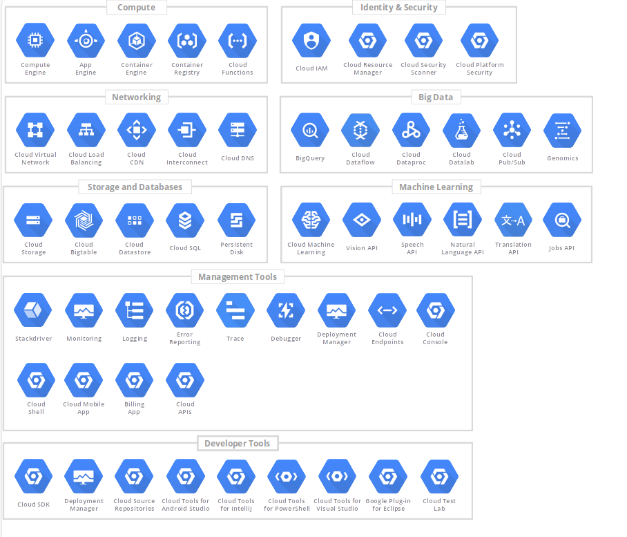
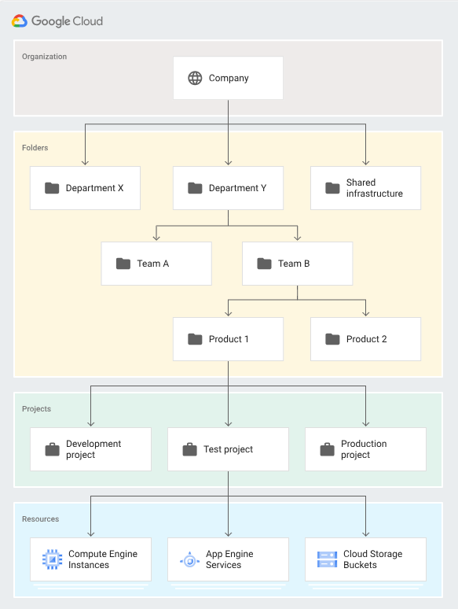

# Google Cloud Platform (GCP) Essentials

## Basic numbers

- 20 regions
- 61 zones
- 134 network edge locations
- 200+ countries and territories.

A Region typically has two Zones. A zone is the equivalent of a data center in Google Cloud.

Overview of services:

### Signing-up with GCP

$300 in free credits to run more than 25 service for free.  are provided with 90

Link: [https://cloud.google.com/gcp/](https://cloud.google.com/gcp/)

### GCP resources

In Google Cloud Platform, everything that you create is a resource. There is a hierarchy:

- Everything that you create is a resource.
- Resources belong to a project. 
- A project directly represents a billable unit. It has a credit card associated. 
- Projects may be organized into folders (like dev or production), which provide logical grouping of projects.
- Folders belong to one and only one organization.
- The organization is the top level entity in GCP hierarchy.

If you use Google Suite, you will see the organization level and folders. If you don't, you will only have access to projects and resources.

To interact with GCP there are these tools: web console, cloud shell cloud SDK, mobile App, Rest API.

GCP Cloud Shell is an interactive shell environment for GCP, accessible from any web browser, with a preloaded IDE  named gcloud, which is the command line utility, and based on a GCE Virtual Machine (provisioned with 5GB persistent disk storage and Debian environment). It has a built-in preview functionality withou dealing with tunneling and other issues.

## 2. Compute Services

Code is deployed and executed in one of the compute services:
### 2.1. App Engine

It's one of the first compute services from Google (PaaS) in 2008. It's a fully managed platform for deploying web apps at scale. It supports multiple languages. It's available in two environments: 

- Standard: Applications run in a sandbox.
- Flexible: You have more control on packages and environments. Applications run on docker containers, which are in use to deploy but also to scale apps.
### 2.2. Compute Engine (GCE)

Google Compute Engine (GCE) enables Linux and Windows VMs to run on Google's global infraestructure. VMs are based on machine types with varied CPU and RAM configuration.

If you need that VMs are persistent, you need to attach additional storage such standards and SSD disks. Otherwise, when closing the VM you will loose all configurations and setups.

### Kubernetes Engine

### Cloud Functions

## 3. Storage Services

## 4. Network Services

## 5. Identity & Access Management

## 6. Database Services

## 7. Data and Analytics Services

## 8. AI and ML Services

## 9. Devops Services

## 10. Anthos and other GC services
