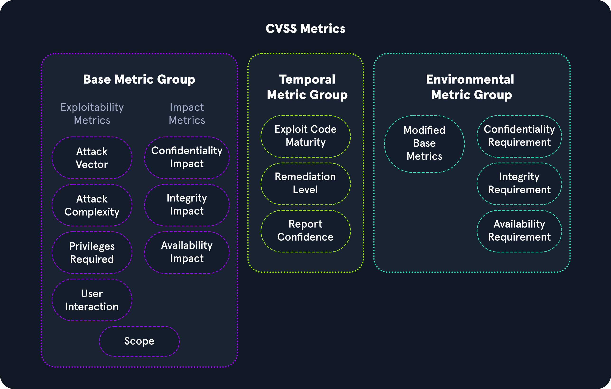

# Common Vulnerability Scoring System

`Source:  Hack The Box Academy`

The [Common Vulnerability Scoring System (CVSS)](https://www.first.org/cvss/) is a framework for rating the severity of software vulnerabilities in an objective way. For that it uses standarized vendor and platform agnostic vulnerability scoring methodologies.

Scores ranges from 0.0 to 10.0 (being the most severe):

- Low: 0.1-3.9.
- Medium: 4.0-6.9 
- High: 7.0-8.9
- Critical: 9.0-10.00

CVSS uses a combination of base, temporal, and environmental metrics

CVSS is not a risk rating framework (for that you have OWASP, for instance); typical out of scope impact: number of customer on a product line, monetary losses due to a breach, ....

There are three basic vectors: Basic metric group, temporal metric group and Environmental metric group. 

The way to quote a CVSS scoring is adding also their vector.

## Metric groups

**Base score reflects** the severity of a vulnerability according to ist intrinsic characteristic which are constant over time and assumes the reasonable worst case impact across different deployed environments:

- Exploitability metrics: The Exploitability metrics are a way to evaluate the technical means needed to exploit the issue.

	- Attack vector (AV): 

		- Network (N attack where there is rooter in place), 
		- Adjacent (A attack is launched from the same network segment, VPN included), 
		- Local (L attacker can login locally into the system), 
		- Physical (P the attacker needs to be physically present).
		
	- Attack Complexity (AC): Conditions that should be present in order for the attack to exists.
	
		- Low (L): there is not specialized access conditions to perform the attack.
		- High (H): attacker should invest or prepare somehow before an attack (for instance, gathering knowledge about configurations or setup software or licenses)
	
	- Privileged Required (PR):  

		- None (N): The attacker is unauthorize prior to attack
		- Low (L): Attacker should have user level access.
		- High (H): Privileges that provide significant control over the vulnerable component.
	
	 - User Interaction (UI): Need user participation.
	
		 - None (N): Attack can be perform without any action from user side.
		 - Required (R): Somebody has to visit the page and click it. 

- Scope: what component is impacted by the vulnerability. Whether a vulnerability in one vulnerable component impacts resources in components beyond its security scope. If the scope is C, then IMPACT needs to be revaluated.

	- Changed (C): the exploited vulnerability affects resources managed by different security authority.
	- Unchanged (U): the exploited vulnerability can only affect resources managed by the same security authority.

- Impact metrics: CIA. The Impact metrics represent the repercussions of successfully exploiting an issue and what is impacted in an environment, and it is based on the CIA triad.

	- Confidentiality (C): Impact to the confidentiality if the information resources are accessed.
	
		- None (N):  None data revealed.
		- Low (L): Some data is accessed. But it has not impact.
		- High (H): Total loss of confidentiality. Access to restricted information is obtained, and disclosed information is critical.
	
	- Integrity (I):

		- None (N):
		- Low (L):
		- High (H):

	- Availability (A):
	
		- None (N):
		- Low (L):
		- High (H):

**Temporal metric group:** the characteristics of a vulnerability that may change over time but not across user environments. 

- Exploit Code Maturity (E) metric represents the probability of an issue being exploited based on ease of exploitation techniques.

	- `Not Defined`
	- `High`
	- `Functional`
	- `Proof-of-Concept`
	- `Unproven`.
	
- Remediation Level (RL)  is used to identify the prioritization of a vulnerability.

	- `Not Defined`
	- `Unavailable`
	- `Workaround`
	- `Temporary Fix`
	- `Official Fix`

- Report Confidence (RC) represents the validation of the vulnerability and how accurate the technical details of the issue are.

	- `Not Defined`
	- `Confirmed`
	- `Reasonable`
	- `Unknown`

**Environmet metric group**: the characteristics of a vulneravbility that are relevant and unique to a particular user's environment. 

- Env (CR, IA, ...)

All metrics are scored under the assumption that the attacker has already located and identified the vulnerability. Analyst need to consider the means by which the vulnerability was identified or difficulty to identify the vulnerability.

##  cvss Calculator

[nist calculator](https://nvd.nist.gov/vuln-metrics/cvss/v3-calculator)

