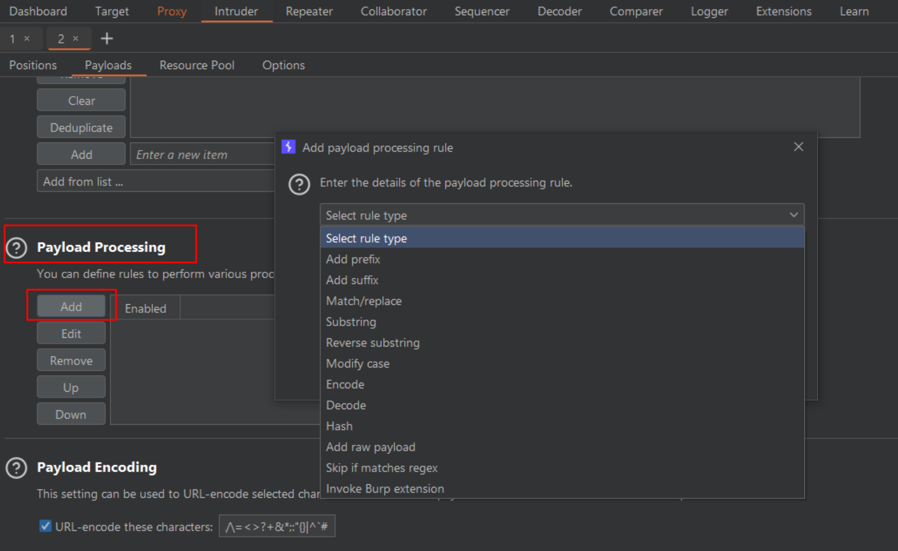

# Evasion and Combining techniques

??? abstract "General index of the course"
    - [Setting up the environment](setting-up-kali.md)
    - [Api Reconnaissance](api-reconnaissance.md).
    - [Endpoint Analysis](endpoint-analysis.md).
    - [Scanning APIS](scanning-apis.md).
    - [API Authorization Attacks](api-authentication-attacks.md).
    - [Exploiting API Authorization](exploiting-api-authorization.md).
    - [Testing for Improper Assets Management](improper-assets-management.md).
    - [Mass Assignment](mass-assignment.md).
    - [Server side Request Forgery](server-side-request-forgery-ssrf.md).
    - [Injection Attacks](injection-attacks.md). 
    - [Evasion and Combining techniques](evasion-combining-techniques.md).
    - [Setting up the labs + Writeups](other-labs.md)

??? note "Resources"
    -  [w3af](../w3af.md)
    - [WAFW00f](https://github.com/EnableSecurity/wafw00f)
	-  [waf-bypass.com](https://waf-bypass.com/).
	- [hacken.io](https://hacken.io/discover/how-to-bypass-waf-hackenproof-cheat-sheet/)
	- [Awesome WAF](https://github.com/0xInfection/Awesome-WAF).

Here some basic techniques for evading or bypassing common API security controls.

## What can trigger a WAF (Web Applicatin Firewall)?

- Too many requests for inexisting resources.
- To many requests in a short period of time.
- Common SQL or XSS payloads attackes in requests.
- Unusual behaviour (like a test for authorizathion vulnerabilities).

## How to detect a WAF

What can a WAF do provided that RESTful APIs are stateless? They can use attribution to identify an atacker and for that they use: IP address, origin headers, authorization tokens and metadata (patterns of requests, rate of requests and the combination of the headers included in the requests).

When it comes to Hacking APIs the best approach is first use the API as it was intended. Second, review the API responses  for evidence of a WAF (in headers):

**1**. Headers such as X-CDN means that the API is leveraging a Content Delivery Network (CDN), which often provides WAFs as a service.

**2**. Use Burp Suite's Proxy and Repeater to watch if your requests are being sent to a proxy (302 sending you to a CDN).

**3**. Use some tools:

```bash
nmap -p 80 -script http-waf-detect $ip 
```

Also [w3af](../w3af.md), [WAFW00f](https://github.com/EnableSecurity/wafw00f), and this recollection of handy tools: [waf-bypass.com](https://waf-bypass.com/).

Great article found when searchin for these tools: [hacken.io](https://hacken.io/discover/how-to-bypass-waf-hackenproof-cheat-sheet/).


## Techniques for evasion


### 1. Burners accounts

So there is a WAF. Before attacking, create several extra accounts (or tokens you can dispose). Watch out! When creating these accounts, make sure you use information not associated to your other accounts:

	- Different names and emails.
	- Different passwords.
	- Use VPN and disguise your IP.

### 2. Bypassing controls with string terminators

[Simple payloads](https://raw.githubusercontent.com/amandaguglieri/dictionaries/main/string-terminators.md).

Null bytes and other combinations of symbols are often interpreted as string terminators. When not filtered out they could terminate the API security control filters.

Here an example of a NULL byte included in a [XSS](../cross-site-scripting-xss.md)  combined with a [SQL injection](../sql-injection.md) attack.

```
POST /api/v1/user/profile/update
--snip--

	 {
		“username”: “<%00script>alert(1);</%00script>”
		“pass”: "%00'OR 1=1"
}
```


### 3. Bypassing controls with case switching

Case switching the payload may provoke the WAF not detecting the attack.


### 4. Bypassing controls by encoding payloads

If you are using Burp Suite, the module Decoder is perfect for quickly encoding or decoding a payload. 

**Trick**: double encoding your payload.


## Tools 

### 1. BurpSuite Intruder

Also, once you know which encoding technique is the efective one to bypass the WAF, use BurpSuite Intruder (section Payload processing under the Intruder Payload option) for configuring you attack. Intruder has some more worthy options:




### 2. wfuzz

[wfuzz Cheat sheet](../wfuzz.md).

```bash
# Check which wfuzz encoders are available
wfuzz -e encoders

# To use an encoder, add a comma to the payload and specify the encoder name
wfuzz -z file,path/to/payload.txt,base64 http://hackig-example.com/api/v2/FUZZ

# Using multiple encoders. Each payload will be processed in separated requests.  
wfuzz -z list,a,base64-md5-none 
# this results in three payloads: one encoded in base64, another in md5 and last with none. 

# Each payload will be processed by multiple encoders.
wfuzz -z file,payload1-payload2,base64@md5@random_upper -u http://hackig-example.com/api/v2/FUZZ
```


## Testing rate limits


### Rate limits. What for?

- To avoid incurring into adittional costs associated with computing resources.
- To avoid falling victim to a DoS attack.
- To monetize.


### How to know if rate limit is in place

- Consult API documentation.
- Check APIs header (x-rate-limit, x-rate-limit-remaining, retry- after).
- See response code 429.

### Techniques

**1. Throttle your scanning**

In wfuzz: 

```
# Units are specified in seconds
-s  Specify a time delay between requests.
-t Specify the concurrent number of connections
```

In BurpSuite:

```
Set up Intruder's Resource Pool to limit the rate (in milliseconds).
```


**2. Bypassing paths**

When altering slightly the URL path, this could cause the API provider to handle the request diferently, potentially bypassing the rate limit.

- Adding null bytes.
- Altering the string ramdonly with various upper and lower case letter.
- Adding meaningless parameters.


**3. Modifying Origin headers**

When the API provider use headers to enforce rate limiting, you could manipulate them:

- X-Forwarded-For
- X-Forwarded-Host
- X-Host
- X-Originating-IP
- X-Remote-IP
- X-Client-IP
- X-Remote-Addr


**4. Modifying User-agent header**

You can use this dictionary: [Seclist](https://github.com/danielmiessler/SecLists/tree/master/Fuzzing/User-Agents).


## Rotating IP addresses with BurpSuite

Add the extension IP Rotate. 

Requirements to install IP Rotate and have it working:

- Install the tool Boto3.

```bash
pip3 install boto3
```

- Install the Jython standalone file from [https://www.jython.org/download.html](https://www.jython.org/download.html).
- You will need an AWS account in which you can create an IAM user. There is a small cost associated with using the AWS API gateway. After downloading the IAM Services page, click Add Users and create an user account with programmatic access selected. On the "Set Permissions page", select "Attach Existing Policies Directly". NExt filter policies by searching for "API". Select the "AmazonAPIGatewayAdministrator" and "AmazonAPIGatewayInvokeFullAccess" permissions. Preceed to the review page.. No tags needed. Skip ahead and create the users. Now, download CSV file containing your user's access key.
- Install IP Rotate
- Open the IP Rotate Module and copy and paste access key from the user added in IAM service. 