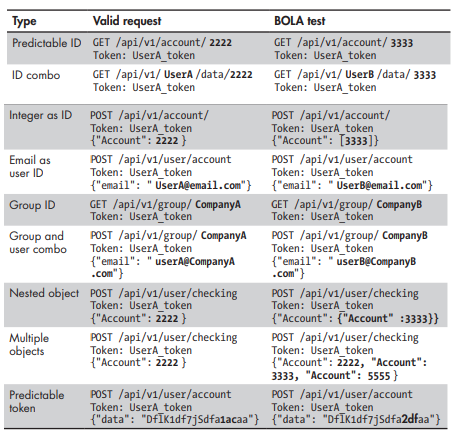

# Exploiting API Authorization

## BOLA - Broken Object Level Authorization

BOLA vulnerability allows UserA to request UserB's resources.

### Methodology

1. Create a UserA account.
2. Use the API and discover requests that involve resource IDs as UserA.
3. Document requests that include resource IDs and should require authorization.
4. Create a UserB account.
5. Obtaining a valid UserB token and attempt to access UserA's resources.

You could also do this by using UserB's resources with a UserA token.

## BFLA - Broken Function Level Authorization

BFLA is about UserA requesting to create, update, post or delete object values that belong to UserB.   

- BFLA request with lateral actions. UserA has the same role or privilege level than UserB.
- BFLA request with escalated actions. UserB has a privilege level and UserA is able to perform actions reserved for UserB.

Important: being careful with DELETE request.

### Methodology

1. Postman. Go through the collection and select requests for resources of UserA. Focus on resources for private information. 
2. Swap out your UserA token for UserB's.
3. Send GET, PUT, POST, and DELETE requests for UserA's resources using Userb's token.
4. Investigate code 200, 401, and responses with strange lengths.

BFLA pays special attention to requests that perform authorized actions. 

### Tools

+ Postman: ue the collection variables. Create specific collections for attacks.
+ BurpSute: use the Match and Replace functionality (tab PROXY>OPTIONS) to perform a large-scale replacement of a variable like an authorization token.

