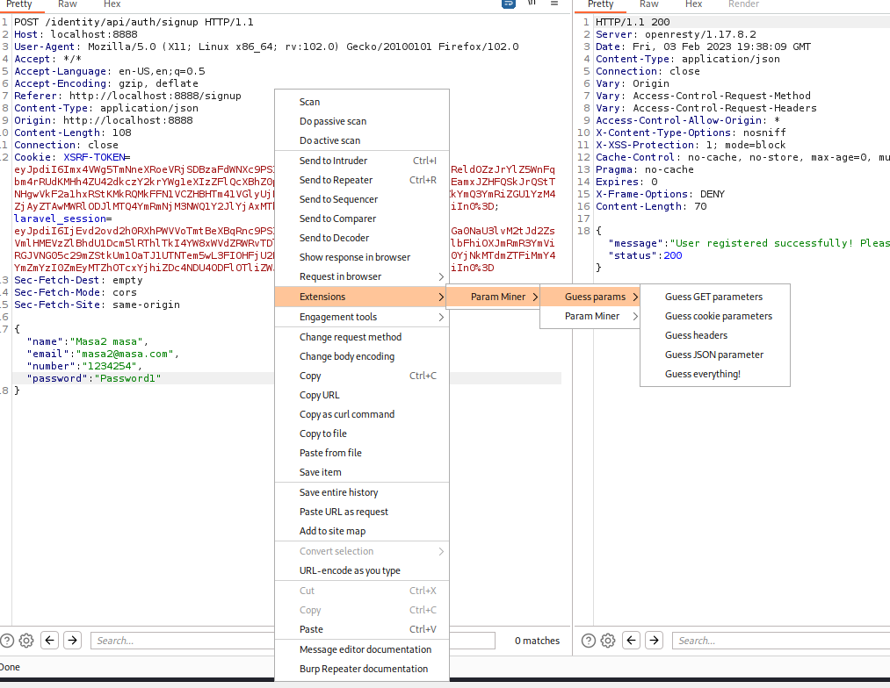
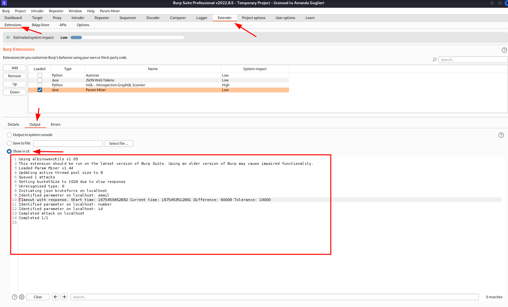

# Mass assignment

??? abstract "General index of the course"
    - [Setting up the environment](setting-up-kali.md)
    - [Api Reconnaissance](api-reconnaissance.md).
    - [Endpoint Analysis](endpoint-analysis.md).
    - [Scanning APIS](scanning-apis.md).
    - [API Authorization Attacks](api-authentication-attacks.md).
    - [Exploiting API Authorization](exploiting-api-authorization.md).
    - [Testing for Improper Assets Management](improper-assets-management.md).
    - [Mass Assignment](mass-assignment.md).
    - [Server side Request Forgery](server-side-request-forgery-ssrf.md).
    - [Injection Attacks](injection-attacks.md). 
    - [Evasion and Combining techniques](evasion-combining-techniques.md).
    - [Setting up the labs + Writeups](other-labs.md)

## What is mass asset management?

Basically UserA is said in the frontend to have the ability to post/update an object and we use that request to post/update a different object. We are sending a request that updates or overwrites server-side variables.

**Example**: 

In a login process you are said to be able to send these parameters:

```
{
	"username":"user22",
	"password":"Password1",
	}
```

But you send this:

```
{
	"username":"user22",
	"password":"Password1",
	"credit":10000
}
```

And now, your new created user will have a credit of 10,000 units.

Other other key-values that you could include in the JSON POST body could be: 

```
"isadmin": true,  
"isadmin":"true",  
"admin": 1,  
"admin": true,
```


Key thing is this vulnerability is to identify vectors and entrypoints.

### Methodology

Identify endpoints that accept user input in your collection and that have the potential to modify objects. In the crAPI application this was about taking a BFLA to the next level:

- Changing the request "GET /workshop/api/shop/products" (which displays existing products) to a "POST  /workshop/api/shop/products", the app responded with a 400 Bad request code, and provided information with suggested fields for a POST request. Basically this post request is a way to submit requests to alter or create store products. So, we can create our own product items. 
- Now we can create a product with a value in negative. Adquiring that item will give you credit!


## Finding Mass assignment targets

To discover and exploit mass assignment vulnerabilities search for API requests that accept and process client input:

**1**. Account registration

	 - Intercept the web request
	- Craft this request with admin variables that you can set from API documentation

**2**. Unauthorized access to organizations: If your user's objects belong to an organization with access to sensitive data, attempt to gain access to that organization.

**3**. Resetting passwords, updating accounts, profiles or organizational objects: Do not limit yourself to the account registration process.

## Tools

BurpSuite Intruder + Param Miner
Arjun


### Using Param Miner extension

**1**. Spotting sections focused on privileged actions. Some headers like: 

    - Token: AdminToke
    -  Or in the json of the body: isadmin: true

A nice way to do this is with Burp Extension: **Param Miner**.

**Param Miner** can be downloaded from BApp Store in BurpSuite. To run it, right-click on a request (for instance, a request in Repeater and select Extensions>Param Miner>Guess params>Gues JSON parameter).



Now, go to Extender tab> Extensions. And in the box below, select Output, and later "Show in UI":



After a while you will see results from the attack.

With Param Miner you can:  fuzz unknown variables.

### Arjun

[More about arjun](../arjun.md).

Arjun is a great tool for finding query parameters in URL endpoints.

Advantages:
- Supports GET/POST/POST-JSON/POST-XML requests. 
- It deals with rate-limits and timeouts.


```bash
# Run arjun againts a single URL
arjun -u https://api.example.com/endpoint

# arjun will provide you with likely parameters from a wordlist. Its results are based on the deviation of response lengths/codes
arjun --headers "Content-Type: application/json" -u http://api.example.com/register -m JSON --include='{$arjun}' --stable
# -m Get method parameters GET/POST/JDON/XML
# -i Import targets (a txt list)
# --include Specify injection point, for example:
		#  --include='<?xml><root>$arjun$</root>
		#  --include='{"root":{"a":"b",$arjun$}}'
```


Awesome wiki about arjun usage: [https://github.com/s0md3v/Arjun/wiki/Usage](https://github.com/s0md3v/Arjun/wiki/Usage).


