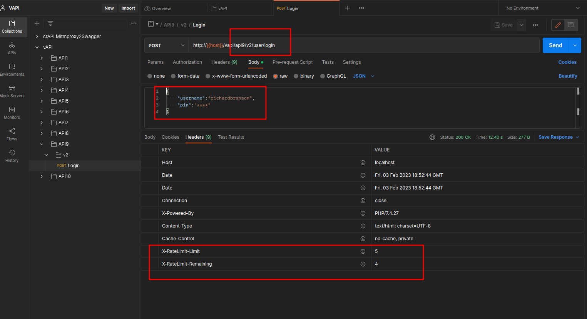
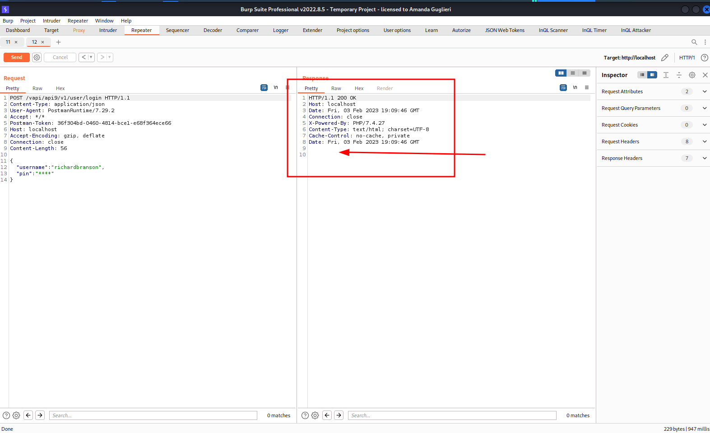
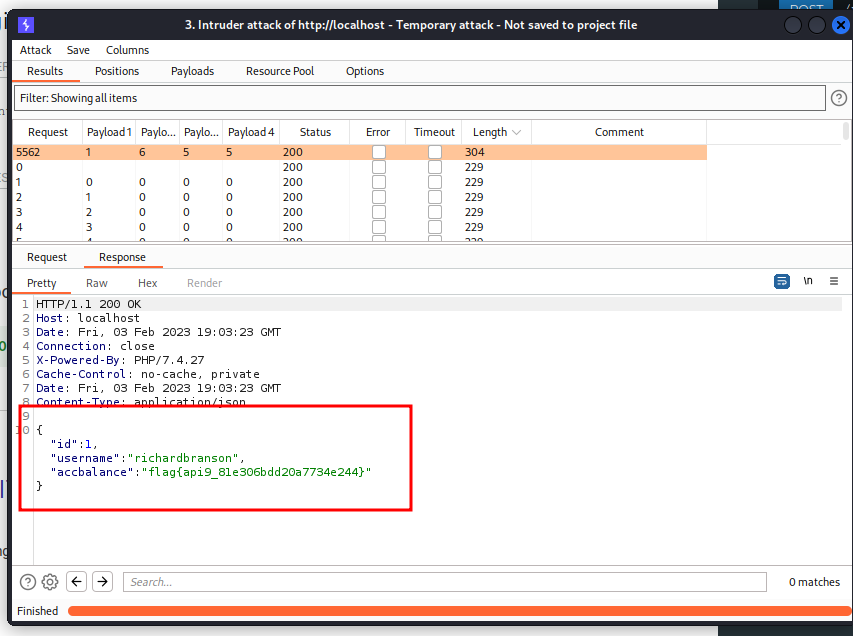

# Setting up the labs + Writeups

??? abstract "General index of the course"
    - [Setting up the environment](setting-up-kali.md)
    - [Api Reconnaissance](api-authentication-attacks.md).
    - [Endpoint Analysis](endpoint-analysis.md).
    - [Scanning APIS](scanning-apis.md).
    - [API Authorization Attacks](api-authentication-attacks.md).
    - [Exploiting API Authorization](exploiting-api-authorization.md).
    - [Testing for Improper Assets Management](improper-assets-management.md).
    - [Mass Assignment](mass-assignment.md).
    - [Server side Request Forgery](server-side-request-forgery-ssrf.md).
    - [Injection Attacks](injection-attacks.md). 
    - [Evasion and Combining techniques](evasion-combining-techniques.md).
    - [Setting up the labs + Writeups](other-labs.md)

Here we'll be practising what we have learned in the course. There are plenty of labs in the wild. My intention here is to overview only the well known ones.

Also, to make it to the end, I will include the writeups for every lab.

## Setting up crAPI

Download it from: [https://github.com/OWASP/crAPI](https://github.com/OWASP/crAPI)

```bash
mkdir ~/lab
cd ~/lab
sudo curl -o docker-compose.yml https://raw.githubusercontent.com/OWASP/crAPI/main/deploy/docker/docker-compose.yml
sudo docker-compose pull
sudo docker-compose -f docker-compose.yml --compatibility up -d
```


## Setting up other labs

Besides "crapi" and "vapi", the book "Hacking APIs" indicates some other interesting labs. Following chapter 5 of Hacking APIs book ("Setting up vuñnerable API targets"), I have installed:

### vapi app 

Source: https://github.com/roottusk/vapi

APIs have become critical element of security landscape. In 2019, OWASP released a list of top 10 API Security vulnerabilities for the first time. Vapi stands for Vulnerable Adversely Programmed Interface, and it's a self-hostable PHP Interface that mimics OWASP API Top 10 scenarios.

**Install**

```bash
# Under /home/kali/labs
git clone https://github.com/roottusk/vapi.git
cd vapi
docker-compose up -d
# prerrequisite: having docker up and running
```

**Setting up Postman**

+ Go to https://www.postman.com/roottusk/workspace/vapi/ 
+ Locate and import vAPI.postman_collection.json in Postman
+ Locate and Import vAPI_ENV.postman_environment.json in Postman
+ Configure the collection to use vAPI_ENV

### OWASP DevSlop Pixi

Pixi is a MongoDB, Express.js, Angular, Node (MEAN) stack web applica­tion that was designed with deliberately vulnerable APIs.

To install it:

```bash
cd ~/lab.
git clone https://github.com/DevSlop/Pixi.git
```

To run it:

```bash
cd ~/lab
sudo docker-compose up
```

Now, in the browser, go to: http://localhost:8000/login


### OWASP Juice Shop

Juice Shop encompasses vulnerabilities from the entire OWASP Top Ten along with many other security flaws found in real-world applications.

To install, go to the github page (https://github.com/juice-shop/juice-shop) and follow the isntructions.

To run it:

```bash
sudo docker run --rm -p 3000:3000 bkimminich/juice-shop
```

Now, in the browser, go to: http://localhost:3000/#/


### Damn-Vulnerable-GraphQL-Application

Damn Vulnerable Web Services is a vulnerable application with a web service and an API that can be used to learn about webservices/API related vulnerabilities.

To install, see the github page: https://github.com/dolevf/Damn-Vulnerable-GraphQL-Application 

To run it:

```bash
sudo docker run -t -p 5013:5013 -e WEB_HOST=0.0.0.0 dvga
```

Now, in the browser, go to: http://localhost:5013/


## Writeups

### VAPI Writeup 

#### Writeup: API1

Tip provided by vAPI: Broken Object Level Authorization. You can register yourself as a User , Thats it ....or is there something more?
 
Solution:

+ Postman: Under folder API0, send a request to Create User. When done, the vAPI_ENV will be filled with two more variables: api1_id, api1_auth.
+ Postman: Under folder API1, send a request to Get User. Initially you will get the user that you have created. BUT if you modify the api1_id in the vAPI_ENV environment, then you will receive the data from (let's say) user with id 1. Or 2. Or 3. Or... Tadam! BOLA.
+ The flag is in user with id 1. See the response body:  

#### Writeup: API2

Tip provided by vAPI: Broken Authentication. We don't seem to have credentials for this , How do we login? (There's something in the Resources Folder given to you).


Solution:

+ Download creds.csv from https://raw.githubusercontent.com/roottusk/vapi/master/Resources/API2_CredentialStuffing/creds.csv.
+ Execute:

```bash
cat creds.csv | cut -d, -f1 >users.txt
cat creds.csv | cut -d, -f3 >pass.txt
```

+ Intercept in mode ON in Burp, enable foxyproxy at 8080 in the browser, and enable proxy in Postman at 8080.
+ Postman: Under  folder API2, send a POST request to login and intercept it with Burp.
+ Burp: send the request to Intruder. Use Pitchfork attack with two payloads (Simplelist). One will be users.txt and second payload, pass.txt. Careful, remove the url encoding when setting up the payloads.
+ Burp: sort by Code (or length). You will get credentials for three users.
+ Postman: Login with the credentials of every user and save the file as an example just in case that you need to go back to this.
+ Postman: Once you are login into the app, a new enviromental variable has been saved in vAPI_ENV: api2_auth. With this authentication now we can resend the request Get Details. Flag will be in the response.

#### Writeup: API3

#### Writeup: API4

#### Writeup: API5

#### Writeup: API6

#### Writeup: API7


#### Writeup: API8

#### Writeup: API9

On this lab we'll be testing for improper asset management. The endpoint provided in the Postman collection is:



Several interesting things to test:

- Only a pin code with 4 digits are required to login.
- We are running this request using version2 of an api.
- There are two significant headers:
	- X-RateLimit-Limit set to 5
	- X-RateLimit Remaining set to 4.

With this in mind we can run that request six times, obtaining a 500 internal server error instead of the 200 response:


But, if we run the same request but modifying the POST request from v2 to v1, then: 


Headers "X-RateLimit-Limit" and "X-RateLimit Remaining" are missing. Looks like there is no Rate limit set for this request and a Brute Force attack can be conducted. So we do it using Burp Intruder and... bingo! we have the flag:




#### Writeup: API10


