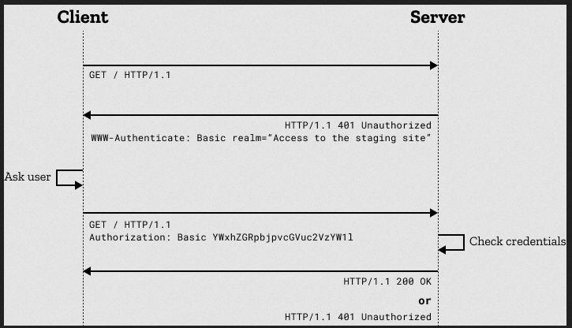
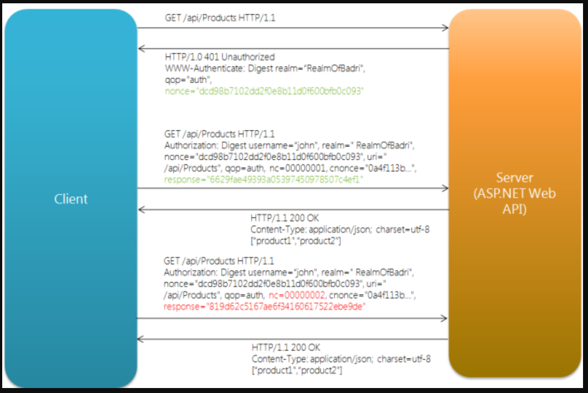

# HTTP Authentication Schemes

This resource is pretty awesome: [https://learn.microsoft.com/en-us/dotnet/framework/wcf/feature-details/understanding-http-authentication](https://learn.microsoft.com/en-us/dotnet/framework/wcf/feature-details/understanding-http-authentication).

I'll be (CTRL-c-CTRL-v)ing what I think it's important.

## Understanding HTTP Authentication

Authentication is the process of identifying whether a client is eligible to access a resource. The HTTP protocol supports authentication as a means of negotiating access to a secure resource.

The initial request from a client is typically an anonymous request, not containing any authentication information. HTTP server applications can deny the anonymous request while indicating that authentication is required. The server application sends WWW-Authentication headers to indicate the supported authentication schemes. 

## HTTP Authentication Schemes


| Authentication Scheme | Description                                                                                                                                                                                                                                                                                                                                                                                                                                                                                                                                                                                                                                                                                                                                                                                                                                                                                                                               |     |
| --------------------- | ----------------------------------------------------------------------------------------------------------------------------------------------------------------------------------------------------------------------------------------------------------------------------------------------------------------------------------------------------------------------------------------------------------------------------------------------------------------------------------------------------------------------------------------------------------------------------------------------------------------------------------------------------------------------------------------------------------------------------------------------------------------------------------------------------------------------------------------------------------------------------------------------------------------------------------------- | --- |
| Anonymous             | An anonymous request does not contain any authentication information. This is equivalent to granting everyone access to the resource.                                                                                                                                                                                                                                                                                                                                                                                                                                                                                                                                                                                                                                                                                                                                                                                                     |     |
| Basic                 | Basic authentication sends a Base64-encoded string that contains a user name and password for the client. Base64 is not a form of encryption and should be considered the same as sending the user name and password in clear text. If a resource needs to be protected, strongly consider using an authentication scheme other than basic authentication.                                                                                                                                                                                                                                                                                                                                                                                                                                                                                                                                                                                |     |
| Digest                | Digest authentication is a challenge-response scheme that is intended to replace Basic authentication. The server sends a string of random data called a nonce to the client as a challenge. The client responds with a hash that includes the user name, password, and nonce, among additional information. The complexity this exchange introduces and the data hashing make it more difficult to steal and reuse the user's credentials with this authentication scheme. Digest authentication requires the use of Windows domain accounts. The digest realm is the Windows domain name. Therefore, you cannot use a server running on an operating system that does not support Windows domains, such as Windows XP Home Edition, with Digest authentication. Conversely, when the client runs on an operating system that does not support Windows domains, a domain account must be explicitly specified during the authentication. |     |
| NTLM                  | NT LAN Manager (NTLM) authentication is a challenge-response scheme that is a securer variation of Digest authentication. NTLM uses Windows credentials to transform the challenge data instead of the unencoded user name and password. NTLM authentication requires multiple exchanges between the client and server. The server and any intervening proxies must support persistent connections to successfully complete the authentication.                                                                                                                                                                                                                                                                                                                                                                                                                                                                                           |     |
| Negotiate             | Negotiate authentication automatically selects between the Kerberos protocol and NTLM authentication, depending on availability. The Kerberos protocol is used if it is available; otherwise, NTLM is tried. Kerberos authentication significantly improves upon NTLM. Kerberos authentication is both faster than NTLM and allows the use of mutual authentication and delegation of credentials to remote machines.                                                                                                                                                                                                                                                                                                                                                                                                                                                                                                                     |     |
| Windows Live ID       | The underlying Windows HTTP service includes authentication using federated protocols. However, the standard HTTP transports in WCF do not support the use of federated authentication schemes, such as Microsoft Windows Live ID. Support for this feature is currently available through the use of message security.                                                                                                                                                                                                                                                                                                                                                                                                                                                                                                                                                                                                                   |     |


## Basic HTTP Authentication

Basic HTTP authentication is a simple authentication mechanism used in web applications and services to restrict access to certain resources or functionalities. Basic authentication sends a Base64-encoded string that contains a user name and password for the client. Base64 is not a form of encryption and should be considered the same as sending the user name and password in clear text. If a resource needs to be protected, strongly consider using an authentication scheme other than basic authentication.



- **Client Request**: When a client (usually a web browser) makes a request to a protected resource on a server, the server responds with a 401 Unauthorized status code if the resource requires authentication.
- **Challenge Header**: In the response, the server includes a WWW-Authenticate header with the value "Basic." This header tells the client that it needs to provide credentials to access the resource.
- **Credential Format**: The client constructs a string in the format username:password and encodes it in Base64. It then includes this encoded string in an Authorization header in subsequent requests. The header looks like this:

	- Authorization: Basic <base64(username:password)>

- **Server Validation**: When the server receives the request with the Authorization header, it decodes the Base64-encoded credentials, checks them against its database of authorized users, and grants access if the credentials are valid.
- **Access Granted or Denied**: If the credentials are valid, the server allows access to the requested resource by responding with the resource content and a 200 OK status code. If the credentials are invalid or missing, it continues to respond with 401 Unauthorized.

### How to attack it

You can perform dictionary attacks with Burpsuite, by encoding the payload with base64.


## Digest HTTP Authentication

HTTP Digest Authentication is an authentication mechanism used in web
applications and services to securely verify the identity of users or clients
trying to access protected resources. It addresses some of the security limitations of Basic Authentication by employing a **challenge-response mechanism** and **hashing** to protect user credentials during transmission. However, like Basic Authentication, it's important to use HTTPS to ensure the security of the communication.



- **Client Request**: When a client (usually a web browser) makes a request to a protected resource on a server, the server responds with a 401 Unauthorized status code if authentication is required.
- **Challenge Header**: In the response, the server includes a WWW-Authenticate header with the value "Digest." This header provides information needed by the client to construct a secure authentication request. Example of a WWW-Authenticate header:

```
WWW-Authenticate: Digest realm="Example", qop="auth", nonce="dcd98b7102dd2f0e8b11d0f600bfb0c093", opaque="5ccc069c403ebaf9f0171e9517f40e41"

# Where:
# - **realm**: A descriptive string indicating the protection space (usually the name of the application or service).
# - **qop (Quality of Protection)**: Specifies the quality of protection. Commonly set to "auth."
# - **nonce**: A unique string generated by the server for each request to prevent replay attacks.
# - **opaque**: An opaque value set by the server, which the client must return unchanged in the response.
```

- **Client Response**: The client constructs a response using the following components: Username, Realm, Password, Nonce, Request URI (the path to the protected resource), HTTP method (e.g., GET, POST), cnonce (a client-generated nonce), qop (the quality of protection), H(A1) and H(A2), which are hashed values derived from the components. It then calculates a response hash (response) based on these components and includes it in an Authorization header. Example Authorization header:

```
Authorization: Digest username="user", realm="Example", nonce="dcd98b7102dd2f0e8b11d0f600bfb0c093", uri="/resource", qop=auth, nc=00000001, cnonce="0a4f113b", response="6629fae49393a05397450978507c4ef1", opaque="5ccc069c403ebaf9f0171e9517f40e41"
```

- **Server Validation**: The server receives the request with the Authorization header and validates the response hash calculated by the client. It does this by reconstructing the same components and calculating its own response hash. If the hashes match, the server considers the client authenticated and grants access to the requested resource.

### How to attack it

We can use [hydra](hydra.md).

```bash
hydra -l admin -P /root/Desktop/wordlists/100-common-passwords.txt http-get://192.155.195.3/digest/

hydra 192.155.195.3 -l admin -P /root/Desktop/wordlists/100-common-passwords.txt http-get /digest/
```

