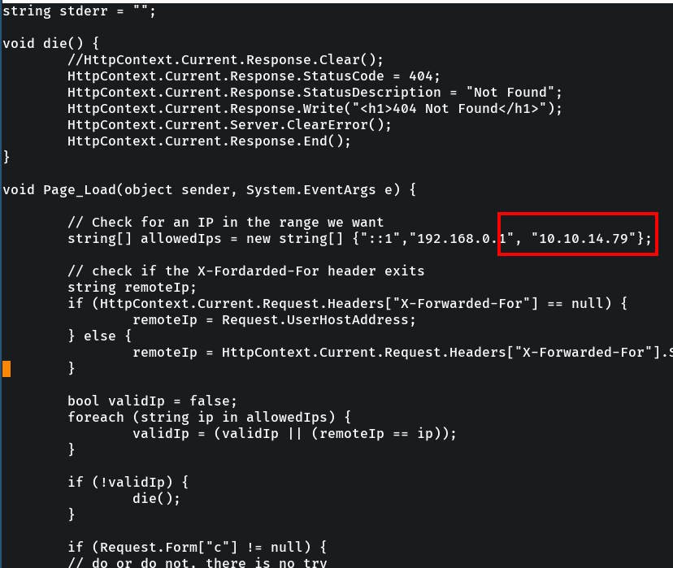

# Laudanum: Injectable Web Exploit Code 

Laudanum is a repository of ready-made files that can be used to inject onto a victim and receive back access via a reverse shell, run commands on the victim host right from the browser, and more. The repo includes injectable files for many different web application languages to include asp, aspx, jsp, php, and more. 

## Installation

Pre-built in Kali.

Download from github repo: [https://github.com/jbarcia/Web-Shells/tree/master/laudanum](https://github.com/jbarcia/Web-Shells/tree/master/laudanum).


## Basic usage

The Laudanum files can be found in the /usr/share/webshells/laudanum directory. For most of the files within Laudanum, you can copy them as-is and place them where you need them on the victim to run. For specific files such as the shells, you must edit the file first to insert your attacking host IP address

```bash
locate laudanum
```

Fist step: Copy the file you want to use from laudanum repo to where you want to use it from:

```shell-session
cp /usr/share/laudanum/aspx/shell.aspx /your/path/laudanum.aspx
# In this case I'm selecting an aspx shell. There are other types.
```

Second step: Modify the shell to use. Add to the whitelisting  rule your ip.




Third step: Upload the file to the web server.

Fourth step: Once uploaded, go to http://webserver//file/laudanum.aspx which is your uploaded file. You will see something like:


Ready to use!