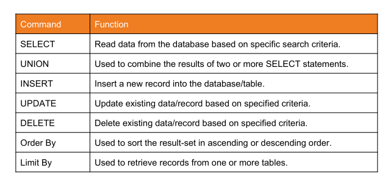
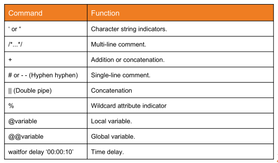

# MySQL

**MySQL**: MySQL is an open-source relational database management system(RDBMS) based on Structured Query Language (SQL). It is developed and managed by oracle corporation and initially released on 23 may, 1995. It is widely being used in many small and large scale industrial applications and capable of handling a large volume of data. After the acquisition of MySQL by Oracle, some issues happened with the usage of the database and hence MariaDB was developed.

By default, MySQL uses `TCP/3306`.

## Authentication Mechanisms

MySQL  supports different authentication methods, such as username and password, as well as Windows authentication (a plugin is required).

`MySQL` default system schemas/databases:

- `mysql` - is the system database that contains tables that store information required by the MySQL server
- `information_schema` - provides access to database metadata
- `performance_schema` - is a feature for monitoring MySQL Server execution at a low level
- `sys` - a set of objects that helps DBAs and developers interpret data collected by the Performance Schema

## Footprinting mysql

```shell-session
sudo nmap $ip -sV -sC -p3306 --script mysql*
```

## Basic commands





Additionally there are two strings that you can use to comment a line in SQL:

- `#` The hash symbol.
- `--`The two dashes followed by a space-

```mysql
# Show datases
SHOW databases;

# Show tables
SHOW tables;

# Create new database
CREATE DATABASE nameofdatabase;

# Delete database
DROP DATABASE nameofdatabase;

# Select a database
USE nameofdatabase;

# Show tablesç
SHOW tables;

# Dump columns from nameOftable
SELECT * FROM NameOfTable;
# SELECT name, description FROM products WHERE id=9;

# Create a table with some columns in the previously selected database
CREATE TABLE person(nombre VARCHAR(255), edad INT, id INT);

# Modify, add, or remove a column attribute of a table
ALTER TABLE persona MODIFY edad VARCHAR(200);
ALTER TABLE persona ADD description VARCHAR(200);
ALTER TABLE persona DROP edad VARCHAR(200);

# Insert a new row with values in a table
INSERT INTO persona VALUES("alvaro", 54, 1);
```


## Basic queries 

```mysql
# Show all columns from table
SELECT * FROM persona

# Select a row from a table filtering by the value of a given column
SELECT * FROM persona WHERE nombre="alvaro";

# JOIN query
SELECT * FROM oficina JOIN persona ON persona.id=oficina.user_id;

# UNION query. This means, for an attack, that the number of columns has to be the same
SELECT * FROM oficina UNION SELECT * from persona;
```


```MySQL
# UNION Statement syntax
#<SELECT statement> UNION <other SELECT statement>;
# Example:
SELECT name, description FROM products WHERE id=9 UNION SELECT price FROM products WHERE id=9;

```


## Enumeration queries 

```mysql
# Show current user
current_user()
user()

# Show current database
database()
```


## Interact with MySQL

### From Linux


```shell-session
mysql -u username -pPassword123 -h $IP
# -h host/ip   
# -u user As default mysql has a root user with no authentication
mysql --host=INSTANCE_IP --user=root --password=thepassword
mysql -h <host/IP> -u root -p<password>
mysql -u root -h <host/IP>
```

### From Windows


```cmd-session
mysql.exe -u username -pPassword123 -h $IP
```


### GUI Application

###  Server Management Studio or SSMS

[SQL Server Management Studio or SSMS](https://docs.microsoft.com/en-us/sql/ssms/download-sql-server-management-studio-ssms)
#### MySQL Workbench

Download from: [https://dev.mysql.com/downloads/workbench/](https://dev.mysql.com/downloads/workbench/).
#### dbeaver 

[dbeaver](https://github.com/dbeaver/dbeaver) is a multi-platform database tool for Linux, macOS, and Windows that supports connecting to multiple database engines such as MSSQL, MySQL, PostgreSQL, among others, making it easy for us, as an attacker, to interact with common database servers.

To install [dbeaver](https://github.com/dbeaver/dbeaver) using a Debian package we can download the release .deb package from [https://github.com/dbeaver/dbeaver/releases](https://github.com/dbeaver/dbeaver/releases) and execute the following command:

```
sudo dpkg -i dbeaver-<version>.deb

# run dbeaver in a second plane
 dbeaver &
```


## Well-know vulnerabilities


### Misconfigurations

Anonymous access enabled.

### Vulnerabilities

`MySQL 5.6.x` servers:  [CVE-2012-2122](https://www.trendmicro.com/vinfo/us/threat-encyclopedia/vulnerability/2383/mysql-database-authentication-bypass) , among others. It allowed us to bypass authentication by repeatedly using the same incorrect password for the given account because the `timing attack` vulnerability existed in the way MySQL handled authentication attempts. In this timing attack, MySQL repeatedly attempts to authenticate to a server and measures the time it takes for the server to respond to each attempt. By measuring the time it takes the server to respond, we can determine when the correct password has been found, even if the server does not indicate success or failure.