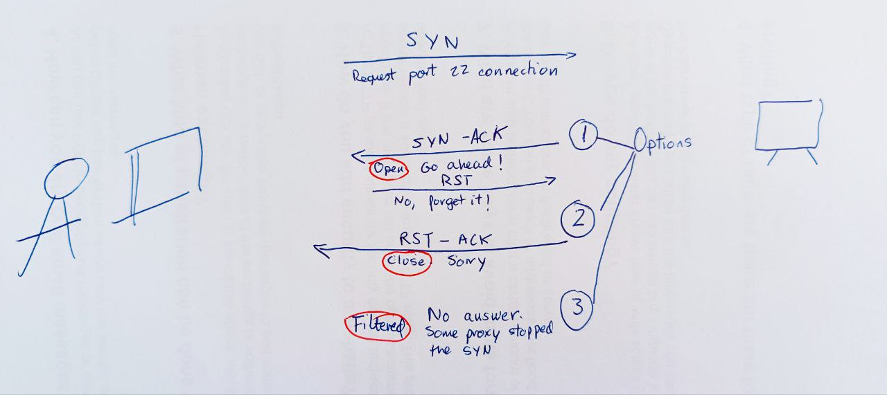
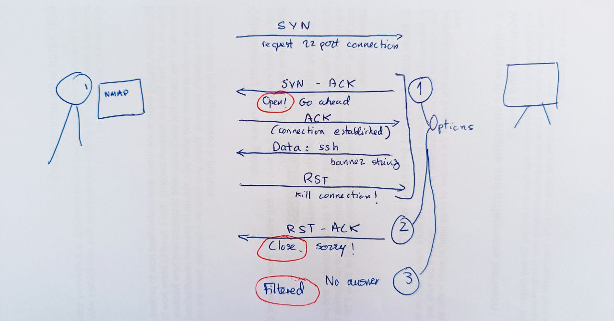
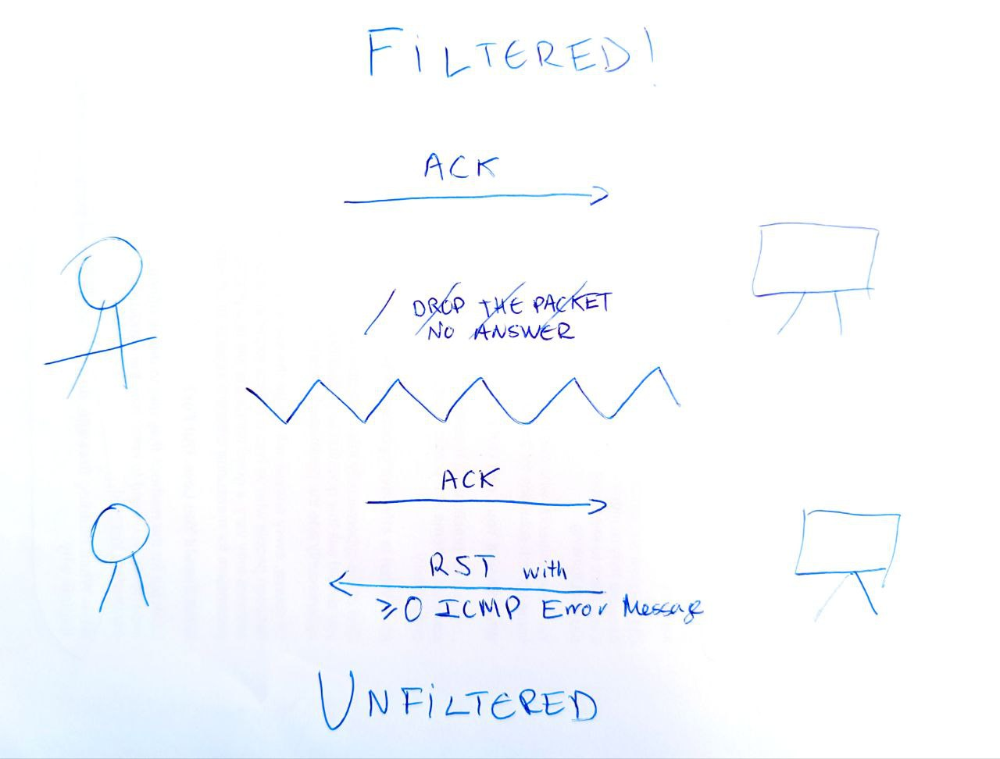
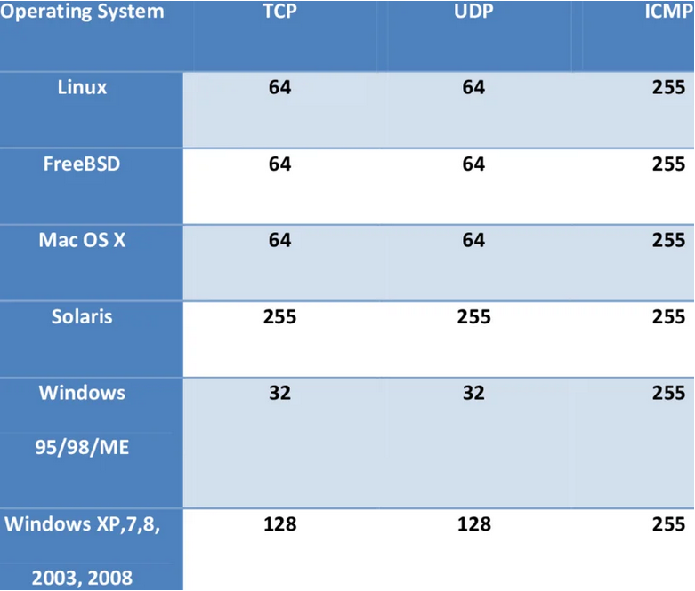

# nmap - A network exploration and security auditing tool

## Description

Network Mapper is an open source tool for network exploration and security auditing. Free and open-source scanner created by Gordon Lyon. Nmap is used to discover hosts and services on a computer network by sending packages and analyzing the responses. Another discovery feature is that of operating system detection. These features are extensible by scripts that provide more advanced service detection.

```shell-session
nmap <scan types> <options> <target>
```


```
# commonly used
nmap -sT -Pn --unprivileged --script banner targetIP

# enumerate ciphers supported by the application server
nmap -sT -p 443 -Pn -unprivilegeds --script ssl-enum-ciphers targetIP

# sync-scan the top 10,000 most well-known ports
nmap -sS $IP --top-ports 10000
```

Worthwhile for understanding how packages are sent and received is the --packet-trace option. Also --reason displays the reason for specific result.


## Cheat Sheet

By default, Nmap will conduct a TCP scan unless specifically requested to perform a UDP scan. 

```bash
nmap 10.0.2.1
nmap 10.0.2.1/24
nmap 10.0.2.1-254
nmap 10.0.*.*
nmap 10.0.2.1,3,17
nmap 10.0.2,4.1,3,17
nmap domain.com
nmap 10.0.2.1 -p 3389
nmap 10.0.2.1 -p 80,3389
nmap 10.0.2.1 -p 50-90
nmap 10.0.2.1 -p U:53, T:80

# It forces port enumeration and it's not limited to 1000 ports
nmap 10.0.2.1 -p-     

# Disables port scanning. If we disable port scan (`-sn`), Nmap automatically ping scan with `ICMP Echo Requests` (`-PE`). Also called ping scan or ping sweep. More reliable that pinging the broadcast address because hosts do not reply to broadcast queries).
nmap -sn 10.0.2.1

# Disables DNS resolution.
nmap -n 10.0.2.1

# Disables ARP ping.
nmap 10.0.2.1 --disable-arp-ping

# This option skips the host discovery stage altogether. It deactivates the ICMP echo requests
nmap  -Pn  10.0.2.1  

# Scans top 100 ports.
nmap  -F  10.0.2.1  

# To skip host discovery and port scan, while still allowing NMAP Scripting Engine to run, we use -Pn -sn combined.
nmap -Pn -sn 10.0.2.1

# OS detection
nmap -O 10.0.2.1 

# Limit OS detection to promising targets
nmap -O 10.0.2.1 -osscan-limit

# Guess OS more aggressively
nmap -O 10.0.2.1 -osscan-guess

# Version detection
nmap -sV 10.0.2.1 

# Intensity level goes from 0 to 9
nmap -sV 10.0.2.1 –version-intensity 8  

# tcpwrapped means that the TCP handshake was completed, 
# but the remote host closed the connection without receiving any data. 
# This means that something is blocking connectivity with the target host. 

# OS detection + version detection + script scanning + traceroute
nmap -A 10.0.2.1

# Half-open scanning. SYN + SYN ACK + RST
# A well-configured IDS will still detect the scan
nmap -sS 10.0.2.1

# TCP connect scan: SYN + SYN ACK + ACK + DATA (banner) +RST
# This scan gets recorded in the application logs on the target systems
nmap -sT 10.0.2.1 

# Scan a list of hosts. One per line in the file
nmap -sn -iL 10.0.2.1 hosttoscanlist.txt 

# List targets to scan
nmap -sL 10.0.2.1  

# Full scanner
nmap -sC -sV -p- 10.0.2.1  
# The script scan `-sC` flag causes `Nmap` to report the server headers `http-server-header` page and the page title `http-title` for any web page hosted on the webserver.


# UDP quick
nmap -sU -sV  10.0.2.1 

# Called ACK scan. Returns if the port is filtered or not. Useful to determine if there is a firewall.
nmap -sA 10.0.2.1 

# It sends a ACK packet. In the response we pay attention to the windows size of the TCP header. If the windows size is different from zero, the port is open. If it is zero, then port is either closed or filtered. 
nmap -sW 10.0.2.1 
```

To redirect results to a file > targetfile.txt


## Search and run a script in nmap

NSE: Nmap Scripting Engine.

```bash
# All scripts are located under:
/usr/share/nmaps/script


locate -r nse$|grep <term>
# if this doesn’t work, update the db with:
sudo updatedb


# Also:
locate scripts/<nameOfservice>
```

Run a script:

```bash
nmap --script <script name> -p<port> <host>

# For instance, a script to grab a banner
nmap -sV --script=banner <target>
```


## Attacking a ssh connection:

```bash
nmap 192.153.213.3 -p 22 --script ssh-brute --script-args userdb=users.txt,passdb=/usr/share/nmap/nselib/data/passwords.lst
```

## To get services in a range

```bash
nmap -sV --script=banner 192.217.70.0/24
```


## Nmap for smb enumeration

```bash
# 1. Search for existing script for smb enumeration
locate -r nse$|grep <term>

# 2. Select smb-enum-shares and run it
nmap -script=smb-enum-shares <target IP>

# 3. Retrieve users
nmap -script=smb-enum-users <target IP>

# 4. Retrieve groups with passwords and user
nmap -script=smb-brute <target IP>

# Interact with the SMB service to extract the reported operating system version
nmap --script smb-os-discovery.nse -p445 <target IP>
```


## Nmap for detecting a WAF

```bash
nmap -p 80 -script http-waf-detect <TARGET> 
```


## Introducing delays

```bash
# While connecting to the service, we noticed that the connection took longer than usual (about 15 seconds). There are some services whose connection speed, or response time, can be configured. Now that we know that an FTP server is running on this port, we can deduce the origin of our "failed" scan. We could confirm this again by specifying the minimum `probe round trip time` (`--min-rtt-timeout`) in Nmap to 15 or 20 seconds and rerunning the scan.
nmap $IP --min-rtt-timeout 15
```


## How nmap works

### Ports


**Open** port:


This indicates that the connection to the scanned port has been established. These connections can be **TCP connections**, **UDP datagrams** as well as **SCTP associations**.

**Filtered** port:


Nmap cannot correctly identify whether the scanned port is open or closed because either no response is returned from the target for the port or we get an error code from the target.


**Close** port:


When the port is shown as closed, the TCP protocol indicates that the packet we received back contains an `RST` flag. This scanning method can also be used to determine if our target is alive or not.


**Unfiltered** port: 

This state of a port only occurs during the **TCP-ACK** scan and means that the port is accessible, but it cannot be determined whether it is open or closed.


**open|filtered ** port:

If we do not get a response for a specific port, Nmap will set it to that state. This indicates that a firewall or packet filter may protect the port.


**closed|filtered** port:

This state only occurs in the **IP ID idle** scans and indicates that it was impossible to determine if the scanned port is closed or filtered by a firewall.


### Probes for HOST discovery

```
TCP SYN probe (-PS <portlist>)
TCP ACK probe (-PA <portlist>)
UDP probe (-PU <portlist>)
ICMP Echo Request/Ping (-PE)
ICMP Timestamp Request (-PP)
ICMP Netmask Request (-PM)
```

List of the most filtered ports:  80, 25, 22, 443, 21, 113, 23, 53, 554, 3389, 1723. These are valuable ping ports.

### Scans

#### -sS (or TCP SYN scan)

By default, `Nmap` scans the top 1000 TCP ports with the SYN scan (`-sS`). This SYN scan is set only to default when we run it as root because of the socket permissions required to create raw TCP packets. Therefore, by default, Nmap performs a SYN Scan, though it substitutes a connect scan if the user does not have proper privileges to send raw packets (requires root access on Unix). Unprivileged users can only execute connect and FTP bounce scans.



- No connection established, but we got our response.
- Technique referred as half-open scanning, because you don't open a full TCP connection.


#### -sT (or TCP Connect scan)

TCP connect scan is the default TCP scan type when SYN scan is not an option (when not running with privileges).  The Nmap [TCP Connect Scan](https://nmap.org/book/scan-methods-connect-scan.html) (-sT) uses the TCP three-way handshake to determine if a specific port on a target host is open or closed. The scan sends an `SYN` packet to the target port and waits for a response. It is considered open if the target port responds with an SYN-ACK packet and closed if it responds with an RST packet.




#### -sN (A NULL scan)

In the SYN message that nmap sends, TCP flag header is set to 0.

If the response is:

- none: the port is open or filtered.
- RST: the port is closed.
- A response saying that it couldn't reach destiny, the port is filtered.


#### -sA (ACK scan)

Returns if the port is filtered or  not. It's useful to detect a firewall.



A variation of the TCP ACK scan is the TCP Windows scan.


#### -sW (TCP Windows scan)

It also sends an ACK packet. In the response we pay attention to the Windows size of the TCP header_

- If the windows size is different from 0, the port is open.
- If the windows size is 0, the port is either close or filtered.

## How To Identify Operating System Using TTL Value And Ping Command

After running:

```shell-session
sudo nmap 10.129.2.18 -sn -oA host -PE --packet-trace --disable-arp-ping 
```

We can get:

```shell-session
Starting Nmap 7.80 ( https://nmap.org ) at 2020-06-15 00:12 CEST
SENT (0.0107s) ICMP [10.10.14.2 > 10.129.2.18 Echo request (type=8/code=0) id=13607 seq=0] IP [ttl=255 id=23541 iplen=28 ]
RCVD (0.0152s) ICMP [10.129.2.18 > 10.10.14.2 Echo reply (type=0/code=0) id=13607 seq=0] IP [ttl=128 id=40622 iplen=28 ]
Nmap scan report for 10.129.2.18
Host is up (0.086s latency).
MAC Address: DE:AD:00:00:BE:EF
Nmap done: 1 IP address (1 host up) scanned in 0.11 seconds
```

You can quickly detect whether a system is running with Linux, or Windows or any other OS by looking at the TTL value from the output of the **`ping`** command. You don't need any extra applications to detect a remote system's OS. The default initial TTL value for **Linux/Unix** is **64**, and TTL value for **Windows** is **128**.




