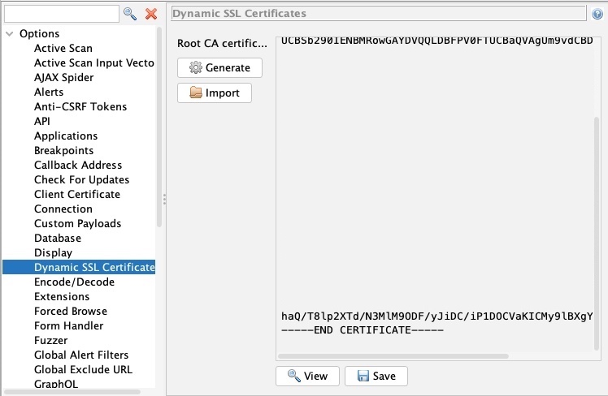

# OWASP zap

To launch it, run:

```bash
zaproxy
```

You can do several things:

+ Run an automatic attack.
+ Import your spec.yml file and run an automatic attack.
+ Run a manual attack. 

The manual explore option will allow you to perform authenticated scanning. Set the URL to your target, make sure the HUD is enabled, and choose "Launch Browser". 

### How to run a manual attack

Select "Continue to your target". On the right-hand side of the HUD, you can set the Attack Mode to On. This will begin scanning and performing authenticated testing of the target. Now you  perform all the actions (sign up a new user, log  in into the account, modify you avatar, post a comment...).

After that, OWASP Zap allows you to narrow the results to your target. How? In the Sites module, right click on your site and select "Include in context". After that, click on the icon shaped as a "target" to filter out sites by context. 

With the results, start your analysis and remove false-negative vulnerabilities.
 

### Certificate installation 
To get ZAP's certificate, we can go to (`Tools>Options>Dynamic SSL Certificate`), then click on `Save`. We can also change our certificate by generating a new one with the `Generate` button.



We can install them within Firefox by browsing to [about:preferences#privacy](about:preferences#privacy), scrolling to the bottom, and clicking `View Certificates`. After that, we can select the `Authorities` tab, and then click on `import`, and select the downloaded CA certificate.

### Intercept requests

In ZAP, interception is off by default, as shown by the green button on the top bar (green indicates that requests can pass and not be intercepted). We can click on this button to turn the Request Interception on or off, or we can use the shortcut [`CTRL+B`] to toggle it on or off:


### Interesting addons

Update all your addons when opening ZAP for the first time.


- Treetools
- Reflect
- Revisit
- Directory List v.2.3
- Wappalyzer
- Python Scripting
- Passive scanner rules
- FileUpload
- Regular Expression tester.


