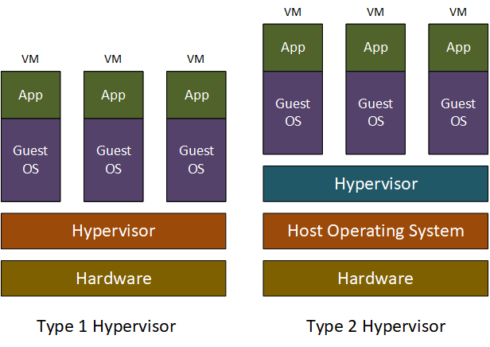

# Pentesting cloud

## Enumerate instances

[insp3ctor](https://github.com/brianwarehime/inSp3ctor): the AWS bucket finder.

## Basic concepts

### Blob storage

Blob storage is a type of cloud storage for unstructured data. A "blob," which is short for **Binary Large Object**, is a mass of data in binary form that does not necessarily conform to any file format. Blob storage keeps these masses of data in non-hierarchical storage areas called data lakes.

[Blobs](https://azure.microsoft.com/en-us/services/storage/blobs/) are Microsoft’s unstructured data storage objects. Most frequently, we’re seeing them used for serving static public data, but we have found blobs being used to store sensitive information (config files, database backups, credentials). Given that Google is indexing about 1.2 million PDFs from the Azure “blob.core.windows.net” subdomain, I think there’s pretty decent surface area here. 

### Cap Ex vs OpEx

CapEx is Capital expenditure, meaning you have to consider it a upfront cost (you have to buy the thing).
OpEx is Operational expenditure, meaning that is a cost that have an ongoing monthly/daily/annually/... fee. 

### Cloud Computing

Acconding to NIST (National Institute of Standards and Technology), 

### Colocation Centre

**A colocation centre** or "colo" is a data center location where the owner of the facility rents out space to external customers. They provide power, cooling and physical security and the customer will put the equipment.

### ETL

ETL, which stands for extract, transform and load, is a data integration process that combines data from multiple data sources into a single, consistent data store that is loaded into a data warehouse or other target system.

### Hypervisor's types

**Type 1** or Bare Metal Hypervisor run directly on the system hardware:

- VMrare ESXi (part of the vSphere suite)  Vm VCenter - Advanced Server Management software
- Microsoft Hyper-V
- Red Hat KVM
- Oracle VM Server
- Citrix XenServer

**Type 2 Hypervisors** run on top of a host operating system:

- VMware Workstation, Player, and Fusion
- VirtualBox
- QEMU
- Parallels

### SLA

A cloud SLA (cloud service-level agreement) is **an agreement between a cloud service provider and a customer that ensures a minimum level of service is maintained**.

### Vm VCenter

Processor Sockets = Running CPUs
Cores per socket = Cores per CPU

### Tenancy

Tenancy in cloud computing refers to **the sharing of computing resources in a private or public environment that is isolated from other users and kept secret**. Tenancy in SaaS is divided into two types: single-tenant SaaS and multi-tenant SaaS.