# Pentesting Thick client Applications


Thick clients applications  are the applications that are run as standalone applications on the desktop.  Thick clients have two attack surfaces:

- Static. 
- Dynamic.

They are quite different from web services in the sense that thick applications, most of the tasks are performed at the client end, so these apps heavily depend on client's system resources like CPU, RAM or memory, for instance.

They are usually written in these languages:

- .NET
- C/C++
- Java applets etc
- Native android / IOS mobile applications: Obtictive C, swift 
- and more

They are considered old, but still might be found in some organizations.


Some decompilation tools

+ C++ decompilation: [https://ghidra-sre.org](https://ghidra-sre.org "https://ghidra-sre.org/")
+ JetBrains dotPeek


## Basic Architecture

- 1-Tier Architecture: It's a standalone application.
- 2-Tier Architecture: EXE/web-based launcher / java-based app + database. Business logic will be in the application. The app directly communicates to the database server. Thinhs to consider when pentesting:  login or registering feature, DB connection, strings, TLS/SSL, Register keys. 
- 3-Tier Architecture: EXE + server + database. Business logic can be move to the server so security findings will be less common. These apps don't have proxy settings in them so for sending traffic to a proxy server, some changes need to be done in the system host file.

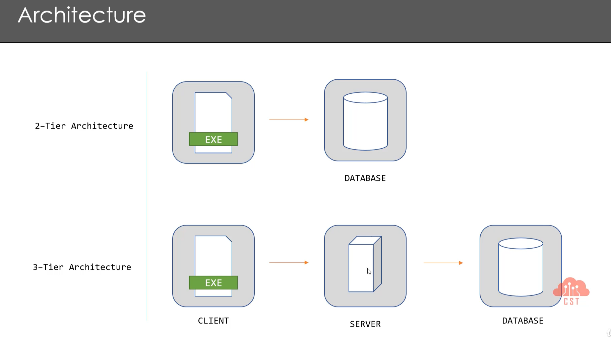


## Basic Lab setup


In my case, I'm using a Windows 11 machine. Downloaded from [https://developer.microsoft.com/en-us/windows/downloads/virtual-machines/](https://developer.microsoft.com/en-us/windows/downloads/virtual-machines/)

**1.** Open your windows machine in virtual box and install : 

- SQL Server Express 2008. SQLEXPR_x64_ENU.exe downloaded from: [Download Microsoft® SQL Server® 2008 R2 SP2 - Express Edition from Official Microsoft Download Center](https://www.microsoft.com/en-US/download/details.aspx?id=30438)


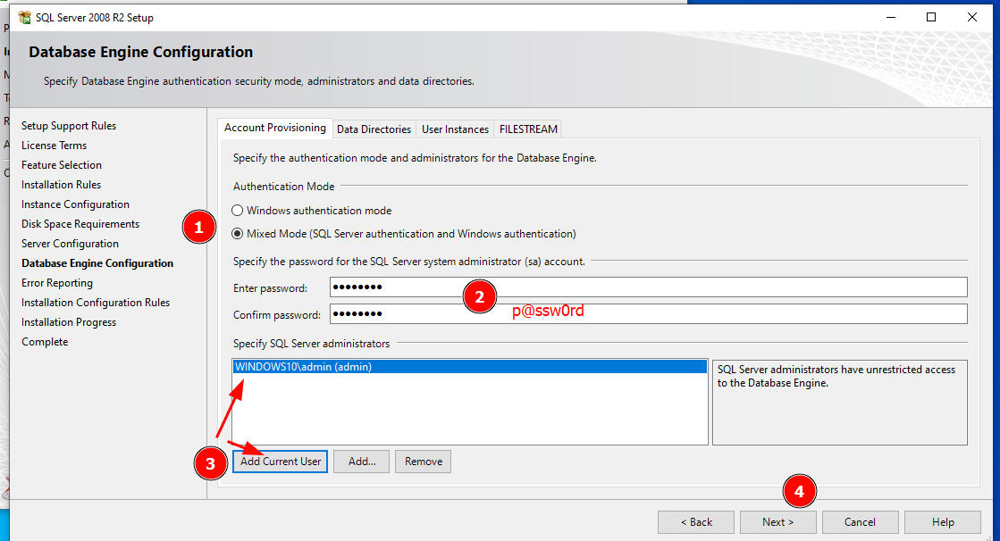

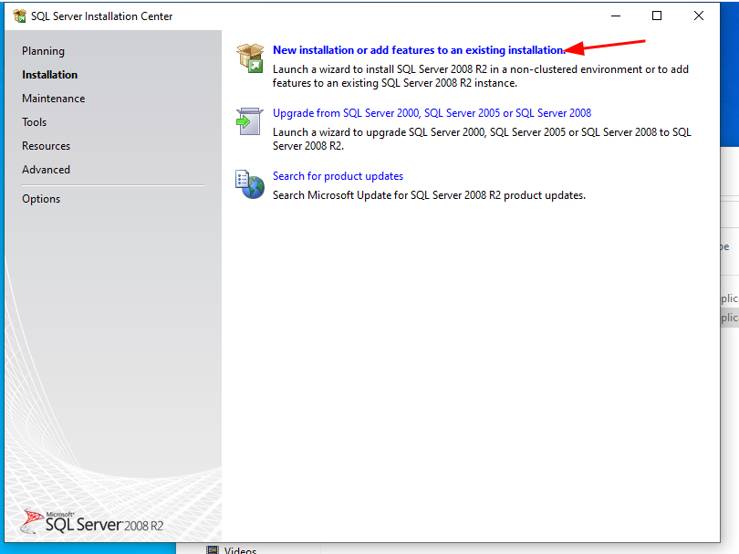


- SQL Server Management Studio 19.0.1, downloaded from [Download SQL Server Management Studio (SSMS) - SQL Server Management Studio (SSMS) | Microsoft Learn](https://learn.microsoft.com/en-us/sql/ssms/download-sql-server-management-studio-ssms?view=sql-server-ver16#download-ssms)

- Filezilla FTP Server.
- Damn Vulnerable Thick Client Application (DVTA).


**2.** Open SSMS (SQL Server Management Studio) and right click on the "Database" object, and create a new database called DVTA.


**3.**  Create a new table "users" in the database DVTA.

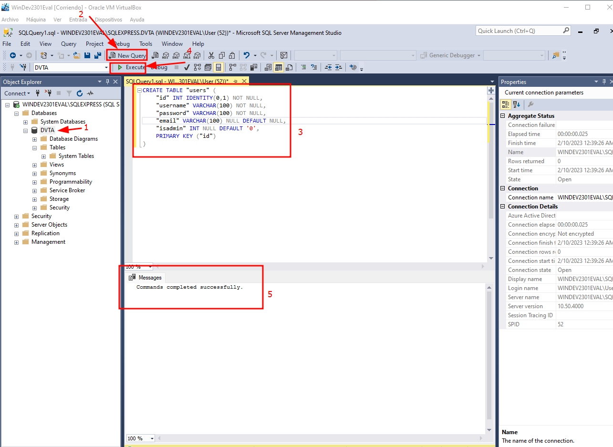

Here is the query:

```
CREATE TABLE "users" (
    "id" INT IDENTITY(0,1) NOT NULL,
    "username" VARCHAR(100) NOT NULL,
    "password" VARCHAR(100) NOT NULL,
    "email" VARCHAR(100) NULL DEFAULT NULL,
    "isadmin" INT NULL DEFAULT '0',
    PRIMARY KEY ("id")
)
```

**4**. Populate the database with 3 given users:


Here is the query:

```
INSERT INTO dbo.users (username, password, email, isadmin)
VALUES
('admin','admin123','admin@damnvulnerablethickclientapp.com',1),
('rebecca','rebecca','rebecca@test.com',0),
('raymond','raymond','raymond@test.com',0);
```

**5.**  Create the  table "expenses" in the database DVTA.


Here is the query:

```
CREATE TABLE "expenses" (
    "id" INT IDENTITY(0,1) NOT NULL,
    "email" VARCHAR(100) NOT NULL,
    "item" VARCHAR(100) NOT NULL,
    "price" VARCHAR(100) NOT NULL,
    "date" VARCHAR(100) NOT NULL,
    "time" VARCHAR(100) NULL DEFAULT NULL,
    PRIMARY KEY ("id")
)
```

**6.** Open  SQL Server Configuration Manager and enable TCP/IP Protocol conections:

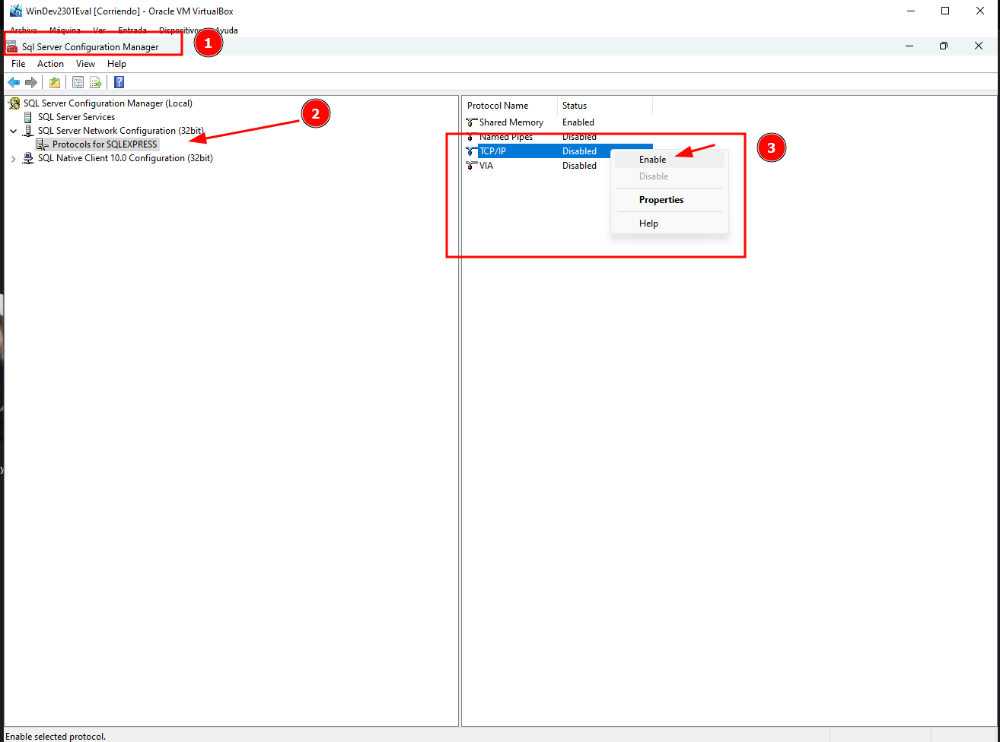

**7**. Also in SQL Server Configuration Manager, restart SQL Server (SQLEXPRESS)


**8.** Download Filezilla Server, install it and initiate a connection.
In my case, I downloaded it from: [Download FileZilla Server for Windows (64bit x86) (filezilla-project.org)](https://filezilla-project.org/download.php?type=server)
As for the conection initiation, I'm using localhost 127.0.0.1, port 14148 and password "filezilla": 


**9.** Add a user. Name "dvta" and password "p@ssw0rd"


**10.** Add a Shared folder. Be careful with slashes and backslashes (wink!) not to get the typical error "error on row number 1 virtual path must be absolute".

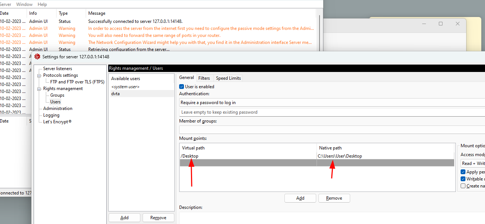


##  First challenge

setting up the server in the vulnerable app (DVTA)

If we launch the vulnerable app, DVTA, we will check that the button labelled as "Configure Server" is not enable. We will use the tool  [dnspy](dnspy.md)  to enable that button.


How is it done?

**1.** We will use dnspy 32 bit version, since dvta is a 32 bit app. Open the version 32 bit of dnspy, and go to FILE  > Open > [Select de DVTA.exe file] and you will see it in the sidebar of dnspy:


**2.** Expand DVTA, go to the decompiled object that is being used in the login and read the code. You will see the function isserverConfigured(). Also in the opening tooltip you can read that this function is receiving a BOOLEAN value. 
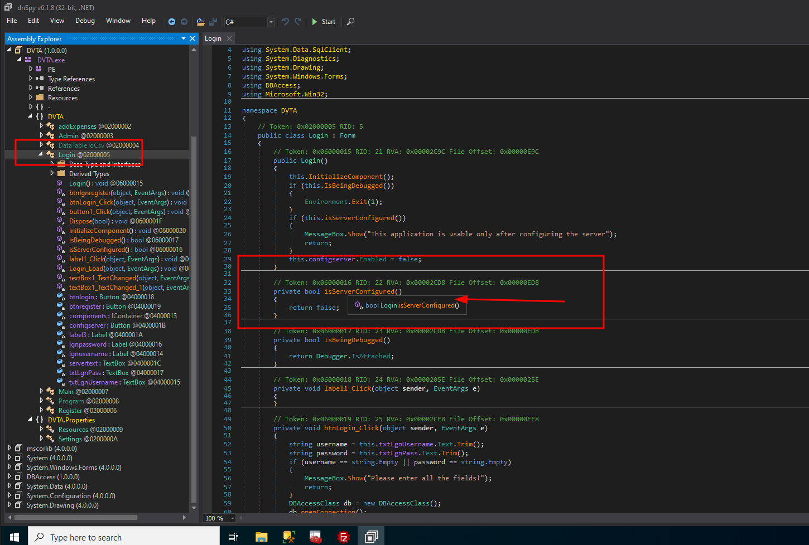

**3.** Edit the function in IL instructions


**4.**  Modify the value of the boolean in the IL instruction 


**5.** Save the module
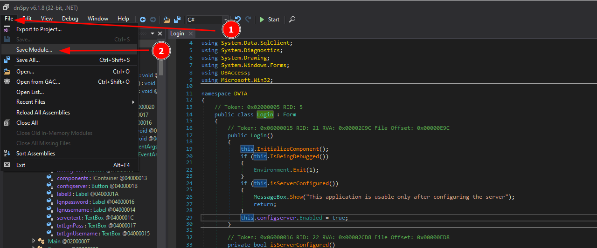

**6.** Now when you open the DVTA application the button will be enabled and we will be able to setup the server. Our server is going to be that one of the database that we just configure for our application (127.0.0.1)


If we browse the configuration file (DVTA.exe.Config) we will see that the configuration has taken place:
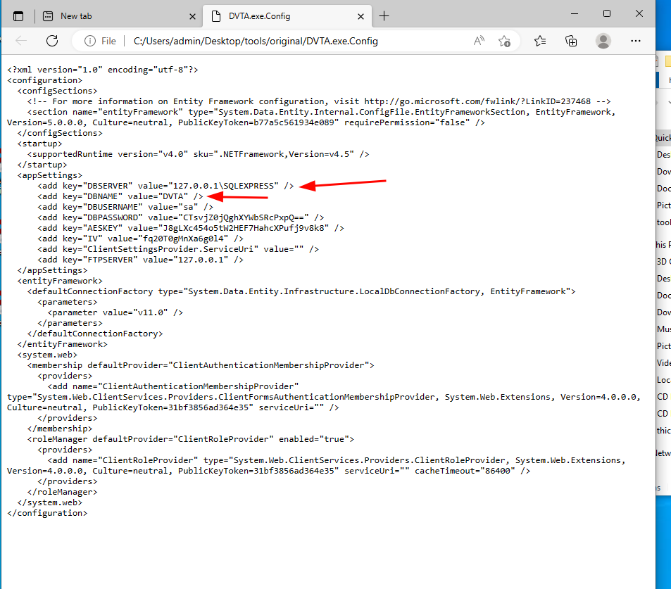


## Information gathering phase

- [ ] Understand the functionality of the application.
- [ ] Architecture diagram from the client.
- [ ] Network communications in the app.
- [ ] Files that are being accessed by the client.
- [ ] Interesting files within the application directory.

Tools:  [CFF explorer](cff-explorer.md), [wireshark], and [sysInternalsSuite](sys-internals-suite.md).


**1.** Install [CFF explorer](cff-explorer.md), [wireshark], and [sysInternalsSuite](sys-internals-suite.md).

**2.** Which IP addresses is the app communicating with. For that you can use TCP View from [sysInternalsSuite](sys-internals-suite.md).


We can also use wireshark

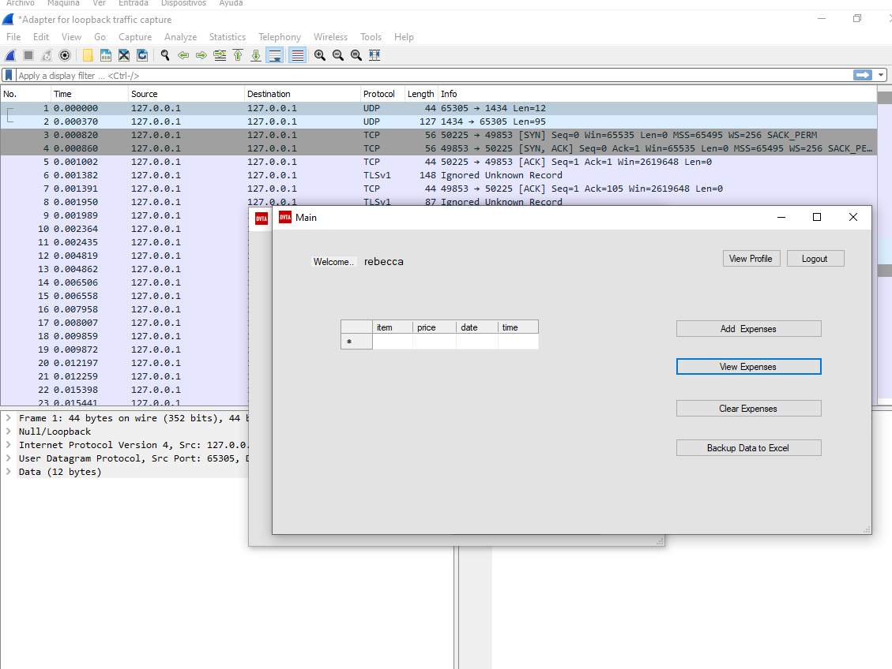


**3.** Which language is the app build in. And which tool was used. Open the app with CFF  Explorer.


**4.** Using ProcessMonitor tool from [SysInternalsSuite](sys-internals-suite.md)  to see changes in the file system.

For instance, you can analyze the access to interesting files in the application directory. Now we have this information:


```
<add key="DBSERVER" value="127.0.0.1\SQLEXPRESS" />
<add key="DBNAME" value="DVTA" />
<add key="DBUSERNAME" value="sa" />
<add key="DBPASSWORD" value="CTsvjZ0jQghXYWbSRcPxpQ==" />
<add key="AESKEY" value="J8gLXc454o5tW2HEF7HahcXPufj9v8k8" />
<add key="IV" value="fq20T0gMnXa6g0l4" />
<add key="ClientSettingsProvider.ServiceUri" value="" />
<add key="FTPSERVER" value="127.0.0.1" />
```

**5.** Using ProccessMonitor from [SysInternalsSuite](sys-internals-suite.md)  to locate credentials and information stored in the key registers.
And for that, after cleaning all the processes in ProcMon (ProcessMonitor app), you close the application and reopen it. If the session is still there, it means that the session is saved somewhere. In this case the session is saved in the registry keys.
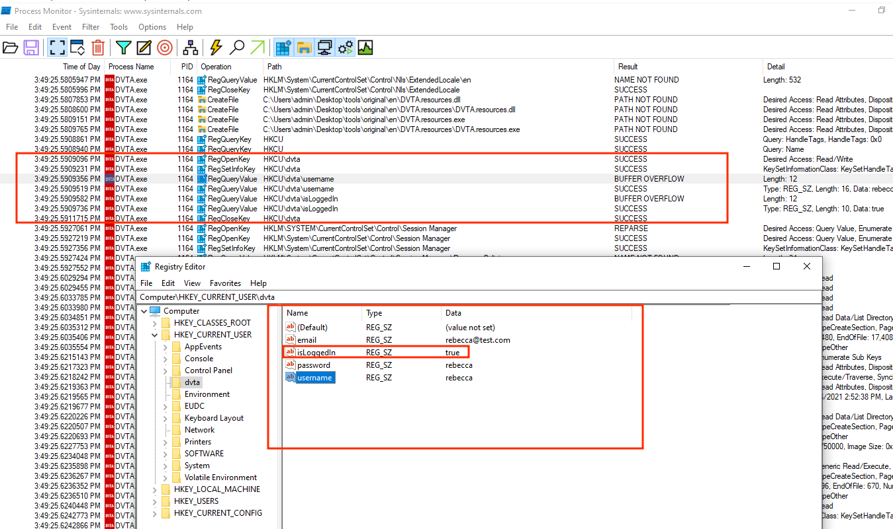

Interesting thing here is the Registry Key "isLoggedIn". We could try to modify the boolean value of that registry to bypass login.

Also, check these other tools and resources:

- [WinSpy](winspy.md).
- [Window Detective](https://windowdetective.sourceforge.net/index.html)
- [netspi.com](https://www.netspi.com/blog/technical/thick-application-penetration-testing/introduction-to-hacking-thick-clients-part-2-the-network/?_gl=1*2wn9s0*_ga*MTQ0NjMzNTMxNi4xNjc1Mjc0ODU3*_ga_BVEZXBBWG7*MTY3NTI3NzMyMS4yLjAuMTY3NTI3NzMzOS40Mi4wLjA).


## Traffic analysis

Used tools: 

- Burp Suite
- Wireshark
- Echo Mirage 
- [mitm_relay](mitm-relay.md) + [BurpSuite](burpsuite.md).

Difficult part here is when the thick app is not using http/https protocol. In that case, BurpSuite alone is out of consideration and we will need to use:

- wireshark, it's ok if we just want to monitor. 
- [Echo mirage](echo-mirage.md), very old and not maintained.
- [mitm_relay](mitm-relay.md) + [BurpSuite](burpsuite.md).

### Traffic monitoring with wireshark

**1.** We make sure  that port 21 is listening in the Filezilla Server.


And we start the capture with Wireshark. We will open DVTA with admin credentials and we will click on "Back up Data to the FTP Server". If we filter the capture in wireshark leaving only FTP traffic we will be able to retrieve user and password in plain text:

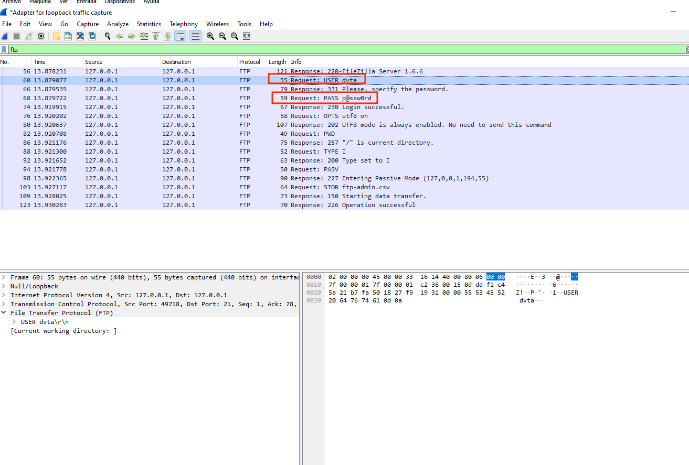


### Traffic monitoring with Echo mirage

**1.** Open Echo Mirage and add a rule to intercept all inbound and outbound traffic in port 21.

**2.**  In TAB "Process" > Inject, and select the application.
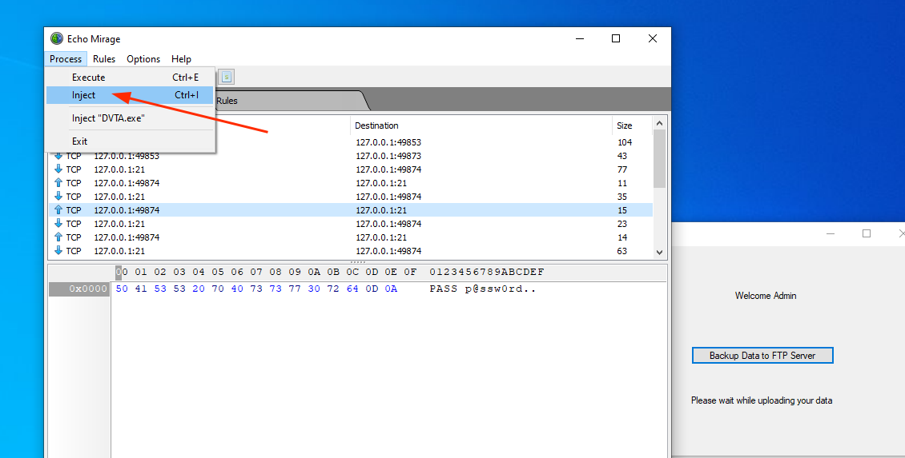

**3.** In the vulnerable app DVTA login as admin and click on action "Backup Data to FTP Server". Now in Echo Mirage you will be intercepting the traffic. This way we can capture USER and PASSWORD:

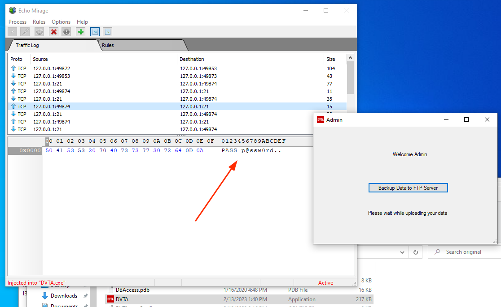

Also, modifying the payload you will be tampering the request.

### Traffic monitoring with mitm_relay

In DVTA we will configure the server to the IP of the local machine. In my lab set up my IP was 10.0.2.15.

In FTP, we will configure the listening port to 2111. Also we will disable IP check for this lab setup to work.

From [https://github.com/jrmdev/mitm_relay](https://github.com/jrmdev/mitm_relay):


This is what we're doing:


**1.** DVTA application sends traffic to port 21, so to intercept it we configure MITM_relay to be listening on port 21.

**2.** mitm_relay encapsulates the application traffic )no matter the protocol, into HTTP protocol so BurpSuite can read it

**3.** Burp Suite will read the traffic. And we can tamper here our code.

**4.** mitm_relay will "unfunnel" the traffic from the HTPP protocol into the raw one

**5.** In a lab setup FTP server will be in the same network, so to not get in conflict with mitm_relay we will modify FTP listen port to 2111. In real life this change is not necessary


Running mitm_relay:

```
python mitm_relay.py -l 0.0.0.0 -r tcp:21:10.0.2.15:2111 -p 127.0.0.1:8080
# -l listening address for mitm_relay (0.0.0.0 means we all listening in all interfaces)
# -r relay configuration: <protocol>:<listeningPort>:<IPofDestinationserver>:<listeningPortonDestinationServer>
# -p Proxy configuration: <IPofProxy>:<portOfProxy> 
```


And this is how the interception looks like:


Also from [https://github.com/jrmdev/mitm_relay](https://github.com/jrmdev/mitm_relay):


## Attacking thick clients applications: Data storage issues


| issue | tool |
| ---- | ----|
| Developer often stores hardcode sensitive details in thick clients. | strings from [sysInternalsSuite](sys-internals-suite.md) |
| Also sensitive data in registry is a common issue. | Regshot | 


### Hard Coded credentials

#### strings

Strings comes in  [sysInternalsSuite](sys-internals-suite.md). It's similar to the command "strings" in bash. It displays all the human readable strings in a binary:

```
strings.exe C:\Users\admin\Desktop\tools\original\DVTA.exe > C:\Users\admin\Desktop\strings.txt
```


#### dnspy

We know the FTP conection is done in the Admin screen, so we open the application with dnspy and we locate the button in the Admin screen that calls the FTP conection. Credentials for the conection can be there:


### Storing sensitive data in Registry entries 

#### regshot


**1.**  Run  regshot version according to your thick-app (84 or 64 v).

**2.** Click on "First shot". It will make a "shot" of the existing registry entries.

**3.** Open the app you want to test and login into it.

**4.** Perform some kind of action, like for instance, viewing the profile.

**5.** Take a "Second shot" of the Registry entries.

**6.** After that, you will see the button "Compare" enabled. Click on it.


An HTM file will be generated and you will see the registry entries:


An interesting registry is "isLoggedIn", that has change from false to true. This may be a potential vector of attack (we could set it to true and also change username to admin). 

```
HKU\S-1-5-21-1067632574-3426529128-2637205584-1000\dvta\isLoggedIn: "false"  
HKU\S-1-5-21-1067632574-3426529128-2637205584-1000\dvta\isLoggedIn: "true"
```


### Database conection strings in memory

When doing a conection to database, that string that does it may be: 
- in clear text 
- or enclypted.

If encrypted, it 's still possible to find it in memory. If we can dump the memory of the process we should be able to find the clear text conection string  in memory. 

#### Process Hacker tool

Download from: https://processhacker.sourceforge.io/downloads.php

We will be using the portable version.

**1.** Open the application you want to test.

**2.** Open Process Hacker Tool.

**3.** Select the application, click right on "Properties".

**4.** Select tab "Memory".

**5.** Click on "Strings".


**6.** Check "Image" and "Mapped" and search!


**7**. In the results you can use the Filter option to search for (in this case) "data source". 


Other possible searches: Decrypt.
Clear text conection string in memory reveals credentials: powned!!!

#### How to connect to a database after getting the credentials

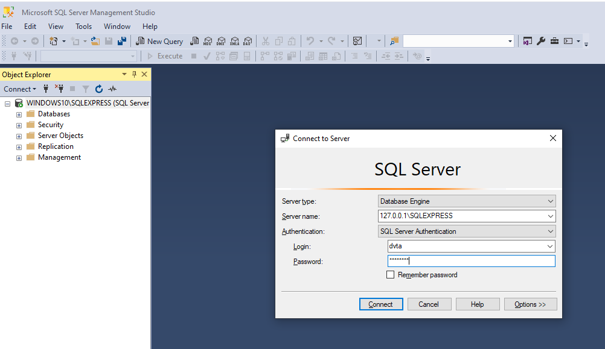


### SQL injection

If input is not sanitize, when login into an app we could deceive the logic of the request to the database:

```SQL
select * from users username='x' and password='x';
```

In the DVTA app, we could try to do this:

```sql
select * from users username='x' or 'x'='x' and password='' or 'x'='x';
```


For that we only need to enter this into the login page:

```
x' or 'x'='x
```


And now we are ... raymond!!!


### Side channel data leaks

Application logs are an example of side channel data leaks. Developers offen use logs for debugging purposes during development. 

**Where can you find those files?**

For example in Console logs. Open the command prompt and run the vulnerable thick application this way:

```
dvta.exe > C:/Users/admin/Desktop
```

### Unreliable logs

### DLL Hijacking


## Reversing and patching thick clients applications


