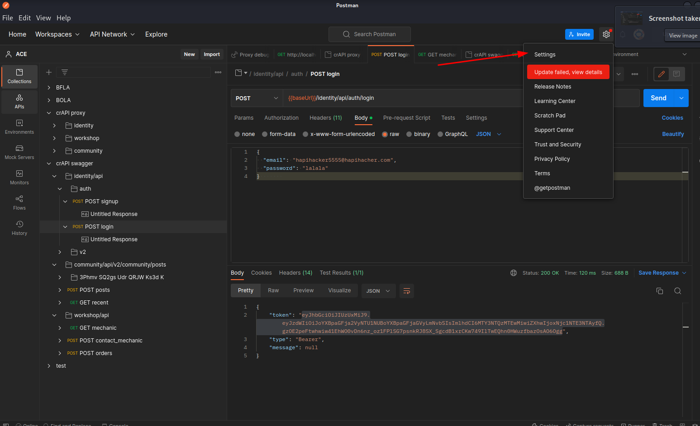
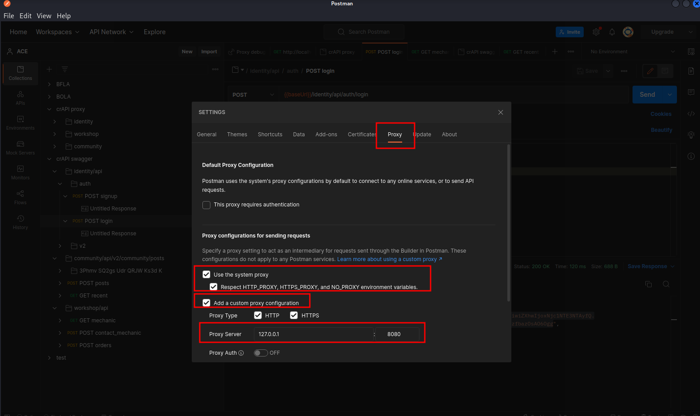
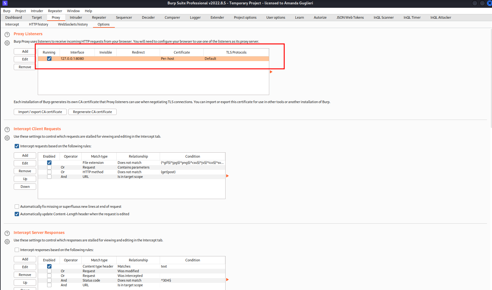
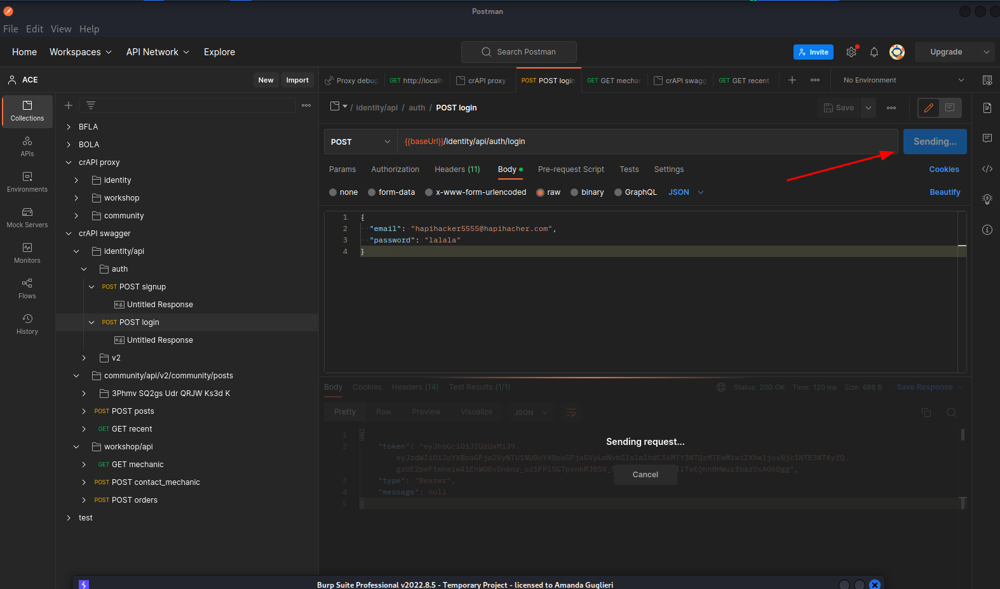
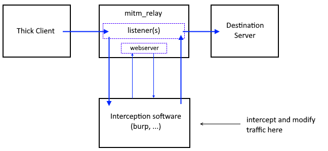
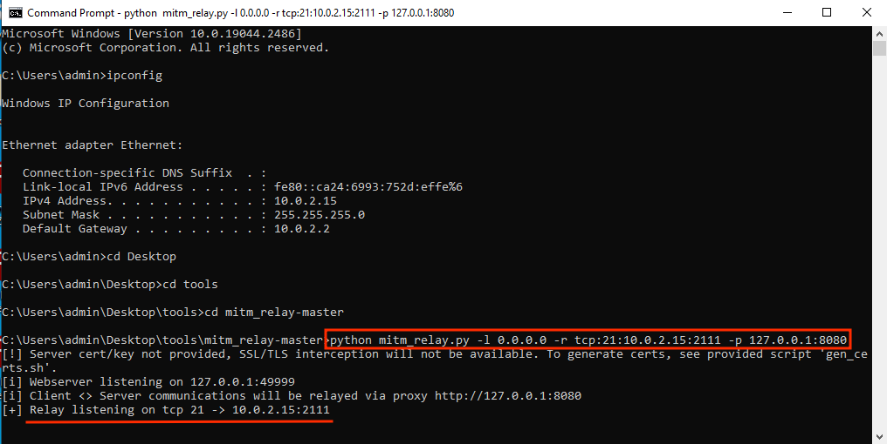
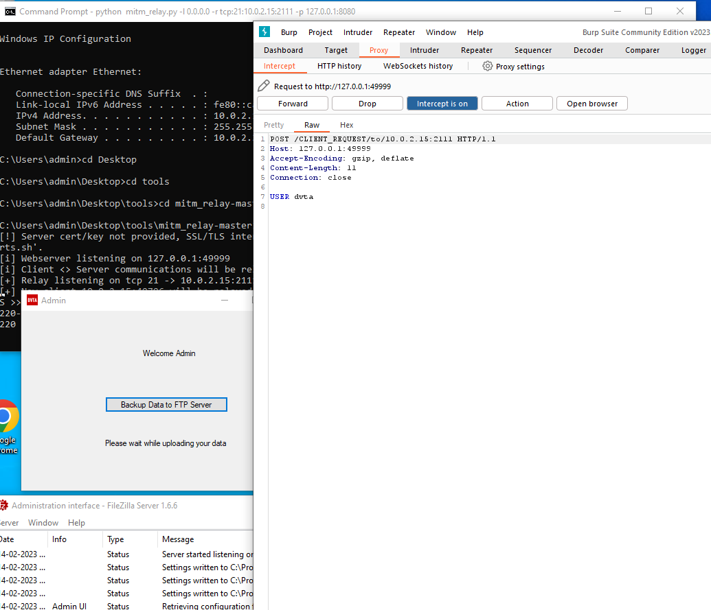
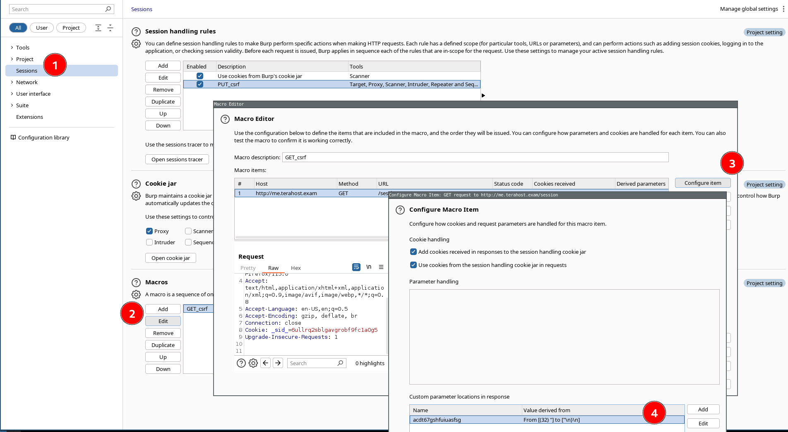
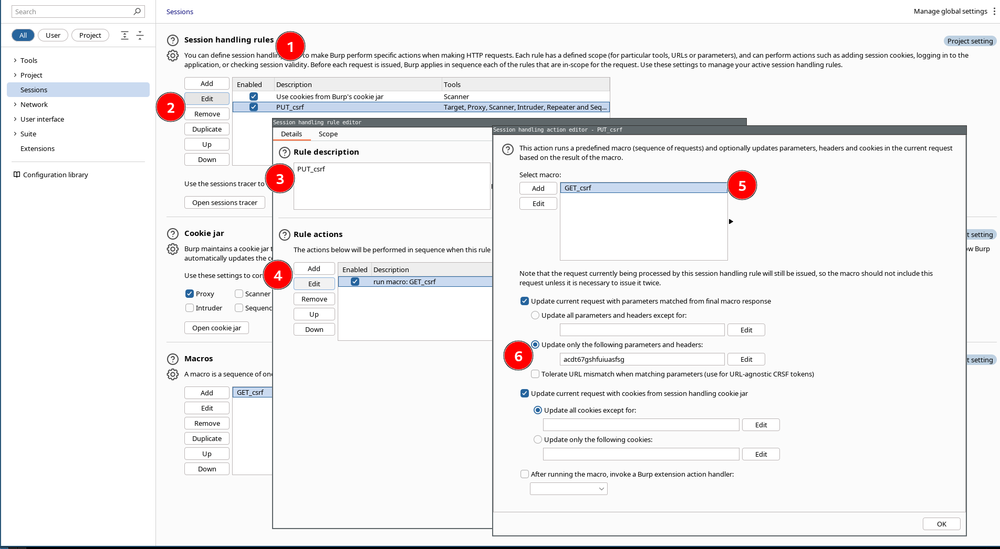

# Proxies

A proxy is when a device or service sits in the middle of a connection and acts as a mediator.

- HTTP Proxies: BurpSuite
-  Postman, mitm_relay
- SOCKS/SSH Proxy (for pivoting): Chisel, ptunnel, sshuttle.

There are many types of proxy services, but the key ones are:

- Dedicated Proxy` / `Forward Proxy: The Forward Proxy, is what most people imagine a proxy to be. A Forward Proxy is when a client makes a request to a computer, and that computer carries out the request. For example, in a corporate network, sensitive computers may not have direct access to the Internet. To access a website, they must go through a proxy (or web filter).
- Reverse Proxy: As you may have guessed, a reverse proxy, is the reverse of a Forward Proxy. Instead of being designed to filter outgoing requests, it filters incoming ones. The most common goal with a Reverse Proxy, is to listen on an address and forward it to a closed-off network. Many organizations use CloudFlare as they have a robust network that can withstand most DDOS Attacks.
- Transparent Proxy


## Setting up Postman with BurpSuite

1 - Postman > Settings 



2 - Proxy tab. Check: 

- Use the system proxy
- Add a custom proxy configuration 
- HTTP 
- HTTPS 
- 127.0.0.1
- 8080



3 -  BurpSuite. Settup proxy listener



4 - Burp Suite. Intercept mode on


5 - Postman. Send the interesting request from your collection



6 - Your BurpSuite will intercept that traffic. Now you can send it to Intruder, Repeater, Sequencer...


## Setting up mitm_relay with Burpsuite

In DVTA we will configure the server to the IP of the local machine. In my lab set up my IP was 10.0.2.15.

In FTP, we will configure the listening port to 2111. Also we will disable IP check for this lab setup to work.

From [https://github.com/jrmdev/mitm_relay](https://github.com/jrmdev/mitm_relay):




This is what we're doing:


**1.** DVTA application sends traffic to port 21, so to intercept it we configure MITM_relay to be listening on port 21.

**2.** mitm_relay encapsulates the application traffic )no matter the protocol, into HTTP protocol so BurpSuite can read it

**3.** Burp Suite will read the traffic. And we can tamper here our code.

**4.** mitm_relay will "unfunnel" the traffic from the HTPP protocol into the raw one

**5.** In a lab setup FTP server will be in the same network, so to not get in conflict with mitm_relay we will modify FTP listen port to 2111. In real life this change is not necessary


Running mitm_relay:

```
python mitm_relay.py -l 0.0.0.0 -r tcp:21:10.0.2.15:2111 -p 127.0.0.1:8080
# -l listening address for mitm_relay (0.0.0.0 means we all listening in all interfaces)
# -r relay configuration: <protocol>:<listeningPort>:<IPofDestinationserver>:<listeningPortonDestinationServer>
# -p Proxy configuration: <IPofProxy>:<portOfProxy> 
```



And this is how the interception looks like:




##  Burpsuite +  sqlmap


### From Burpsuite

Browse the application to capture the generating csfr request in your traffic.



Open Settings, go to tab Session and scroll down to the section Macros. 

Click on "Add" (a macro.) You will see the already captured requests. 

Select the request in which the csrt is created/refreshed (and still not used) and click on OK.

Name your macro in the window "Macro Editor," for instance GET_csrf, and select "Configure item". 

Now you indicate to Burpsuite where the value of the CSRF is shown in the response. Don't forget to add the name of the parameter. Click on OK.

Click on OK in the window "Macro editor".



You are again in the Setting>Sessions section. Macro section is at the bottom of the page. Now we are going to configure the section "Session handling rules":

Click on "Add" (a rule,) and the "Session handling rule editor" will open.

- In Rule description write: PUT_CSRF
- In Rule actions, click on "Add > Run a macro." 
- New window will open for defining the action performed by the macro:
	- Select the macro GET_csrf.
	- Select the option "Update only the following parameter," and add in there the name we used before when defining where the token was, "csrf."
	- In the top menu, select the tab "Scope," and add the url within scope. 
	- IMPORTANT: In Tools Scope, select the module "Proxy." This will allow  sqlmap request to be routed.


### From Sqlmap

Create a file that contains the request that is vulnerable to SQLi and save it.

Then:

```
sqlmap -r request.txt -p id --proxy=http://localhost:8080 --current-db --flush sessions -vv 
```

Important: Flag --proxy sends the request via Burpsuite.

For Blind injections you need to specify other parameters such as risk and level.
