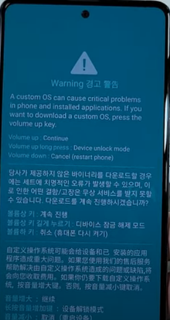
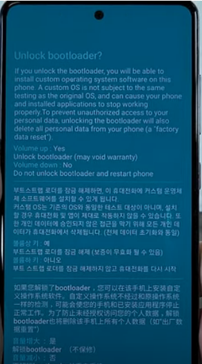
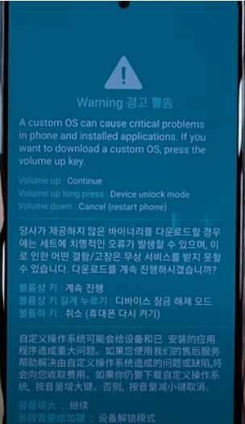
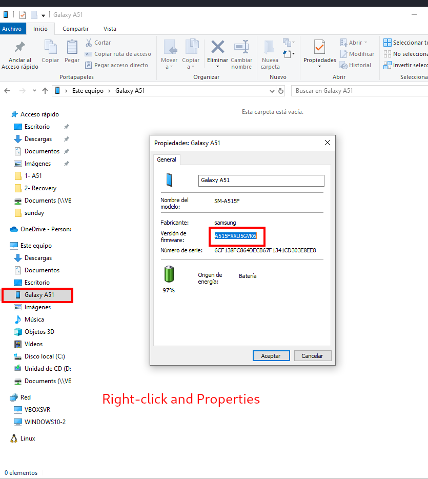
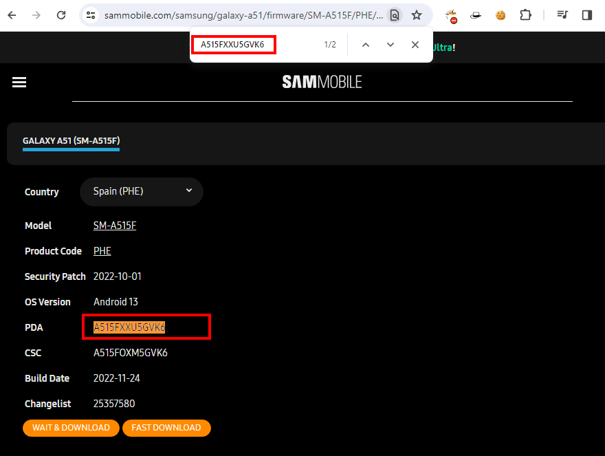
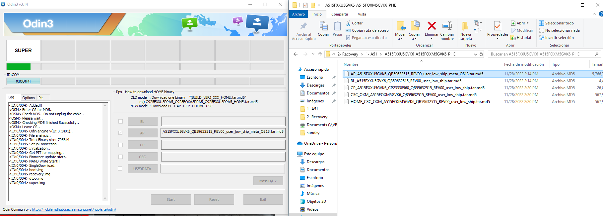
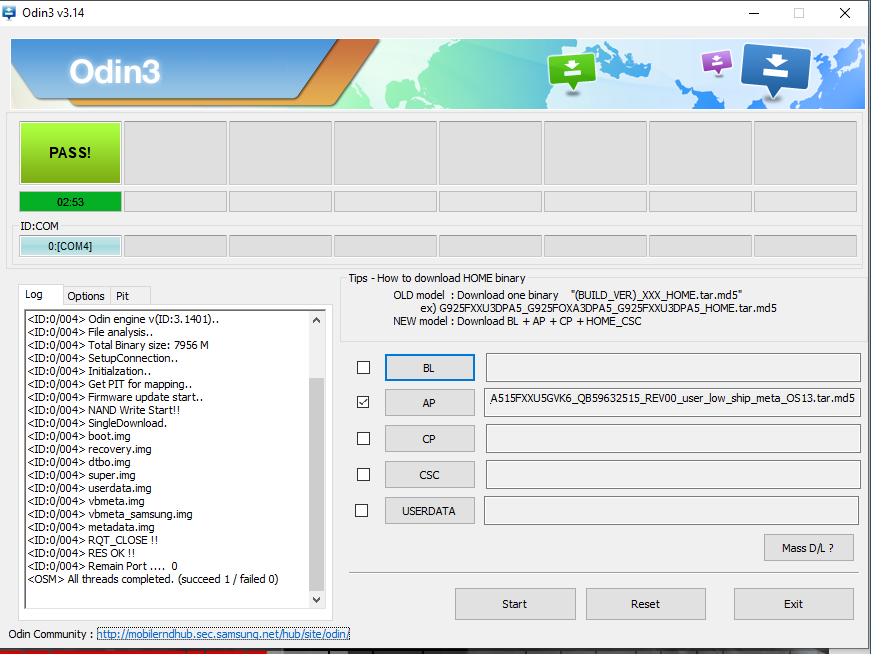

## Samsung Galaxy A515F


## Install a Windows 10 VM in your phisical kali machine

1. Install a Windows10 VM in your preferred hyper XXX technology.

2. Virtualize your USB in the windows machine: VirtualBox > Settings (on the desired VM) > USB > Make sure usb 3 is selected > click on + icon and select device. 


Troubleshooting: You may find that your android phone does not appear there yet. The reason behind might be that the user responsible for the virtualbox process has no permissions to access the USB mounted devices. We will add it in our phisical machine (kali):

```
sudo usermod -a -G vboxusers $username
newgrp vboxusers

# and reboot kali
```

After that, replay step 2 and we should see the device.


## Install Samsung drivers in your Windows VM

There is this video with assistance for this: [https://www.youtube.com/watch?v=K3Jk7dCvdNM](https://www.youtube.com/watch?v=K3Jk7dCvdNM).

This is the download link for getting those drivers: [https://developer.samsung.com/android-usb-driver](https://developer.samsung.com/android-usb-driver).

And try to install [Samsung Dex](https://www.samsung.com/latin/apps/samsung-dex/). I could not, but since I have the drivers installed, this was optional.

## Backup your mobile

Because we are going to go to fabric resetting

## Enable developers mode in your device

Go to Settings > About the phone > Software  Information > and tap I don't know how many times on "Build Number" (5?). Eventually you will see a message with a countdown number to enable "Developer mode".

## Enable Debug mode

Go to Settings > Developer options (now these are enabled) > Debug mode ---set to on

## Set OEM unlocking to ON

Go to Settings > Developer options (now these are enabled) > OEM unlocking  ---set to on


## Get into Download mode and unblock the Bootloader

Turn off your android phone completely. But completely.

Press volume up and press volume down both at the same time and keep it press. Connect at the same time the USB-C cable to your device (and to your computer) and you will see a Warning screen. When you see it, you can stop pressing the up-down volume buttons. 



Now, long press Volume up button and you will see this message (stop pressing when you see it):



The following two steps are:

Press volume up once, and you will see a black screen. When the screens turns into black press quickly volume up and down at the same time once. With that Bootloader will be unblocked.

Now we will enter in the Download mode, 



only by pressing once on the volume up button.

Leave the device and go to your windows.


## Flash the device from the windows VM

Firstable, you will need to make sure that you have the proper firmware file. For that open the properties of your device and see the firmware version:




This, alone with your mobile model, will be useful for finding the firmware. 



Download it to your windows VM and unzip it.

Open Odin. 

Make sure the device appears.

Go to Options tab and disable "Auto Reboot". In AP, select the file and have fun, the process may take a while:




Click on Start and wait until you see the PASS message:




Be careful not to disconnect the USB-C cable.

## Enter in Recovery mode 

Go back to your Android Device and long press the 3 buttons (volume Up - Volume Down - and Power) at the same time.

When the screen turns into black, remove the pressing only from the Volume Down until the logo of Samsung appears. From that point we need to count to three and then remove the pressing only from the Power button and keep pressing Volume Up.

...

>Troubleshooting: Aparently, I did not do it correctly and got stuck in the situation in which, my phone was is download mode displaying RMM/KG State: Prenormal. So my phone had no OEM unlocking enable option and could not be rooted. The solution:  https://www.youtube.com/watch?v=TBUY05mnCP8

Odin3 v3.14.4 : [https://dl2018.sammobile.com/Odin.zipDriver](https://dl2018.sammobile.com/Odin.zipDriver) 

de Samsung : [https://developer.samsung.com/android-usb-driver](https://developer.samsung.com/android-usb-driver) 

TWRP : [https://forum.xda-developers.com/t/recovery-unofficial-teamwin-recovery-project-v3-6-2-android-11-12.4400869/Magisk](https://forum.xda-developers.com/t/recovery-unofficial-teamwin-recovery-project-v3-6-2-android-11-12.4400869/Magisk) : [https://github.com/topjohnwu/Magisk](https://github.com/topjohnwu/Magisk) 

MultiDisabler : [https://forum.xda-developers.com/t/pie-10-11-system-as-root-multidisabler-disables-encryption-vaultkeeper-auto-flash-of-stock-recovery-proca-wsm-cass-etc.3919714/](https://forum.xda-developers.com/t/pie-10-11-system-as-root-multidisabler-disables-encryption-vaultkeeper-auto-flash-of-stock-recovery-proca-wsm-cass-etc.3919714/)


Samsung health
Samsung Gear
Samsung Safe folder
-enable


Rooting a device will allow us to:

- install custom rom based on One UI, pure android and ROM gsi and android generic images 
- modify in device app that requires root access

Also we will loose some Samsung features.
Samsung ... path
Samsung health
Samsung Gear
Samsung Safe folder
Guarantee

But some of these features  (Samsung health, Samsung Gear, Samsung Safe) x1may be recovered with a custom ROM


How to enable USB in virtualbox:
https://www.techrepublic.com/article/how-to-enable-usb-in-virtualbox/