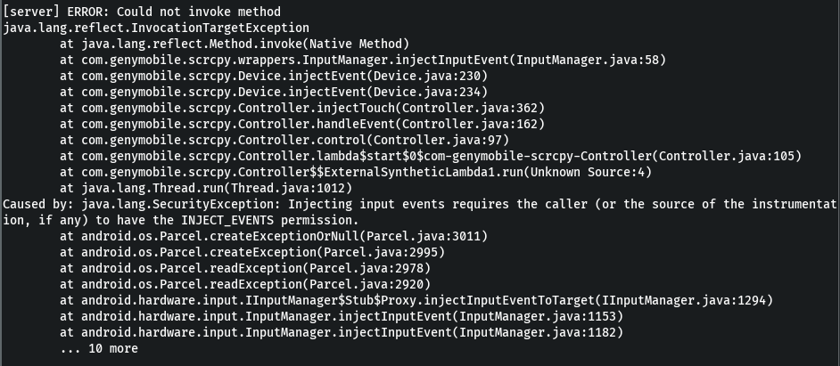

## Installation

Download from: [https://github.com/Genymobile/scrcpy](https://github.com/Genymobile/scrcpy).

### On Linux

Source: [https://github.com/Genymobile/scrcpy/blob/master/doc/linux.md](https://github.com/Genymobile/scrcpy/blob/master/doc/linux.md)

First, you need to install the required packages:

```shell
# for Debian/Ubuntu
sudo apt install ffmpeg libsdl2-2.0-0 adb wget \
                 gcc git pkg-config meson ninja-build libsdl2-dev \
                 libavcodec-dev libavdevice-dev libavformat-dev libavutil-dev \
                 libswresample-dev libusb-1.0-0 libusb-1.0-0-dev
```

Then clone the repo and execute the installation script ([source](https://github.com/Genymobile/scrcpy/blob/master/install_release.sh)):

```shell
git clone https://github.com/Genymobile/scrcpy
cd scrcpy
./install_release.sh
```

When a new release is out, update the repo and reinstall:

```shell
git pull
./install_release.sh
```

To uninstall:

```shell
sudo ninja -Cbuild-auto uninstall
```

_Note that this simplified process only works for released versions (it downloads a prebuilt server binary), so for example you can't use it for testing the development branch (`dev`)._

## Basic usage

```
scrcpy
```


## Debugging

For scrcpy to work, there must be an [adb connection](android-debug-bridge.md), which requires:

- Having developer mode enabled.
- Having USB debug mode enabled.

And there’s an extra security restriction on Xiaomi Miui devices, which prevents USB debugging assigning permissions by default:

> **USB debugging (Security settings)**  
> _Allow granting permissions and simulating input via USB debugging_

This may require to sign in into a Xiaomi account (or sign up if you have no account.)

Otherwise you will obtain messages such as 


