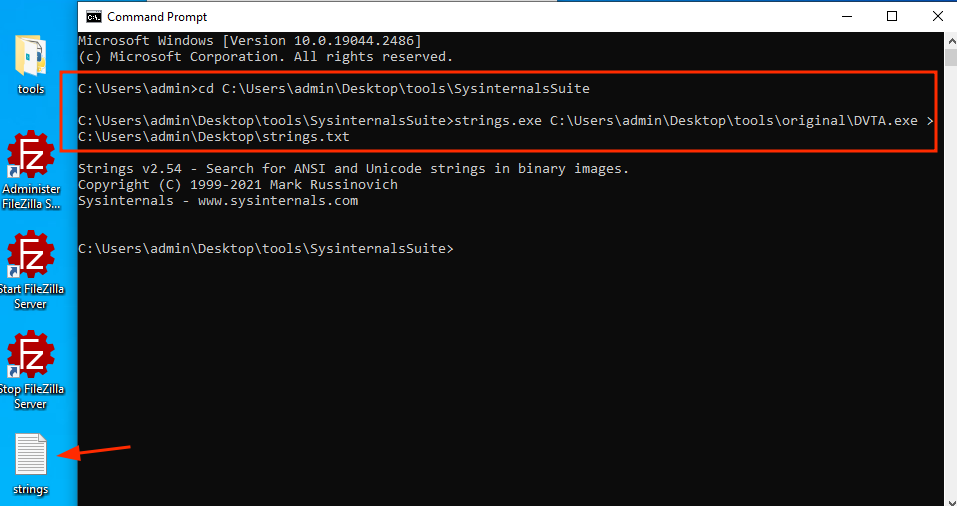
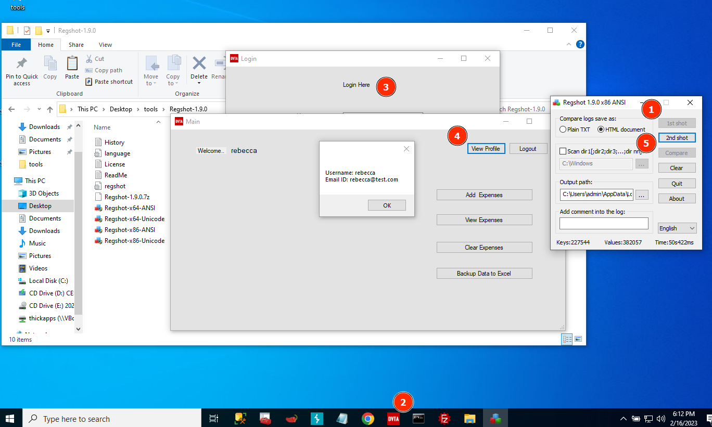
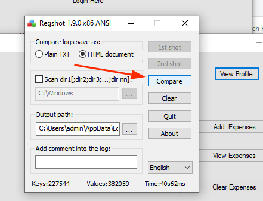
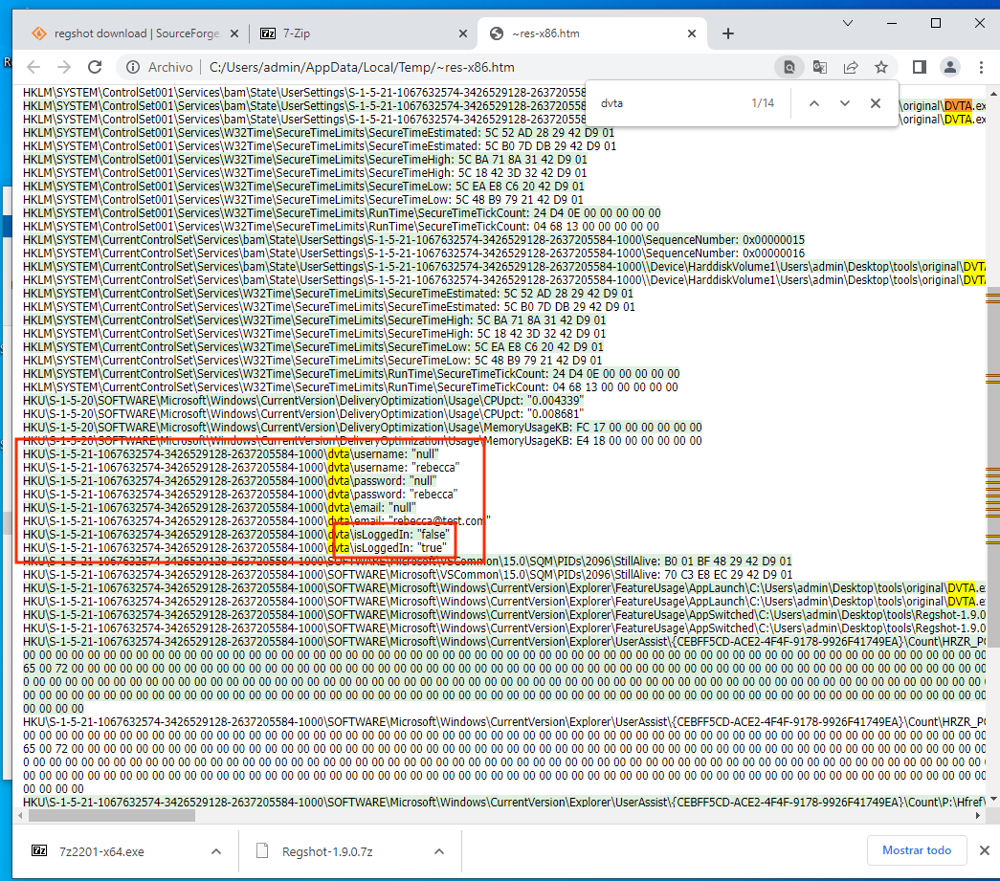
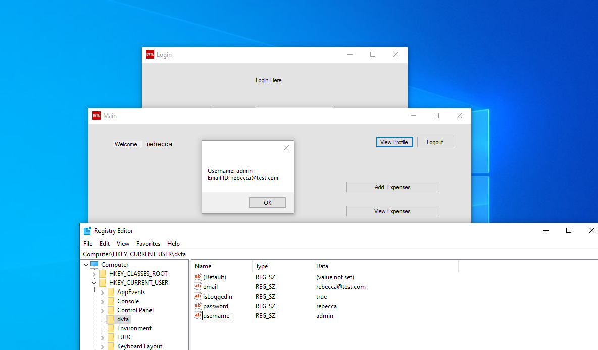
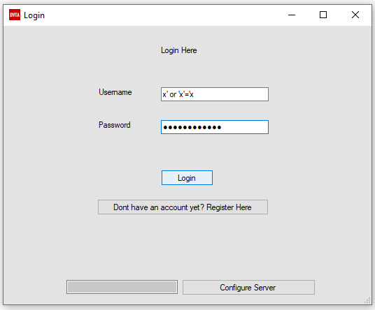
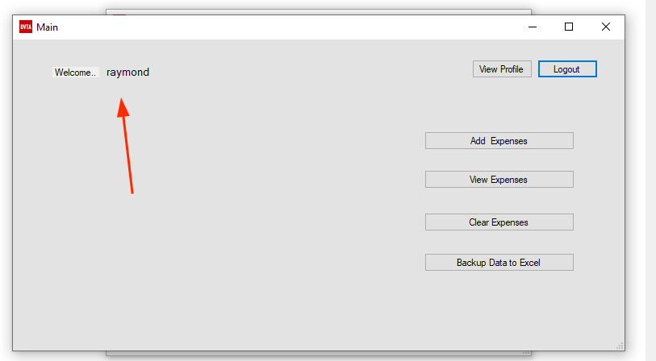

# Attacking thick clients applications: Data storage issues

??? abstract "General index of the course"
    - [Introduction](tca-introduction.md)
    - [Basic lab setup](tca-basic-lab-setup.md)
    - [First challenge: enabling a button](tca-first-challenge.md)
    - [Information gathering phase](tca-information-gathering-phase.md).
    - [Traffic analysis](tca-traffic-analysis.md).
    - [Attacking thick clients applications](tca-attacking-thick-clients-applications.md).
    - [Reversing and patching thick clients applications](tca-reversing-and-patching.md)


| issue | tool |
| ---- | ----|
| Developer often stores hardcode sensitive details in thick clients. | strings from [sysInternalsSuite](../sys-internals-suite.md) |
| Also sensitive data in registry is a common issue. | [Regshot](../regshot.md) | 


## Hard Coded credentials

### strings

Strings comes in  [sysInternalsSuite](../sys-internals-suite.md). It's similar to the command "strings" in bash. It displays all the human readable strings in a binary:

```
strings.exe C:\Users\admin\Desktop\tools\original\DVTA.exe > C:\Users\admin\Desktop\strings.txt
```



### dnspy

We know the FTP conection is done in the Admin screen, so we open the application with dnspy and we locate the button in the Admin screen that calls the FTP conection. Credentials for the conection can be there:


## Storing sensitive data in Registry entries 

### regshot


**1.**  Run  regshot version according to your thick-app (84 or 64 v).

**2.** Click on "First shot". It will make a "shot" of the existing registry entries.

**3.** Open the app you want to test and login into it.

**4.** Perform some kind of action, like for instance, viewing the profile.

**5.** Take a "Second shot" of the Registry entries.

**6.** After that, you will see the button "Compare" enabled. Click on it.






An HTM file will be generated and you will see the registry entries:



An interesting registry is "isLoggedIn", that has change from false to true. This may be a potential vector of attack (we could set it to true and also change username to admin). 

```
HKU\S-1-5-21-1067632574-3426529128-2637205584-1000\dvta\isLoggedIn: "false"  
HKU\S-1-5-21-1067632574-3426529128-2637205584-1000\dvta\isLoggedIn: "true"
```




## Database conection strings in memory

When doing a conection to database, that string that does it may be: 
- in clear text 
- or enclypted.

If encrypted, it 's still possible to find it in memory. If we can dump the memory of the process we should be able to find the clear text conection string  in memory. 

#### Process Hacker tool

Download from: https://processhacker.sourceforge.io/downloads.php

We will be using the portable version.

**1.** Open the application you want to test.

**2.** Open Process Hacker Tool.

**3.** Select the application, click right on "Properties".

**4.** Select tab "Memory".

**5.** Click on "Strings".


**6.** Check "Image" and "Mapped" and search!


**7**. In the results you can use the Filter option to search for (in this case) "data source". 


Other possible searches: Decrypt.
Clear text conection string in memory reveals credentials: powned!!!

#### How to connect to a database after getting the credentials


## SQL injection

If input is not sanitize, when login into an app we could deceive the logic of the request to the database:

```SQL
select * from users username='x' and password='x';
```

In the DVTA app, we could try to do this:

```sql
select * from users username='x' or 'x'='x' and password='' or 'x'='x';
```


For that we only need to enter this into the login page:

```
x' or 'x'='x
```




And now we are ... raymond!!!




## Side channel data leaks

Application logs are an example of side channel data leaks. Developers offen use logs for debugging purposes during development. 

**Where can you find those files?**

For example in Console logs. Open the command prompt and run the vulnerable thick application this way:

```
dvta.exe > C:/Users/admin/Desktop
```

## Unreliable logs

## DLL Hijacking

