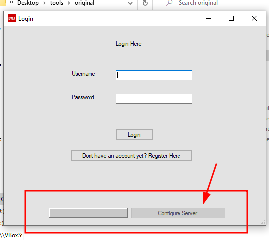
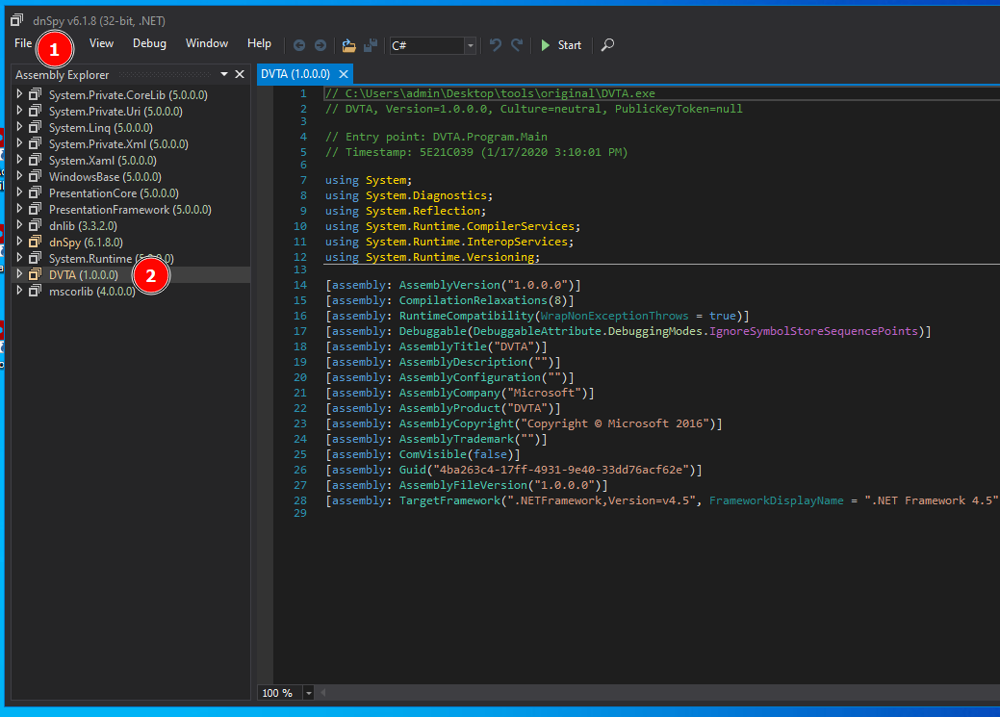
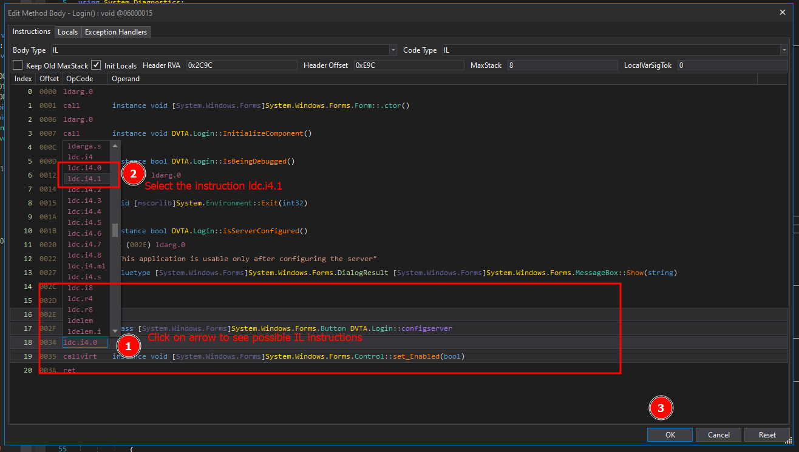
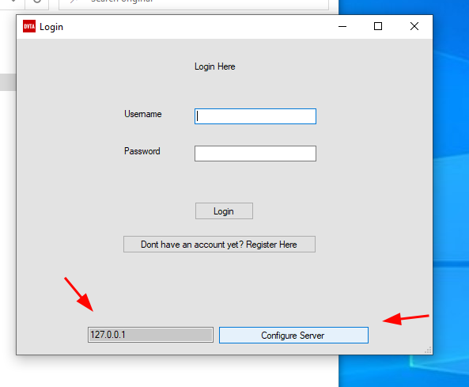
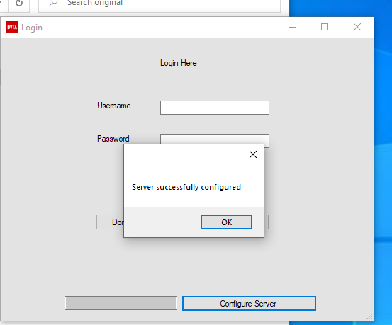

# First challenge: enabling a button

??? abstract "Open to see the general index of the course"
    - [Introduction](tca-introduction.md)
    - [Basic lab setup](tca-basic-lab-setup.md)
    - [First challenge: enabling a button](tca-first-challenge.md)
    - [Information gathering phase](tca-information-gathering-phase.md).
    - [Traffic analysis](tca-traffic-analysis.md).
    - [Attacking thick clients applications](tca-attacking-thick-clients-applications.md).
    - [Reversing and patching thick clients applications](tca-reversing-and-patching.md)

One thing is still missing after the [Basic lab setup](tca-basic-lab-setup.md): launching the application and making sure that it works. If we proceed, sooner than later we will see that one thing is left to be done before starting to use DVTA app: **Setting up the server in the vulnerable app (DVTA)**.

## The problem: a button is not working

If we launch the vulnerable app, DVTA, we will check that the button labelled as "Configure Server" is not enable. We will use the tool  [dnspy](../dnspy.md)  to enable that button.

## Using dnspy to see and modify compiled code

**1.** We will use dnspy 32 bit version, since dvta is a 32 bit app. Open the version 32 bit of dnspy, and go to FILE  > Open > [Select de DVTA.exe file] and you will see it in the sidebar of dnspy:

**2.** Expand DVTA, go to the decompiled object that is being used in the login and read the code. You will see the function isserverConfigured(). Also in the opening tooltip you can read that this function is receiving a BOOLEAN value. 

**3.** Edit the function in IL instructions

**4.**  Modify the value of the boolean in the IL instruction.

**5.** Save the module.

**6.** Now when you open the DVTA application the button will be enabled and we will be able to setup the server. Our server is going to be that one of the database that we just configure for our application (127.0.0.1).

## Making sure that it works

If we browse the configuration file (DVTA.exe.Config) we will see that the configuration has taken place:

