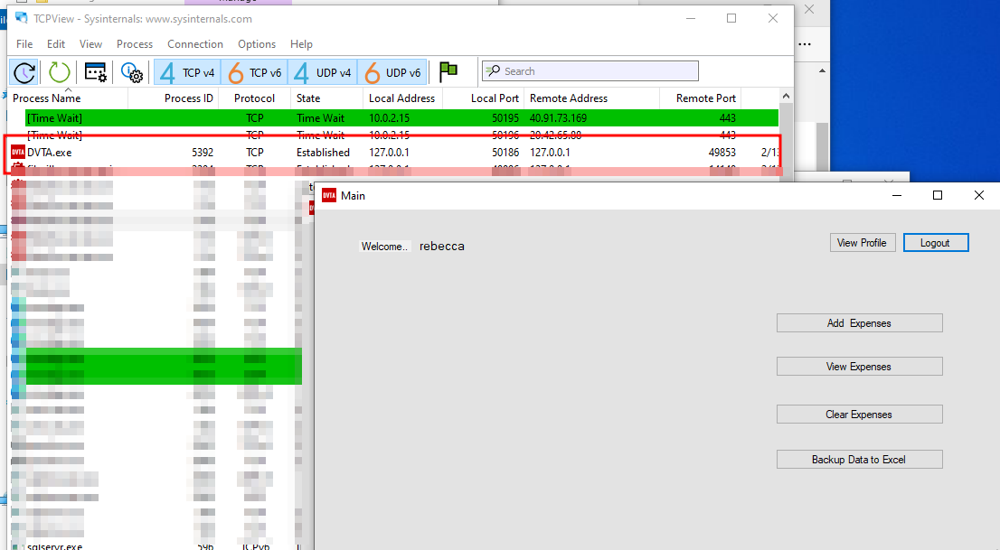

# Information gathering phase - Thick client Applications 

??? abstract "General index of the course"
    - [Introduction](tca-introduction.md)
    - [Basic lab setup](tca-basic-lab-setup.md)
    - [First challenge: enabling a button](tca-first-challenge.md)
    - [Information gathering phase](tca-information-gathering-phase.md).
    - [Traffic analysis](tca-traffic-analysis.md).
    - [Attacking thick clients applications](tca-attacking-thick-clients-applications.md).
    - [Reversing and patching thick clients applications](tca-reversing-and-patching.md)


- [ ] Understand the functionality of the application.
- [ ] Architecture diagram from the client.
- [ ] Network communications in the app.
- [ ] Files that are being accessed by the client.
- [ ] Interesting files within the application directory.

Tools:  [CFF explorer](../cff-explorer.md)), wireshark, and [sysInternalsSuite](../sys-internals-suite.md).


**1.** Install [CFF explorer](../cff-explorer.md), wireshark, and [sysInternalsSuite](../sys-internals-suite.md).

**2.** Which IP addresses is the app communicating with. For that you can use TCP View from [sysInternalsSuite](../sys-internals-suite.md).



We can also use wireshark


**3.** Which language is the app build in. And which tool was used. Open the app with CFF  Explorer.


**4.** Using ProcessMonitor tool from [sysInternalsSuite](../sys-internals-suite.md) to see changes in the file system.

For instance, you can analyze the access to interesting files in the application directory. Now we have this information:


```
<add key="DBSERVER" value="127.0.0.1\SQLEXPRESS" />
<add key="DBNAME" value="DVTA" />
<add key="DBUSERNAME" value="sa" />
<add key="DBPASSWORD" value="CTsvjZ0jQghXYWbSRcPxpQ==" />
<add key="AESKEY" value="J8gLXc454o5tW2HEF7HahcXPufj9v8k8" />
<add key="IV" value="fq20T0gMnXa6g0l4" />
<add key="ClientSettingsProvider.ServiceUri" value="" />
<add key="FTPSERVER" value="127.0.0.1" />
```

**5.** Using ProccessMonitor from [sysInternalsSuite](../sys-internals-suite.md) to locate credentials and information stored in the key registers.
And for that, after cleaning all the processes in ProcMon (ProcessMonitor app), you close the application and reopen it. If the session is still there, it means that the session is saved somewhere. In this case the session is saved in the registry keys.


Interesting thing here is the Registry Key "isLoggedIn". We could try to modify the boolean value of that registry to bypass login.


Also, check these other tools and resources:

- [WinSpy](../winspy.md).
- [Window Detective](https://windowdetective.sourceforge.net/index.html)
- [netspi.com](https://www.netspi.com/blog/technical/thick-application-penetration-testing/introduction-to-hacking-thick-clients-part-2-the-network/?_gl=1*2wn9s0*_ga*MTQ0NjMzNTMxNi4xNjc1Mjc0ODU3*_ga_BVEZXBBWG7*MTY3NTI3NzMyMS4yLjAuMTY3NTI3NzMzOS40Mi4wLjA).
