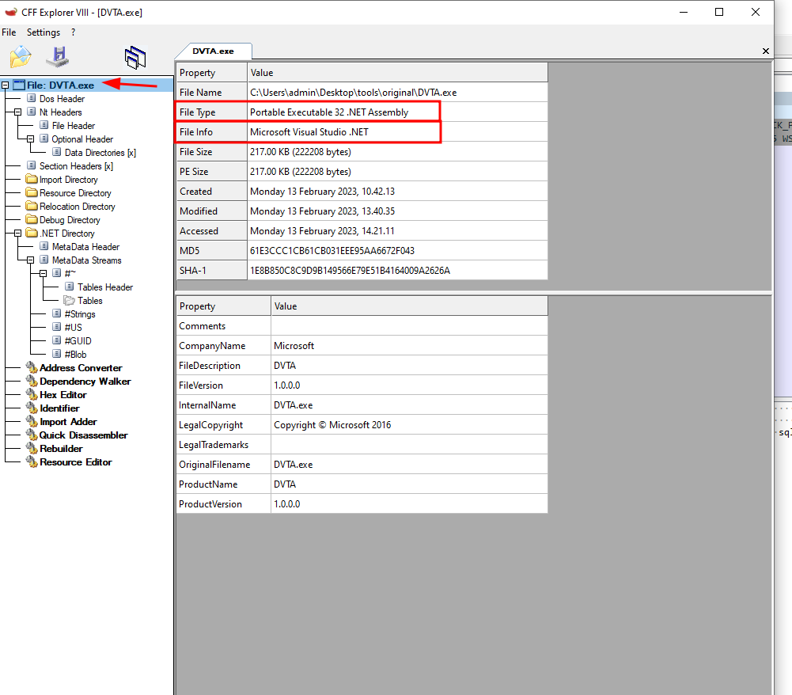
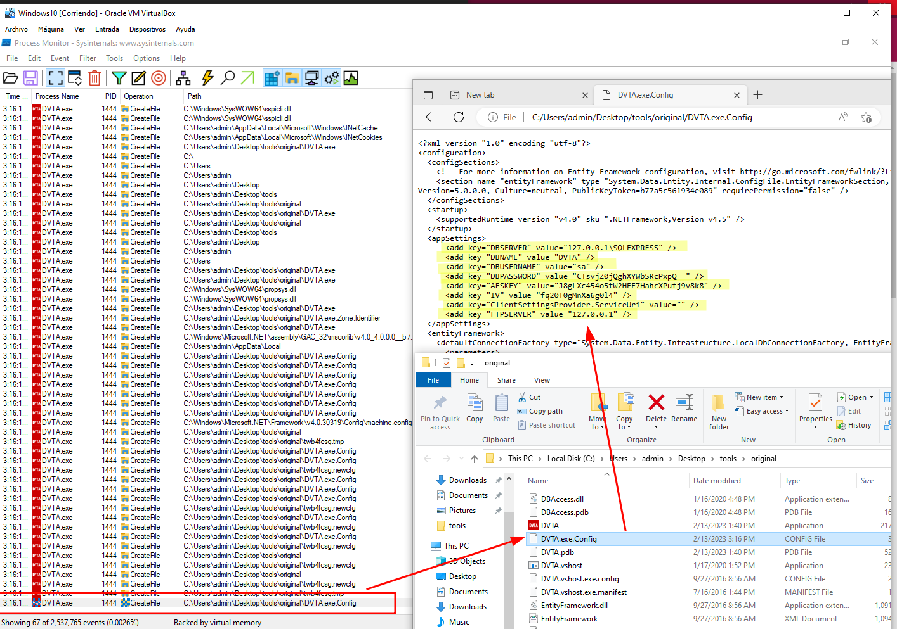

# Information gathering phase - Thick client Applications 

!!! abstract "General index of the course"
    - [Tools for pentesting thick client applications](tools-for-thick-apps.md).
    - [Introduction](tca-introduction.md).
    - [Basic lab setup](tca-basic-lab-setup.md).
    - [First challenge: enabling a button](tca-first-challenge.md).
    - [Information gathering phase](tca-information-gathering-phase.md).
    - [Traffic analysis](tca-traffic-analysis.md).
    - [Attacking thick clients applications](tca-attacking-thick-clients-applications.md).
    - [Reversing and patching thick clients applications](tca-reversing-and-patching.md).    
    - [Common vulnerabilities](tca-common-vulnerabilities.md).


## What we will be doing

**1.** Understand the functionality of the application.

**2.** Architecture diagram from the client.

**3.** Network communications in the app.

**4.** Files that are being accessed by the client.

**5.** Interesting files within the application directory.

Tools:  [CFF explorer](../cff-explorer.md), wireshark, and [sysInternalsSuite](../sys-internals-suite.md).

## IP addresses that the app is communicating with

### TCP View

To see which IP addresses is the app communicating with, we can use TCP View from [sysInternalsSuite](../sys-internals-suite.md).


### Wireshark 

We can also use wireshark


## Language in which the app is built in

### CFF Explorer

To see which  language is the app build in, and which tool was used, we can use  [CFF explorer](../cff-explorer.md). Open the app with CFF  Explorer.



## Changes in the FileSystem

### ProcesMonitor

Use ProcessMonitor tool from [sysInternalsSuite](../sys-internals-suite.md) to see changes in the file system.

For instance, you can analyze the access to interesting files in the application directory. Now we have this information:



```
<add key="DBSERVER" value="127.0.0.1\SQLEXPRESS" />
<add key="DBNAME" value="DVTA" />
<add key="DBUSERNAME" value="sa" />
<add key="DBPASSWORD" value="CTsvjZ0jQghXYWbSRcPxpQ==" />
<add key="AESKEY" value="J8gLXc454o5tW2HEF7HahcXPufj9v8k8" />
<add key="IV" value="fq20T0gMnXa6g0l4" />
<add key="ClientSettingsProvider.ServiceUri" value="" />
<add key="FTPSERVER" value="127.0.0.1" />
```
## Locate credentials and information in Registry entries

### ProcessMonitor

Using ProccessMonitor from [sysInternalsSuite](../sys-internals-suite.md) to locate credentials and information stored in the key registers. And for that, after cleaning all the processes in ProcMon (ProcessMonitor app), you close the application and reopen it. 

If the session is still there, it means that the session is saved somewhere. In this case the session is saved in the registry keys.


Interesting thing here is the Registry Key "isLoggedIn". We could try to modify the boolean value of that registry to bypass login.

Also, check these other tools and resources:

- [WinSpy](../winspy.md).
- [Window Detective](https://windowdetective.sourceforge.net/index.html)
- [netspi.com](https://www.netspi.com/blog/technical/thick-application-penetration-testing/introduction-to-hacking-thick-clients-part-2-the-network/?_gl=1*2wn9s0*_ga*MTQ0NjMzNTMxNi4xNjc1Mjc0ODU3*_ga_BVEZXBBWG7*MTY3NTI3NzMyMS4yLjAuMTY3NTI3NzMzOS40Mi4wLjA).


## Enumerate libraries and resources employed in building the app

When pentesting a thick-client application, I came across this nice way to enumerate libraries, dependencies, sources...  By using  [Sigcheck from sysInternalsSuite](../sys-internals-suite.md), you can view metadata from the images with executables. Additionally, you can save the results to a CSV for reporting purposes.

```powershell
.\sigcheck.exe -nobanner -s -e <folder/binaryFile>
# -s: Search recursively, useful for thick client apps with lot of folders and subfolders
# -e: Scan executable images only (regardless of their extension)
# -nobanner:	Do not display the startup banner and copyright message.
```


One cool flag is the recursive one ("-s"), which helps you avoid navigating through the folder structure. 
