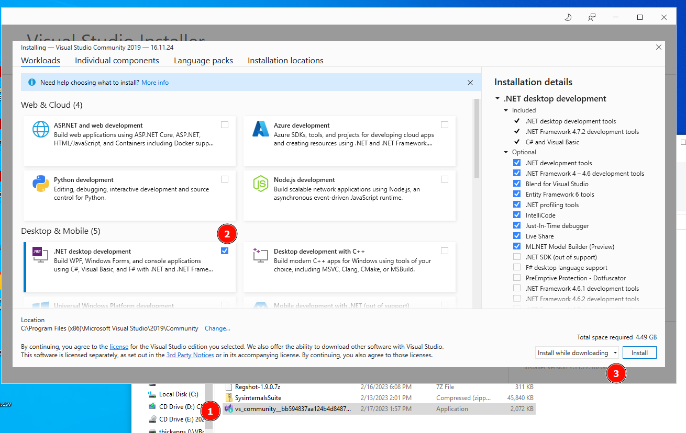
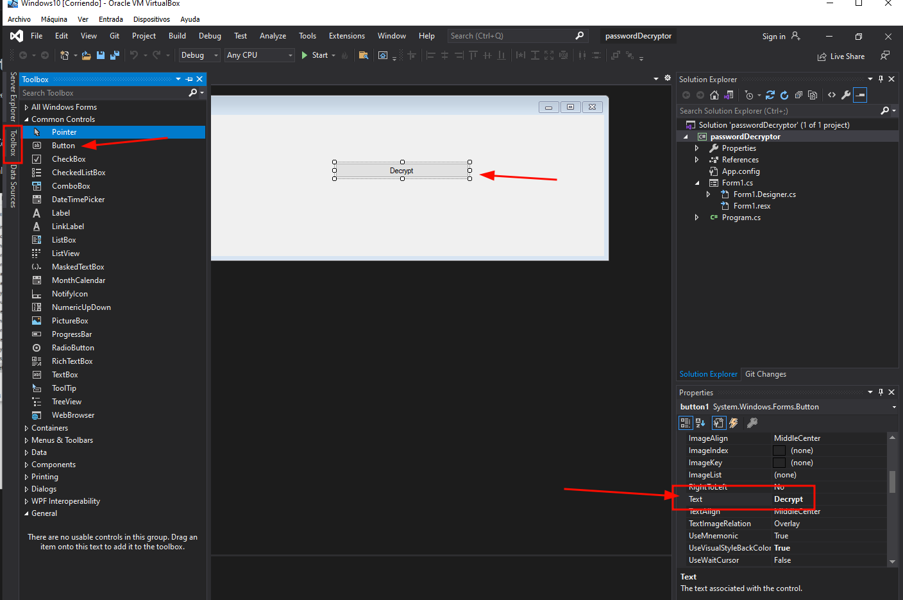
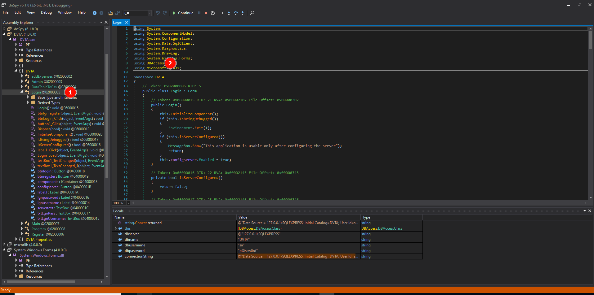
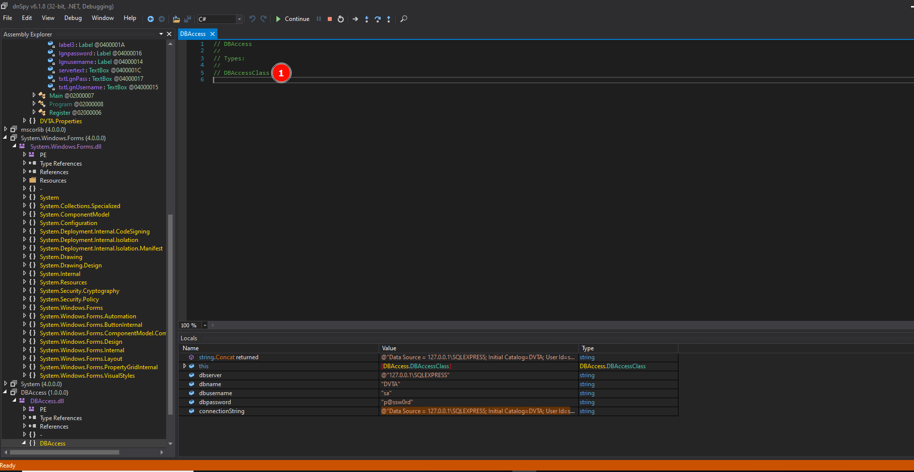
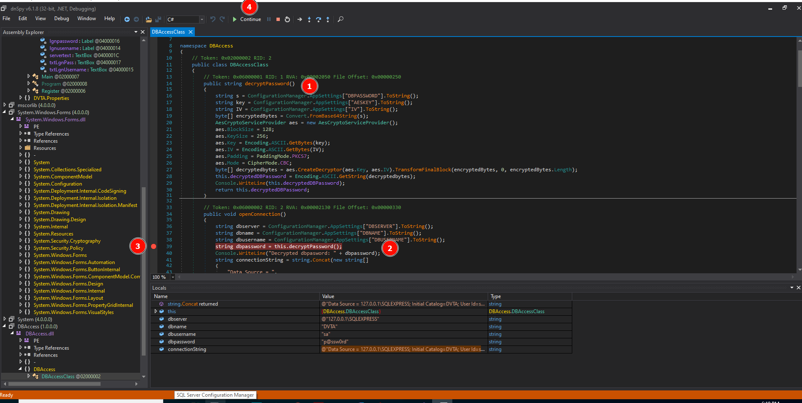
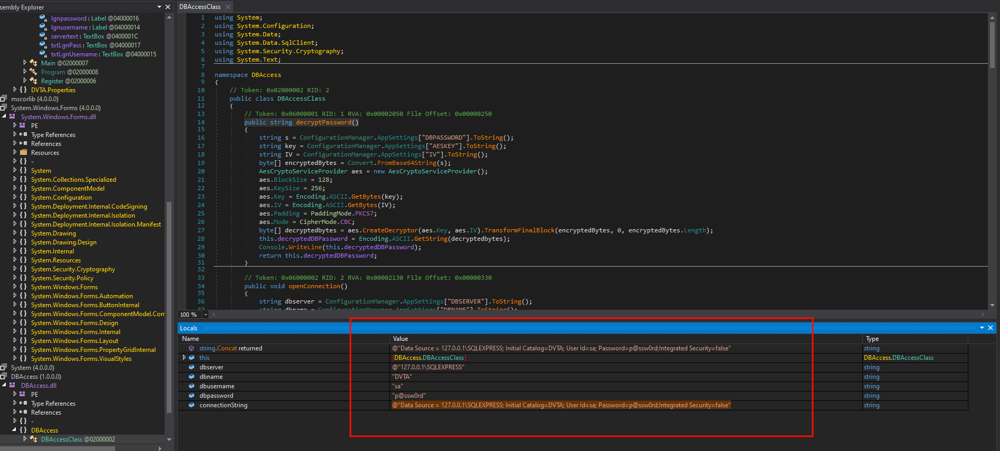

# Reversing and patching thick clients applications

??? abstract "General index of the course"
    - [Introduction](tca-introduction.md)
    - [Basic lab setup](tca-basic-lab-setup.md)
    - [First challenge: enabling a button](tca-first-challenge.md)
    - [Information gathering phase](tca-information-gathering-phase.md).
    - [Traffic analysis](tca-traffic-analysis.md).
    - [Attacking thick clients applications](tca-attacking-thick-clients-applications.md).
    - [Reversing and patching thick clients applications](tca-reversing-and-patching.md)


## Reversing .NET applications

### Required software

- [dnspy](../dnspy.md): c# code + IL code + patching the application
- [dotPeek](../dotpeek.md) (from JetBrains)
- ILspy / Reflexil
- ILASM (IL Assembler) (comes with .NET Framework).
- ILDASM (IL Disassembler) (comes with Visual Studio).

IL stands for Intermediate Language.

### Installing Visual Studio Community 2019 (version 16.11)

Download from: https://my.visualstudio.com/Downloads?q=Visual%20Studio%202019




### Installing dotPeek

[dotPeek Cheatsheet](../dotpeek.md) 
Download from: https://www.jetbrains.com/es-es/decompiler/download/#section=web-installer


## decompiling with dotPeek + executing with Visual Studio

We will try to decompile the app using dotPeek to decrypt the database connection. Remember from the config file 

```

      <add key="DBPASSWORD" value="CTsvjZ0jQghXYWbSRcPxpQ==" />
      <add key="AESKEY" value="J8gLXc454o5tW2HEF7HahcXPufj9v8k8" />
      <add key="IV" value="fq20T0gMnXa6g0l4" />
```


(The config file was  DVTA.exe.Config, localted in the same directory as the app).

We will use dotpeek + Visual Studio to understand the logic under that connection.

Open the app DVTA from dotpeek, go to DVTA>References>DBAccess and double click it. Then you will get a Resource uploaded with the name > DBAccess Class. In it there is a function called decryptPassword() 

```
public string decryptPassword()
    {
      string s1 = ConfigurationManager.AppSettings["DBPASSWORD"].ToString();
      string s2 = ConfigurationManager.AppSettings["AESKEY"].ToString();
      string s3 = ConfigurationManager.AppSettings["IV"].ToString();
      byte[] inputBuffer = Convert.FromBase64String(s1);
      AesCryptoServiceProvider cryptoServiceProvider = new AesCryptoServiceProvider();
      cryptoServiceProvider.BlockSize = 128;
      cryptoServiceProvider.KeySize = 256;
      cryptoServiceProvider.Key = Encoding.ASCII.GetBytes(s2);
      cryptoServiceProvider.IV = Encoding.ASCII.GetBytes(s3);
      cryptoServiceProvider.Padding = PaddingMode.PKCS7;
      cryptoServiceProvider.Mode = CipherMode.CBC;
      this.decryptedDBPassword = Encoding.ASCII.GetString(cryptoServiceProvider.CreateDecryptor(cryptoServiceProvider.Key, cryptoServiceProvider.IV).TransformFinalBlock(inputBuffer, 0, inputBuffer.Length));
      Console.WriteLine(this.decryptedDBPassword);
      return this.decryptedDBPassword;
```


So we will open Visual Studio and we will create a New Project, a Windows Form  Application (.NET Framework).
We will call the project PasswordDecryptor. 
Create a button. Name it Decrypt.




By double-clicking on the Decrypt button we will be taken to the Source code of that button.

This is what we are going to put in that button:

```
using System;
using System.Collections.Generic;
using System.ComponentModel;
using System.Data;
using System.Drawing;
using System.Linq;
using System.Text;
using System.Threading.Tasks;
using System.Windows.Forms;
using System.Security.Cryptography;

namespace decryptorpassword
{
    public partial class Decrypt : Form
    {
        public Decrypt()
        {
            InitializeComponent();
        }

        private void button1_Click(object sender, EventArgs e)
        {
            string dbpassword = "CTsvjZ0jQghXYWbSRcPxpQ==";
            string  aeskey = "J8gLXc454o5tW2HEF7HahcXPufj9v8k8";
            string iv = "fq20T0gMnXa6g0l4";
            byte[] inputBuffer = Convert.FromBase64String(dbpassword);
            AesCryptoServiceProvider cryptoServiceProvider = new AesCryptoServiceProvider();
            cryptoServiceProvider.BlockSize = 128;
            cryptoServiceProvider.KeySize = 256;
            cryptoServiceProvider.Key = Encoding.ASCII.GetBytes(aeskey);
            cryptoServiceProvider.IV = Encoding.ASCII.GetBytes(iv);
            cryptoServiceProvider.Padding = PaddingMode.PKCS7;
            cryptoServiceProvider.Mode = CipherMode.CBC;
            string decryptedDBPassword = Encoding.ASCII.GetString(cryptoServiceProvider.CreateDecryptor(cryptoServiceProvider.Key, cryptoServiceProvider.IV).TransformFinalBlock(inputBuffer, 0, inputBuffer.Length));
            Console.WriteLine(decryptedDBPassword);
        }
    }
}
```


Some things not said in the video: it's quite possible you will need to debug this simple application. For that, the best thing to do is reading error messages and try to fix them. In my case,  a basic library for the execution of this code was missing:

```
using System.Security.Cryptography;
```

Also, it was needed to rename the .exe output file in the Main() function like this

```
# what is said
  Application.Run(new Form1());
# what it needed to say to match to my code
  Application.Run(new Decrypt());
  ```


## Decompiling and executing with dnspy

**1.** Open the application in dnspy. Go to Login. Click on namespace DBAccess



**2.** Click on DBAccessClass



**3.** Locate the function decryptPassword(). That's the one we would love to run. For that locate where it is called from. Add a Breakpoint there. Run the code. YOu will be asked about which executable to run (select DVTA.exe). After that the code will be executed up to the breakpoint. Enter credentials and see in the Notification area how variables are being called.



Eventually, you will see the decrypted connection string in those variables. You can add more breakpoints.




## Using ILSpy + Reflexil to patch applications

Reflexil 